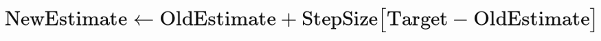

- ## What is Temporal Difference Learning

Richard S. Sutton proposed the temporal difference learning technique in 1988. Because it integrated the benefits of dynamic programming and the Monte Carlo method, the temporal difference learning method became popular. The policy is given as input in the Temporal Difference prediction method, and we try to estimate the value function using the given policy. Temporal Difference learning bootstraps like Dynamic Programming, thus it doesn't have to wait until the conclusion of the episode to calculate the value function or the Q function, and unlike the Monte Carlo technique, it doesn't require the environment's model dynamics to compute the value function or the Q function.

- ## How Temporal Difference Learning works

The Temporal Difference learning algorithm considers the advantages of both the Dynamic Programming and Monte Carlo approaches. So, just like in Dynamic Programming, we perform bootstrapping so that we don't have to wait until the end of an episode to compute the state value or Q value, and it's a model-free method, so it doesn't require the model dynamics of the environment to calculate the state value or Q value, and it's a model-free technique, so it doesn't require the model dynamics of the environment to compute the state value or Q value, just like the Monte Carlo technique. Let's go into the mechanics of the Temporal Difference learning algorithm now that we have a fundamental understanding of how it works.

Temporal Difference Learning technique can be used in 1. `Prediction` as well as 2. `Control` tasks

1. **Prediction Method:-** A policy is given as an input in the prediction technique, and we attempt to predict the value function or Q function using that policy. We can describe how nice it is for the agent to be in each state if it uses the specified policy if we anticipate the value function with it. That is, we can estimate how much money an agent will make in each condition if it follows the policy.

2. **Control Method:-** We are not given a policy as input in the control method, and the purpose of the control method is to identify the best policy. As a result, we start with a random policy and try to identify the best policy repeatedly. That is, we aim to identify the best policy that will maximize our profit.

Temporal Difference algorithms enable the agent to learn through every single action it takes. TD updates the knowledge of the agent on every timestep (action) rather than on every episode (reaching the goal or end state).

The value Target-OldEstimate is called the target error. StepSize is usually denoted by α is also called the learning rate. Its value lies between 0 and 1.

- ## Conclusion

So, in a basic approach, that's temporal difference learning. The basic idea is that we establish an initial estimate, then explore a space and update our previous estimate based on our findings. The challenging part of Reinforcement Learning appears to be deciding where to use it, what environment to use it in, how to correctly set up my rewards, and so on, but at the very least, you now understand how to explore a state space and make estimates using an unsupervised model-free technique.

- ## References

1. [Temporal-Difference Learning
Optimizing value functions by bootstrapping through experience](https://towardsdatascience.com/my-journey-into-reinforcement-learning-part-5-temporal-difference-learning-d0cae79e850)

2. [Understanding the Temporal Difference Learning and its Predication](https://medium.com/@ODSC/understanding-the-temporal-difference-learning-and-its-predication-efc91016144a)