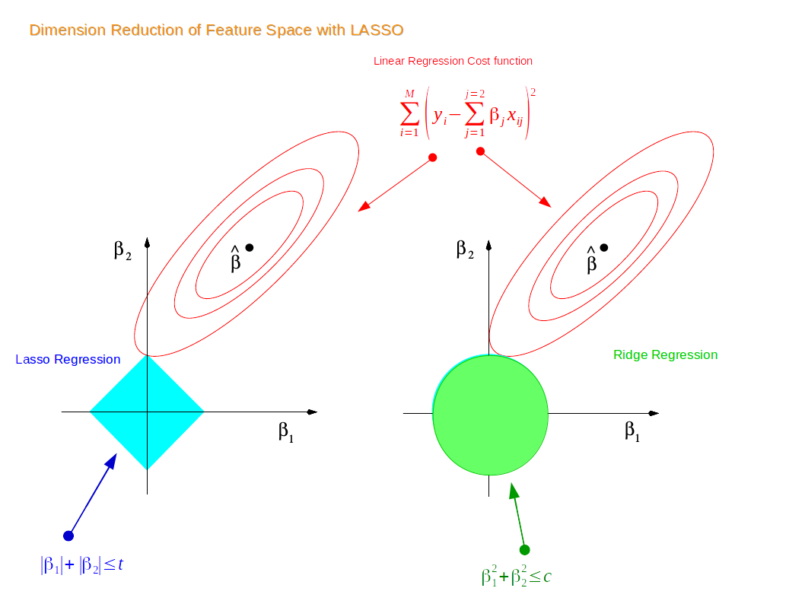

**Ridge and Lasso are regresssion techniques used to reduce model complexity (the number of predictors) and prevent over-fitting which may result from simple Linear Regression.**

# Ridge

- It penalizes sum of squared coefficients, hence it comes under the category of `L2 Regularisation`

- They penalize the size of regression coffecient based on L2 norm:

- Lridge (β) = Σ(yi - β x'i)2 + λ (Σ β2k)

  - here λ - Regularisation Penalty
    - as λ -> ∞ then, β -> 0
    - as λ -> 0 then, βridge -> βOLS (**OLS:** Ordinary Least Squares - Method to evaluate regression coefficients)

- Tuning parameter serves λ to control the relative impact on these two terms on the regression coefficients estimates.

- Bias-Variance Trade-Off:

  - as λ >> 0 then, variance decreases and bias increases.

- Selecting a good value of λ is critical and to make the task easier we use cross-validation for this.

# Lasso

- **Abbreavation:** Least Absoulte Shrinkage and Selection Operator

- It adds penalty for the non-zero coefficients as well and also penalizes the sum of their absolute value, hence it comes under the category of `L1 Regularisation`

- Llasso (β) = Σ(yi - β x'i)2 + λ (Σ βk)
  - here λ - Regularisation Penalty
    - as λ -> ∞ then, β = 0

## Overall Comparsion

| Lasso | Ridge       |
| :--------------: | :--------------: |
| Neither is overall better | Neither is overall better |
| Can bring co-efficients to zero | It cannot |
| One has large correaltion value, whereas others are almost zeroed | Co-efficients are almost similar |
| Used when there are small number of parameters to examine | Used when there are large number of parameters to examine |

**References:**

1. [Meduim-Blog](https://towardsdatascience.com/ridge-and-lasso-regression-a-complete-guide-with-python-scikit-learn-e20e34bcbf0b)

1. [AnalyticsVidhya-Blog](https://www.analyticsvidhya.com/blog/2017/06/a-comprehensive-guide-for-linear-ridge-and-lasso-regression/)
