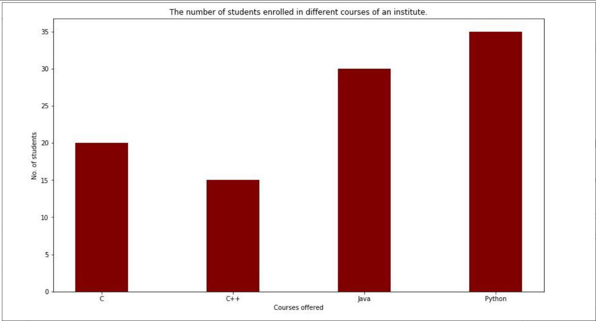
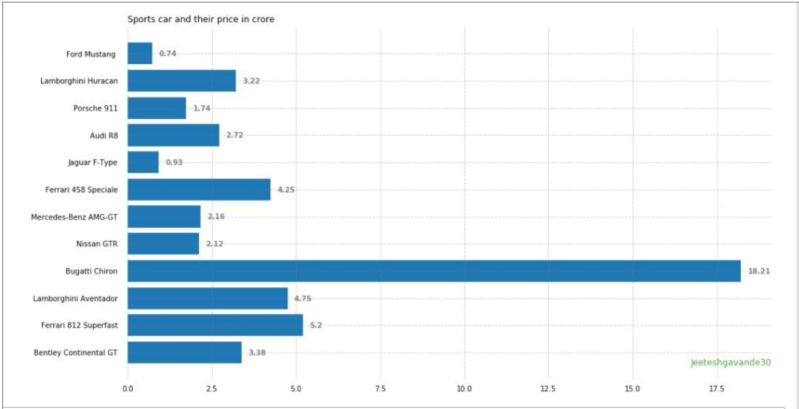
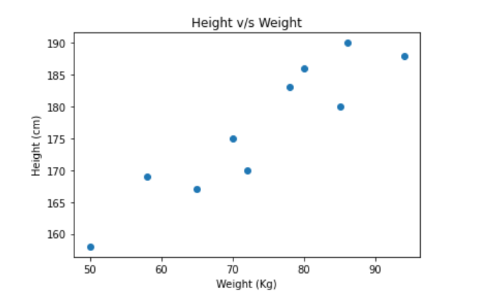
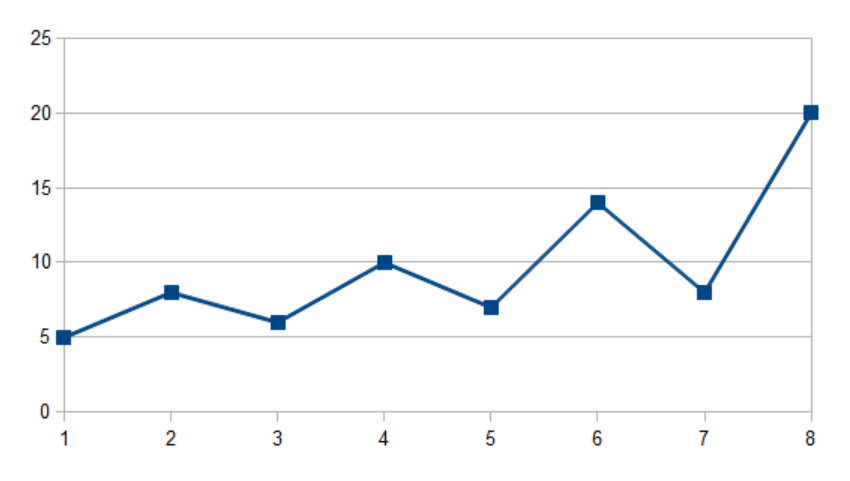
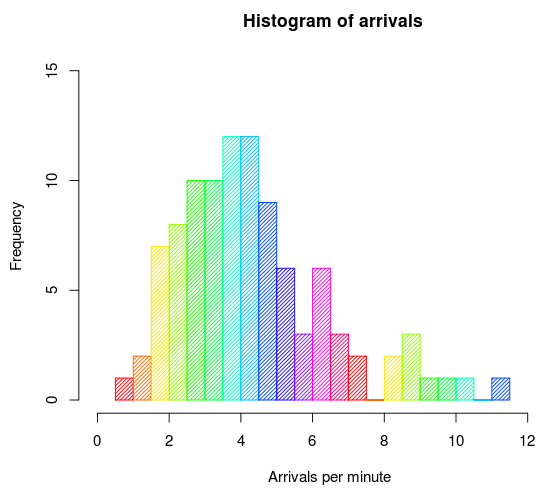
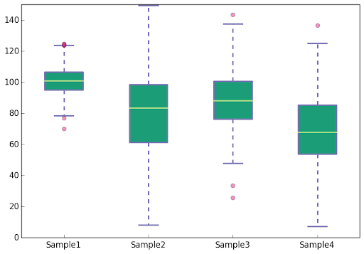

# Matplotlib Cheatsheet

- A library which provides building blocks to create rich data visualisation for different datasets
- Most of the Matplotlib utilities lies under the pyplot submodule, here we will discuss more about in detail
## Installing Matplotlib library
- pip install matplotlib
#### Import Matplotlib subpackage Pyplot 
- import matplotlib.pyplot as plt

## Codes used for different actions:
#### Create Figure : 
- fig = plt.figure()
- fig2 = plt.figure(figsize=plt.figaspect(2.0))
#### Create Axes :
- All plotting is done with respect to an Axes. In most cases, a subplot will fit your needs. 
- A subplot is an axes on a grid system.
- fig.add_axes()
- ax1 = fig.add_subplot(221)  #row-col-num
- ax3 = fig.add_subplot(212)
- fig3, axes = plt.subplots(nrows=2,ncols=2)
- fig4, axes2 = plt.subplots(ncols=3)
#### Plotting x and y points : 
- plt.plot(x_points,y_points)  where x_points is array containing the points on the x-axis & y_points is array containing the points on the y-axis
#### Plotting x and y points without a line :
- plt.plot(x_points, y_points, 'o')
#### Plotting default-x points :
- plt.plot(y_points)
#### Markers :
- plt.plot(x_points, y_points, '*') where * is marker. Library has lots of different markers and markers can have size, color
#### LineStyle :
- plt.plot(x_points, y_points, linestyle = 'dotted') here 'linestyle' can be written as ls
- Different LineStyles are :
- 'solid' (default)	'-'	
- 'dotted'	':'	
- 'dashed'	'--'	
- 'dashdot'	'-.'	
- 'None'	'' or ' '
lines too can have colors, width.
#### Labels for a Plot :
- plt.xlabel("X-Axis")
- plt.ylabel("Y-Axis")
#### Title for a Plot :
- plt.title("Title of Plot")
#### Font Properties for Title and Labels : 
- We can use fontdict parameter in xlabel(), ylabel(), and title() to set font properties for the title and labels
- Example: plt.title("Sports Watch Data", fontdict = {'family':'serif','color':'blue','size':20} )
#### To display the plot :
- plt.show() -Explicit command required to display the plot object
#### To save a plot :
- plt.savefig('image.png') - to save figures
- plt.savefig('image.png' , transparent=True)  - to save transparent figures 
## Barplots :
 
 
- A bar graph is helpful when you have to visualise a numeric feature (fact) across multiple categories. 
- To draw a bar graph: plt.bar(x_component, y_component) 
 #### Horizontal Bar Graphs : 
 
 
 
- plt.barh(x_component, y_component) 
 #### Bar Color, Width :
 - color : plt.bar(x_component, y_component, color="red")
 - width : plt.bar(x_component, y_component, width=0.6)
 #### Tick values and label :
 - plt.yticks(tick_values, tick_labels)
 
## Scatterplots :
 - Scatterplot, displays the scatter of the data. 
 - It can be helpful in checking for any relationship pattern between two quantitative variables and detecting the presence of outliers within them.
 
   
  
 - To draw a scatterplot : plt.scatter(x_axis, y_axis)
 - plt.scatter(x_axis, y_axis, c = color, label = labels) :  all the information (x_axis, y_axis, colour, labels) needs to be provided in the form of a list or array
 - plt.annotate(text, xy = points_to_annotate_xy) : to add a note (annotate) with a point in the scatterplot
 - plt.scatter(x_axis, y_axis, alpha=0.5) : this attribute helps set the transparency of points in a scatterplot
 
## Line Graphs :
 - A line graph is used to present continuous time-dependent data. 
 - It accurately depicts the trend of a variable over a specified time period.

 
 
 - plt.plot(x_axis, y_axis) : command to plot a line graph
 - plt.plot(y, 'red', marker = 'o') : command to get line plot with the points marked
 - plt.yticks(rotation = number) : to rotate the tick labels on the axes, could do for xticks as well
 
 ## Histogram :
 - A histogram is a frequency chart that records the occurrence of an entry or an element in a data set. 
 - It is useful when you want to understand the distribution of a given series.
 
  
  
 - plt.hist(input, bins = number_of_bins, edgecolor = "color", color = "color") : command to plot a histogram
 
 ## Box Plots :
 - Box plots are very effective in summarising the spread of large data into a visual representation. 
 - They take the help of percentiles to divide the data range. 
 - 
  
  
 - plt.boxplot([ list_1, list_2]) : command to create a box plot
 - Box plots divide the data range into three important categories:
  #### Median value: 
   This is the value that divides the data range into two equal halves, that is, the 50th percentile.
  #### Interquartile range (IQR): 
   These are data points between the 25th and 75th percentile values.
  #### Outliers: 
   These are data points that differ significantly from other observations and lie beyond the whiskers.
   
## Jupyter Notebook for Reference :
  here is the link to better understand the matplotlib library.

  Click here 👇

 - [Visualisation_of_Matplotlib](https://github.com/singhmansi25/winter-of-contributing/blob/patch-4/Datascience_With_Python/Machine%20Learning/Cheatsheets/Matplotlib/Visualization_using_Matplotlib.ipynb)
