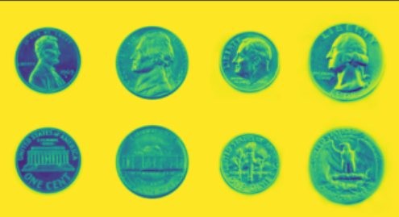

# OpenCV Cheatsheet

## Computer Vision
1. Computer vision is a field of study focused on the problem of helping computers to see.
2. Computer vision enables computers to see, identify and process images in the same way that human vision does, and then provide appropriate output. 
3. It is like imparting human intelligence and instincts to a computer, then perform appropriate analysis or act accordingly.
4. Computer vision is distinct from image processing.

## OpenCV
1. OpenCV is a huge open-source library for computer vision, machine learning, and image processing.
2. OpenCV supports a wide variety of programming languages like Python, C++, Java, etc.

## Use of OpenCV
1. OpenCV is the huge open-source library for the computer vision, machine learning, and image processing and now it plays a major role in real-time operation which is very important in today’s systems.
2. By using it, one can process images and videos to identify objects, faces, or even handwriting of a human. When it integrated with various libraries, such as NumPy, python is capable of processing the OpenCV array structure for analysis.

## Application of OpenCV

1. Optical character recognition (OCR)
2. Machine inspection
3. Retail (e.g. automated checkouts)
4. 3D model building (photogrammetry)
5. Medical imaging
6. Automotive safety
7. Match move (e.g. merging CGI with live actors in movies)
8. Motion capture (mocap)
9. Surveillance
10. Fingerprint recognition and biometrics

## Installing OpenCV
    pip install opencv-python

## Import OpenCV
    import cv2

 

## Working on images
  
### Read an image from path
     cv2.imread(path,flag)
  
  **Parameter:**
  - path: Location of image to be read as a string.
  - flag(optional): flag value, that defines the format image to be read. Default value is 1(CV2.IMREAD_COLOR).It value varies from 0, 1, -1.
 
  
 

  ### Image Resizing
      cv2.resize(image,(width,height),fx,fy,interpolation)
  **Parameter:**
  - image: source image read
  - (width,height) : dimension as tuple
  - fx(optional) : scaling along horizontal axis.
  - fy(optional) : scaling along vertical axis.
  - interpolation(optional) : flag value that defines the any following method -INTER_NEAREST, INTER_LINEAR, INTER_AREA, INTER_CUBIC.
  

 

  ### Blurring an Image
    👉 👉
  
  
  **Gaussian Blur:**
  
    cv2.GaussianBlur(image,ksize,sigmaX,sigmaY,borderType)
  **Parameter:**
  - image: source image read
  - ksize: kernel size as tuple
  - sigmaX(optional): kernel standard deviation along x-axis
  - sigmaY(optional): kernel standard deviation along y-axis
  - borderType: specifies image boundaries
  
  **Median Blur:**
  
      cv2.medianBlur(image, ksize)
  **Parameter:**
  - image : source image read
  - ksize: kernel size as integer
  
  **Bilateral Blur:**
  
      cv2.bilateralFilter(image, d, sigmaColor, sigmaSpace, borderType)
  **Parameter:**
  - image: source image read
  - d: diameter of pixel neighbourhood as integer
  - sigmaColor: filter sigma in the color space as integer
  - sigmaSpace: filter sigma in the coordinate space.
  - borderType: specifies image boundaries 
  

   
  
  ### Grayscaling of images
  
  
      cv2.cvtColor(image,colorcode)
  **Parameter:**
  - image: source image read
  - colorcode: color space conversion code.
  for grayscale colorcode is *cv2.COLOR_BGR2GRAY*

>  *Sample Code can be found **[here](Notebooks/OpenCV.ipynb)***
 

### Canny Edge Detection 

           👇

            👇

             👇

    cv2.Canny(image, edges, threshold1, threshold2, apertureSize, L2gradient)
 **Parameter:**
- image - The 8-bit input image
- edges - The 8-bit image after the edges have been detected
- threshold1 & threshold2 - The minimum and maximum threshold. The edges with intensity gradients above and below these values are discarded.
- apertureSize - This is used in the Sobel filter to find the intensity gradient of the input image
- L2gradient - This specifies the equation for finding gradient magnitude

> *Sample Code can be found **[here](Notebooks/Canny_edge_detection.ipynb)***
 

## Working with Images

### Play videos with OpenCv:
*Find a video to use* 
- If using Google Colab upload a video to your google drive to use. Add the following code to let google colab access your google drive:

        from google.colab import drive

- Find your video url and add into the wget code inside the double quotes: 

        !wget = "put your video url here"

- Also put your ending part of the video url in the cap code inside the parentheses and quote: 

        cap = cv2.VideoCapture('number part.mp4')

- It will play the video frame by frame. Warning it will be very slow on Google Colab.

## Refernce Notebooks

> *Sample Notebooks can be found **[here](Notebooks)***

 

