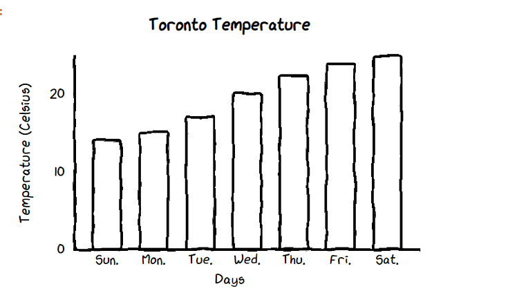

# Introduction
Visualization plays a crucial role in presenting data, ideas, analysis results etc. We need charting, diagramming and graphics tools for nearly any modern applications. The availability of quality charting and visualization tools and libraries could be of great importance so we will specialise in the first .

Cutecharts are perfect to offer a more personal touch to charts. If you would like to form charts less intimidating then add a spoonful of sweetness then cute charts are the simplest option.

It’s very different from the regular Matplotlib and Seaborn library, it's a lookout of handmade charts and while hovering on the charts it shows us the values. The hovering effect isn't there within the Matplotlib chart which is a plus of cute charts. Creating charts in cute charts may be a bit longer compared to seaborn, but a still lesser number of codes than the quality matplotlib library.

This package is often used to generate the subsequent sorts of charts. At the moment, this library support five different charts- Bar, Pie, Radar, Scatter, and Line.

# Types of Charts
* Bar Chart

* Bar Chart 2

* Pie Chart

* Donut Chart from Pie Chart

* Line Chart

* Radar Chart

* Scatter Plot

# Advantages
* Making an assessment of facts becomes easier for audiences as these visual modes allow them to deferentiate data and numbers.
* More can be said, more facts can be accommodated and arranged in a terse manner and that is the beauty of graphs, charts or pictorial diagrams 
* They help the prospective clients to make important inferences on different finer aspects of your business on different comprehensible parameters.

# Disadvantages
* It can support only five charts:Bar, Pie, Radar, Scatter, and Line.

# Conclusion
Although, it has a disadvantage. It is still an effective tool to manage projects, teams, and time with more effect. Due to its clarity in the visual representation, the tasks are easy to schedule and understand by different time frames.

# References
* https://towardsdatascience.com/make-the-cutest-chart-in-python-visualize-your-data-with-hand-drawn-charts-f21157f76b4b
* https://morioh.com/p/1b800d4712d8
