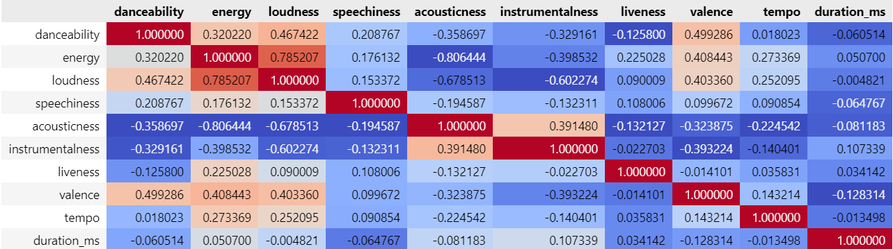
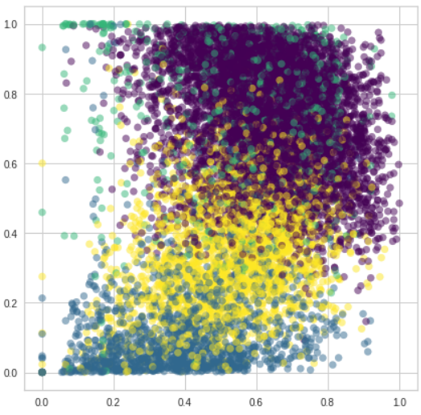
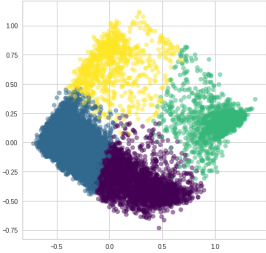
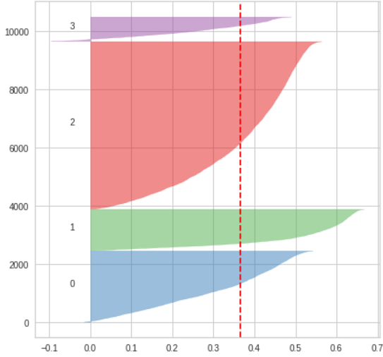

#  Music Recommendation Systems
# Introduction
The number of songs which are available exceeds the listening
capacity of an individual in their lifetime. It is tedious for an
individual to sometimes choose from millions of songs and
there is also a good chance of missing out on songs which
could have been the apt for the occasion.
These days all effort and research is going in predicting the
kind of songs that a particular user will like, using their entire
song history. Here, people are trying to recommend songs
without taking in mood as a factor. A user may like party
songs as well as soothing songs, but recommending a song
in any one of these categories requires not just the history of
the songs the user like but also capturing the current mood
of the user. If a person is in the mood to listen to a party
song, he wouldn’t want the app to recommend a slow song,
which statistically, according to his history is apt but just not
suitable for the current mood.

So, we can solve this problem by asking one particular
question; given a song the user is currently listening to, which
song will the user like to listen to next?
This is the question we are trying to answer in this project.
We are trying to find similarity in the song being played by
the user with the list of songs available in our dataset by
using clustering techniques. After generating a playlist of
songs similar to the current song, we use popularity based
recommendation system to recommend the next song to the
user.

# What is the purpose of music recommendation system?
By using music recommender system, the music provider can predict and then offer the appropriate songs to their users based on the characteristics of the music that has been heard previously.

# Steps to be Followed
1. Import Required Libraries.
2. Load the Dataset
3. Data Normalization
4. Data Visualization
5. Apply PCA ( Principal Component Analysis)
6. Model Training
7. Model Evaluation
8. Conclusion
# Data Visualization
We first tried to find the relationship between the noncategorical
columns of the dataset. We can do this by finding
correlation between non-categorical data.

We can see that there is high correlation between a few features,
such as energy and loudness, valence and danceability,
and also danceability and loudness. This shows that we need
to reduce the dimensionality of our data.
 
We have used Min-Max Scaling to normalize the data. to see if
cluster formation is possible, we tried making 4 clusters out
of the scaled data using K-Means Clustering. Although the
clustering doesn’t look neat, we can see some clear distinction
between the clusters.
 
To create our similarity model, we extract the label of the
current song being played and generate a playlist of songs, by
collecting all the songs present in the same cluster as that of
the current song (by taking songs having same label as of the
current song). After extracting the playlist we sort the playlist
according to a particular value named as popularityDistance,
for each song in the playlist.

After sorting the playlist in descending order of popularity-
Distance value, we recommend song linearly from the playlist.

# Model Evaluation
To evaluate our model, we use two metrics, namely:
- Silhouette Visualizer
- Intercluster Distance Maps
From the plot, we can see that all the clusters have above
average silhouette scores. Even though the width of cluster 2
is big, thus making the clusters unevenly sized, k=4 is a good
fit, because k=5 showed a poor silhouette score as seen from
the elbow plot in Fig. 3.
Intercluster distance maps display an embedding of the cluster
centers in 2 dimensions with the distance to other centers
preserved. E.g. the closer to centers are in the visualization,
the closer they are in the original feature space. The clusters
are sized according to a scoring metric. By default, they are
Fig. 5. Silhouette Coefficient per cluster
Fig. 6. Intercluster Distance Map for 4 clusters
sized by membership, e.g. the number of instances that belong
to each center. This gives a sense of the relative importance
of clusters. In our plot, we can see that the cluster sizes are
quite varied, which we attribute to the limited amount of data.
The spacing between the cluster centres shows that the clusters
aren’t very mixed up.
VII. RECOMMENDATION ALGORITHM
After the similarity model is generated, the question arises
that how to recommend the next song considering the change
in mood as a factor. Before we discussed in the model building
section on how to generate playlist similar to the current song
being played. As the mood starts to change, our algorithms
should detect it and recommend some different kind of music.
This can be achieved by using simple reinforcement learning
technique.

What we do is that we recommend a song similar to the one
being played, and if the user rejects it, (rejection of a song in
this content can be referred as; amount of listening time of that
song being less that 50%) then suggest different song similar
to the first one. If the user still rejects it, we can conclude that
user wants different type of music. So then we suggest song
from some different cluster and repeat the above process until
we converge to the type of song the user wants to hear and

# Feature Engineering
Clustering algorithms don’t work well with categorical
data. Hence, we decided to remove these features from the
dataset. As discussed earlier, we found out high correlation
between a few features. To combat this, we applied Principal
Component Analysis(PCA) with a variance preservation of
95%. PCA helped reduce the number of features from 10 to
6.

PCA serves a dual purpose in clustering problems. As we
saw earlier, the clusters formed from the normalised data
weren’t very distinct. Since clustering algorithms such as Kmeans
operate only on distances, the right distance metric to
use is the distance metric which is preserved by the dimensionality
reduction. This way, the dimensionality reduction step
can be seen as a computational shortcut to cluster the data
in a lower dimensional space. Thus, PCA serves as a noise

# Model Training

Silhouette analysis can be used to study the separation
distance between the resulting clusters. The silhouette plot
displays a measure of how close each point in one cluster is to
points in the neighboring clusters and thus provides a way to
assess parameters like number of clusters visually. Silhouette
coefficients near +1 indicate that the sample is far away from
the neighboring clusters. A value of 0 indicates that the sample
is on or very close to the decision boundary between two
neighboring clusters and negative values indicate that those
samples might have been assigned to the wrong cluster.

To determine the optimal value of k for the K-Means
algorithm, we use the elbow method on silhouette score
analysis. If the line chart resembles an arm, then the “elbow”
(the point of inflection on the curve) is a good indication that
the underlying model fits best at that point. In the visualizer
“elbow” will be annotated with a dashed line. The silhouette
score calculates the mean Silhouette Coefficient of all samples. 

From the graph, we can see that a value of k = 4 best suits
the K-Means Clustering algorithm.
So now we apply K-Means Clustering algorithm with K =
4 and generate our model.

# RECOMMENDATION ALGORITHM
After the similarity model is generated, the question arises
that how to recommend the next song considering the change
in mood as a factor. Before we discussed in the model building
section on how to generate playlist similar to the current song
being played. As the mood starts to change, our algorithms
should detect it and recommend some different kind of music.
This can be achieved by using simple reinforcement learning
technique.
What we do is that we recommend a song similar to the one
being played, and if the user rejects it, (rejection of a song in
this content can be referred as; amount of listening time of that song being less that 50%) then suggest different song similar
to the first one. If the user still rejects it, we can conclude that
user wants different type of music. So then we suggest song
from some different cluster and repeat the above process until
we converge to the type of song the user wants to hear and
suggests the next songs accordingly.
# Advantages of Recommendation System
1. Based on Real Activity
2. Personalization
3. Great for Discovery
4. Reduced Organizational Maintenance
5. Always Up-To-Date

# Disadvantages of Recommendation System
1. Difficult to Set Up
2. Sometimes They’re Wrong
3. Maintenance Shifted Elsewhere
# Conclusion
The method used in this task is a primitive approach
to music suggestion. Although the predictions made by
the model seems fair, due to limitations in the amount of
data that we could procure, they couldn’t perform up to
the mark. In order to achieve a more comprehensive music
suggestion, we need to perform both Content based filtering
and Collaborative filtering.

Content based filtering focuses on suggestion based on
acoustic properties of the music whereas Collaborative filtering
uses data from patterns of other users who browsed the same
music to suggest a track. On combining both of these factors,
we can improve the quality of suggestions drastically.
