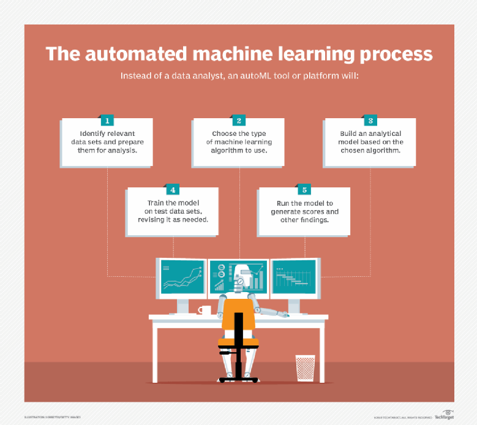

# AUTOMATED MACHINE LEARNING

- Automated machine learning (AutoML) is the process of applying machine learning (ML) models to real-world problems using automation. More specifically, it automates the selection, composition and parameterization of machine learning models.
- Automated Machine Learning provides methods and processes to make Machine Learning available for non-Machine Learning experts, to improve efficiency of Machine Learning and to accelerate research on Machine Learning. 
- Automating the machine learning process makes it more user-friendly and often provides faster, more accurate outputs than hand-coded algorithms.
- AutoML software platforms make machine learning more user-friendly and give organizations without a specialized data scientist or machine learning expert access to machine learning.

---

# AutoML Process

<p>AutoML is typically a platform or open source library that simplifies each step in the machine learning process, from handling a raw dataset to deploying a practical machine learning model. <br><br>
In traditional machine learning, models are developed by hand, and each step in the process must be handled separately.</p><br>

<br>

<p>Hhere are some of the steps of the machine learning process that AutoML can automate, in the order they occur in the process:</p>

- Raw data processing
- Feature engineering and feature selection
- Model selection
- Hyperparameter optimization and parameter optimization
- Deployment with consideration for business and technology constraints
- Evaluation metric selection
- Monitoring and problem checking
- Analysis of results

---

# Pros and Cons of AutoML

## Pros :

<p>The main benefits of AutoML are:</p>

- <b>Efficiency</b> : It speeds up and simplifies the machine learning process and reduces training time of machine learning models.
- <b>Cost savings</b> : Having a faster, more efficient machine learning process means a company can save money by devoting less of its budget to maintaining that process.
- <b>Accessibility</b> : Having a simpler process allows companies to save money on training staff or hiring experts. It also makes machine learning a viable possibility for a wider range of companies.
- <b>Performance</b> : AutoML algorithms also tend to be more efficient than hand-coded models.

## Cons :

- The main challenge of AutoML is the temptation to view it as a replacement for human knowledge. Like most automation, AutoML is designed to perform rote tasks efficiently with accuracy and precision, freeing up employees to focus on more complex or novel tasks. Things that AutoML automates, like monitoring, analysis and problem detection, are rote tasks that are faster if automated. A human should still be involved to assess and supervise the model, but no longer needs to participate in the machine learning process step-by-step. AutoML should help improve data scientist and employee efficiency, not replace them.

- Another challenge is that AutoML is a relatively new field and some of the most popular tools are not yet fully developed.

---

# Applications of AutoML

<p>AutoML shares common use cases with traditional machine learning. Some of these include:</p>

- <b>Fraud detection in finance</b>. It can improve the accuracy and precision of fraud detection models.
- <b>Research and development in healthcare</b>, where it can analyze large data sets and draw insights.
- <b>Image recognition</b>, which is useful for facial recognition.
- <b>Risk assessment and management in banking, finance and insurance.</b>
- <b>Cybersecurity</b>, where it can be used for risk assessment, monitoring and testing.
- <b>Customer support</b>, where it can be used for sentiment analysis in chatbots and to increase the efficiency of the customer support team.
- <b>Malware and spam</b>, where it can be used to generate adaptive cyberthreats.
- <b>Agriculture</b>, where it can be used to expediate the quality testing process.
- <b>Marketing</b>, where it can be used for predictive analytics and improved engagement rates. It can also be used to improve efficiency of behavioral marketing campaigns on social media.
- <b>Entertainment</b>, where it can be used as a content selection engine.
- <b>Retail</b>, where it can be used to improve profits and reduce waste/inventory carryover.

---

# AutoML Platforms

<p>Some popular AutoML platforms include:</p>

- <b>Google AutoML</b>, Google's proprietary, cloud-based automated machine learning platform.
- <b>Azure Automated Machine Learning</b>, a proprietary, cloud-based platform.
- <b>Auto Keras</b>, an open-source software library developed by the DATA lab at Texas A&M university.
- <b>Auto-sklearn</b>, which evolved from and replaced Scikit learn, which was an open source, commercially usable collection of simple machine learning tools in Python.

---

# AutoML Tutorial using Auto-sklearn

<p>Auto-Sklearn is an open-source Python library for AutoML using machine learning models from the scikit-learn machine learning library.</p>

<p>The first step is to install the Auto-Sklearn library, which can be achieved using pip, as follows:</p>

```
sudo pip install autosklearn
```

<p>Once installed, we can import the library and print the version number to confirm it was installed successfully:</p>

```
# print autosklearn version
import autosklearn
print('autosklearn: %s' % autosklearn.__version__)
```

<p>Running the example prints the version number. Your version number should be the same or higher.</p>

```
autosklearn: 0.6.0
```

<p>Next, we can demonstrate using Auto-Sklearn on a synthetic classification task.</p>
<p>We can define an AutoSklearnClassifier class that controls the search and configure it to run for two minutes (120 seconds) and kill any single model that takes more than 30 seconds to evaluate. At the end of the run, we can report the statistics of the search and evaluate the best performing model on a holdout dataset.</p>
<p>The complete example is listed below.</p>

```
# example of auto-sklearn for a classification dataset
from sklearn.datasets import make_classification
from sklearn.model_selection import train_test_split
from sklearn.metrics import accuracy_score
from autosklearn.classification import AutoSklearnClassifier
# define dataset
X, y = make_classification(n_samples=100, n_features=10, n_informative=5, n_redundant=5, random_state=1)
# split into train and test sets
X_train, X_test, y_train, y_test = train_test_split(X, y, test_size=0.33, random_state=1)
# define search
model = AutoSklearnClassifier(time_left_for_this_task=2*60, per_run_time_limit=30, n_jobs=8)
# perform the search
model.fit(X_train, y_train)
# summarize
print(model.sprint_statistics())
# evaluate best model
y_hat = model.predict(X_test)
acc = accuracy_score(y_test, y_hat)
print("Accuracy: %.3f" % acc)
```

<p>Running the example will take about two minutes, given the hard limit we imposed on the run.</p>
<p>At the end of the run, a summary is printed showing that 599 models were evaluated and the estimated performance of the final model was 95.6 percent.</p>

```
auto-sklearn results:
Dataset name: 771625f7c0142be6ac52bcd108459927
Metric: accuracy
Best validation score: 0.956522
Number of target algorithm runs: 653
Number of successful target algorithm runs: 599
Number of crashed target algorithm runs: 54
Number of target algorithms that exceeded the time limit: 0
Number of target algorithms that exceeded the memory limit: 0
```

<p>We then evaluate the model on the holdout dataset and see that a classification accuracy of 97 percent was achieved, which is reasonably skillful.</p>

```
Accuracy: 0.970
```

# Resources

- https://www.automl.org/automl/
- https://searchenterpriseai.techtarget.com/definition/automated-machine-learning-AutoML
- https://en.wikipedia.org/wiki/Automated_machine_learning
- https://machinelearningmastery.com/automl-libraries-for-python/

---

## <center>Thank You</center>