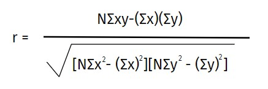
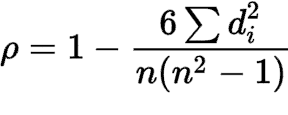
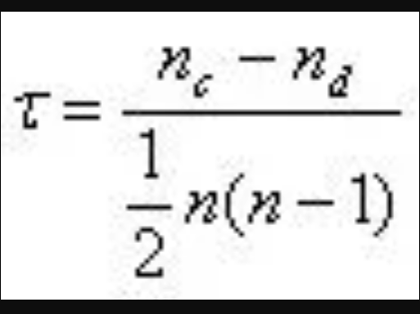

# Correlation Coefficients

# Introduction
Correlation coefficients quantify the affiliation among variables or capabilities of a dataset. These records are of excessive significance for technological know-how and technology, and Python has amazing equipment that you may use to calculate them. SciPy, NumPy, and Pandas correlation techniques are fast, comprehensive, and well-documented. 

A correlation could be positive, meaning both variables move in the same direction, or negative, meaning that when one variable’s value increases, the other variables’ values decrease. Correlation can also be neutral or zero, meaning that the variables are unrelated. 
- Positive Correlation: both variables change in the same direction.
- Neutral Correlation: No relationship in the change of the variables.
- Negative Correlation: variables change in opposite directions.

# Types of Correlation Coefficients

In this tutorial, you’ll learn about three correlation coefficients: 
1. Pearson correlation coefficient : Pearson correlation coefficient or Pearson’s correlation coefficient or Pearson’s r is defined in statistics as the measurement of the strength of the relationship between two variables and their association with each other. 
The Pearson coefficient correlation has a excessive statistical significance. It appears at the connection among variables. It seeks to draw a line via the data of variables to expose their relationship. The relationship of the variables is measured with the assist Pearson coefficient of correlation calculator. This linear relationship may be positive or negative.

Pearson correlation coefficient Formula : 

 

2.Spearman’s correlation coefficient : Spearman’s correlation coefficient is a statistical degree of the power of a monotonic relationship amongnst paired data. The Spearman rank correlation check does now not convey any assumptions about the distribution of the facts and is the precise correlation evaluation on the identical time because the variables are measured on a scale this is at the least ordinal. 

Spearman’s correlation coefficient Formula : 

 

3.Kendall rank correlation coefficient : In statistics, the Kendall rank correlation coefficient, usually called Kendall's τ coefficient, is a statistic used to degree the ordinal affiliation among measured quantities. 
It is taken into consideration a nonparametric opportunity to the Pearson’s product-moment correlation whilst your data has failed one or extra of the assumptions of this test. 

Kendall rank correlation coefficient Formula : 

 

# Why Correlation Coefficients are used
Correlation is used to explain the linear relationship
between two continuous variables.
Generally, correlation tends to be used when there's no
identified response variable. It measures the strength
(qualitatively) and direction of the linear relationship
between two or more variables. 

# Steps to be followed: 
1. Import Required Libraries
2. Load the Dataset
3. Data Cleaning and preprocessing
4. Data visualizations
5. Calculate the Correlation Coefficients.

# Data Visualizations(Correlation Heatmaps)
1. 
 
2. 
 
3. 
 

# Applications of Correlation Coefficients
1. Ecommerce
2. Real Estate
3. Education Ministry 

# Advantages of Correlation Coefficients
- Can display power of relationship among  variables.
- Study behaviour which you can not study.
- Gain quantitative information which may be effortlessly analysed.
- Correlational studies may be used while experimental studies isn't always viable due to the fact the variables can not be manipulated or it might be unethical to apply an experiment. 
- Correlational designs additionally have the gain of permitting the researcher to examine conduct because it happens in everyday life.

# Disadvantages of Correlation Coefficients
- Cannot display purpose and effect (what variables manage what).
- No control of third variable that could have an effect on the correlation.
- It may be very a good deal possibly to be misinterpreted in particular in case of homogeneous data.
- It is very much affected by the values of the extreme items.

# Conclusion
Correlation coefficients describe the energy and course of an affiliation among variables. A Pearson correlation can also be a degree of a linear affiliation among 2 generally disbursed random variables. A Spearman rank correlation describes the monotonic dating among 2 variables. it's (1) beneficial for nonnormally disbursed non-stop data, (2) are frequently used for ordinal data, and  (3) is incredibly strong to outliers. Hypothesis assessments are used to check the null speculation of no correlation, and self-belief durations offer a range of manageable values of the estimate.<br

Researchers have to keep away from inferring causation from correlation, and correlation is unsuited for analyses of agreement. Visual inspection of scatter plots is continually advisable, as correlation fails to effectively describe nonlinear or nonmonotonic relationships, and exclusive relationships among variables can bring about comparable correlation coefficients.

