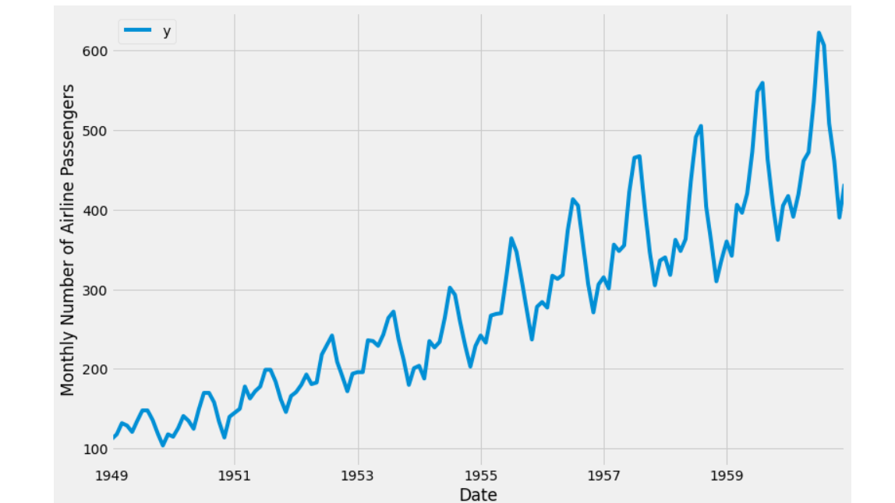

# Introduction to Time Series Forecasting with Prophet

# Introduction
Prophet algorithm is defined as a technique for forecasting statistic facts supported an additive version wherein non-linear traits are in shape with yearly, weekly, and every day seasonality, plus vacation outcomes.  It works fine with statistic which have sturdy seasonal outcomes and numerous different seasons of historic facts. Prophet is robust to lacking facts and shifts in the trend, and commonly handles outliers well. 
The cool thing about this algorithm is that it's veritably flexible when it comes to the data that's fed to the algorithm. You can have NAs and do n’t need to have all the dates and times linedup. 
The Prophet library is an open- source library designed for making vaticinations for univariate time series datasets. It's easy to use and designed to automatically find a good set of hyperparameters for the model in an trouble to make skillful vaticinations for data with trends and seasonal structure by dereliction. 

The basic objective of the time series analysis is to work out a model that describes the pattern of the statistic and will be used for forecasting.

# Implementation
To use Fbprophet one must have a few libraries already installed within the system like Pandas, Matplotlib, Numpy, Warnings (exceptional), and Jupyter Notebook. 
The steps involved in carrying out predictive analysis with the Fbprophet library are: 
1. Importing the necessary libraries
2. Load the Dataset with the help of the Pandas library.
3. Data Preprocessing
4. Fitting/Training the whole model under the Prophet library.
5. Creating new data with the help of the Prophet and then predicting the output on this new data.
6. Plot the forecast as obtained.

# Data Visualization
1. 

2. 
 
3. 
 
4. 

# Advantages of Time Series Forecasting with Prophet
1. Accurate and also fast - Prophet is accurate and fast. It is utilized in many applications across Facebook for producing reliable forecasts for planning and goal setting. 
2. Fully automatic - Prophet is fully automatic. We will get an inexpensive forecast on messy data with no manual effort. 
3. Tunable forecasts - Prophet produces adjustable forecasts. It involves many possibilities for users to tweak and adjust forecasts. We can utilize human-interpretable parameters to improve the forecast by adding it to our domain knowledge. 
4. Available in Python - We can implement the Prophet procedure in R or Python. 
5. Handles differences due to the season well - Prophet accommodates seasonality with multiple periods. 
6. Robust to outliers - it's robust to outliers. It handles outliers by removing them. 
7. Robust to missing data - Prophet is resilient to any quite missing data.

# Conclusion
• In this tutorial, we defined and explained the way to use the Prophet library to perform statistic forecasting in Python. 
• We are using out-of-the box parameters, but Prophet enables us to specify more arguments. 
• Generally, Prophet provides the functionality to bring your own knowledge about statistic to the table.

# References
1.	https://facebook.github.io/prophet/
2.	https://facebook.github.io/prophet/docs/quick_start.html	
3.	https://peerj.com/preprints/3190.pdf
