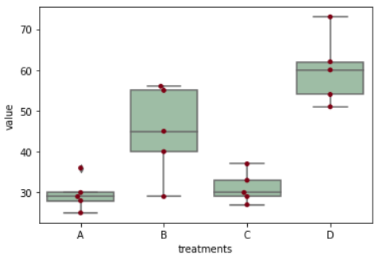
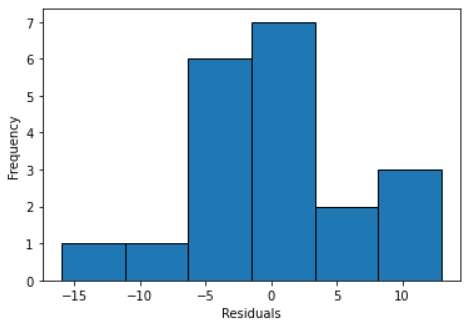
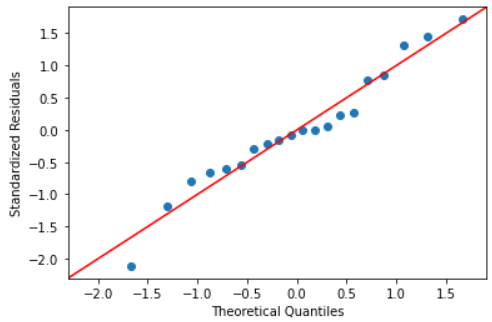

# ANOVA(Analysis of Variation)
# Video Link : [Video Link](https://drive.google.com/file/d/1v3BLTe7q4YjRMU5wj8n358sGY5sUdEZt/view?usp=sharing)
# Introduction
# What is ANOVA?
Analysis of Variance (ANOVA) is a parametric statistical method used to evaluate the statistics sets. This method became invented with the aid of using R.A. Fisher, consequently it's also referred as Fisher’s ANOVA. It is comparable strategies including t-take a look at and z-take a look at, to evaluate approach and additionally the relative variance among them.
# Types of ANOVA
1.	One-Way ANOVA:One-way ANOVA is mostly the foremost used method of performing the ANOVA test. it's also mentioned as one-factor ANOVA, between-subjects ANOVA, and an independent factor ANOVA. it's used to compare the means of two independent groups using the F-distribution.
Two do the one-way ANOVA test, you must necessarily have just one variable quantity with a minimum of two levels. One-way ANOVA doesn't differ much from t-test.
Example where one-way ANOVA is used
Suppose an educator wants to understand how good he has been in teaching with the scholars. So, he can split the scholars of the category into different groups and assign different projects associated with the topics taught to them.
He can use one-way ANOVA to check the common score of every group. He can get a rough understanding of topics to show again. However, he won’t be able to identify the scholar who couldn't understand the subject.

2.	Two-Way ANOVA:Two-way ANOVA is administered once you have two independent variables. It is an extension of one-way ANOVA. You can use the two-way ANOVA test when your experiment features a quantitative outcome and there are two independent variables.

3.	N-Way ANOVA (MANOVA):When we've more than one or greater than independent variables, we use MANOVA. The most important reason of the MANOVA take a look at is to discover the impact on dependent/reaction variables towards a change in the IV.
# Assumptions of ANOVA
Though it's been mentioned withinside the conceptual element simply to reiterate it ought to be ensured that the subsequent assumptions should be fulfilled: 
1.	The populations from in which samples had been drawn ought to observe a everyday distribution. 
2.	The samples had been decided on randomly and independently. 
3.	 Each organization ought to have not unusualplace variance i.e. ought to be homoscedastic i.e. the range withinside the based variable values inside distinct organizations is equal. 

It ought to be stated that the Linear Model utilized in ANOVA isn't laid low with minor deviations withinside the assumptions specifically if the pattern is large.
# Steps to be Followed
1.	Import Required Libraries
2.	Load the Dataset
3.	Interpretation
4.	Test ANOVA Assumptions
5.	Conclusion
# Data Visualization
1.  
2.  
3. 
# Uses of ANOVA
- To check correlation and regression
- To observe the homogeneity withinside the case of two-manner classification. 
- To check the importance of the more than one correlation coefficient. 
- To check the linearity of regression.
# Advantages
- Suitable for multidimensional variables.
- Analysis of varied factors at a time.
- Can be utilized in 3 or quite 3 groups
# Disadvantages
- It is hard to investigate ANOVA below strict assumptions concerning the character of data. 
- It isn't so beneficial in assessment with the t-take a look at that there may be no unique interpretation of the importance of means. 
- The requirement of the post-ANOVA t-take a look at for in addition testing.
# Applications
- Lean-Six Sigma/operational efficiency.
- Comparing the mileage of various vehicles, and also an equivalent vehicle under different fuel types.
- Understanding the impact of temperature, pressure, or reaction (power reactors, chemical plants, etc).
- Understanding the performance, quality, or speed of producing processes supported the amount of cells.
# Conclusion
ANOVA-based approaches require at least interval data for the dependent variable. 

