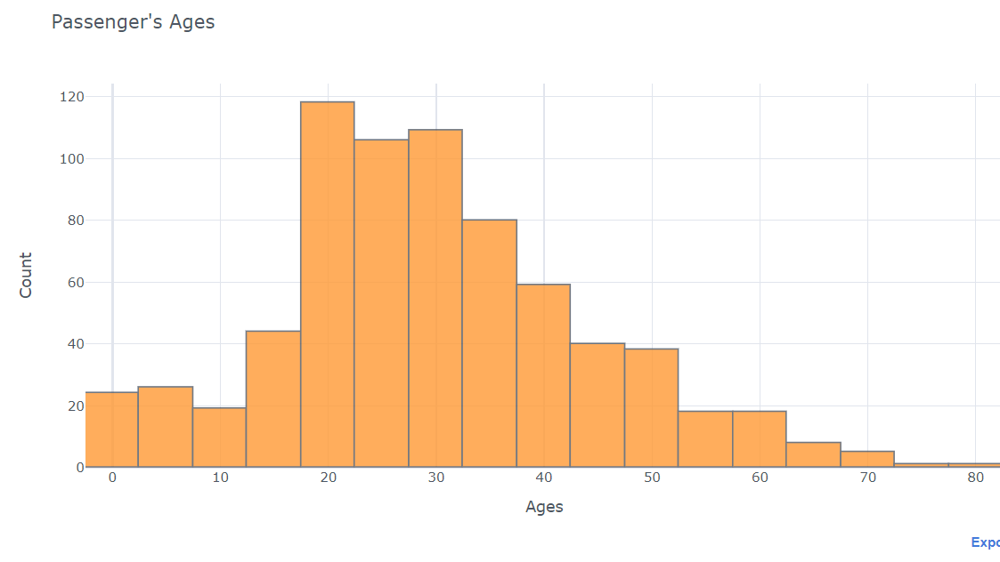
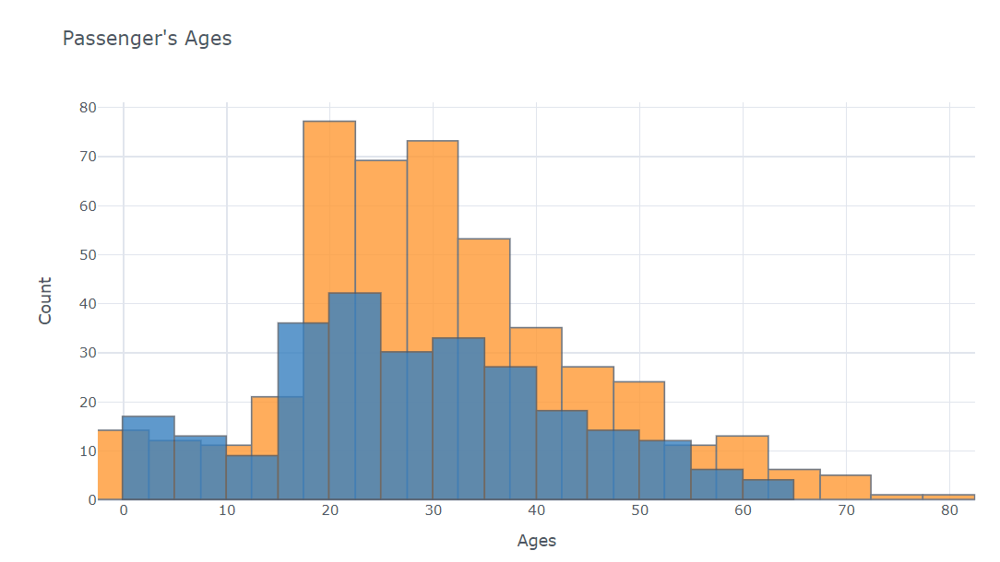
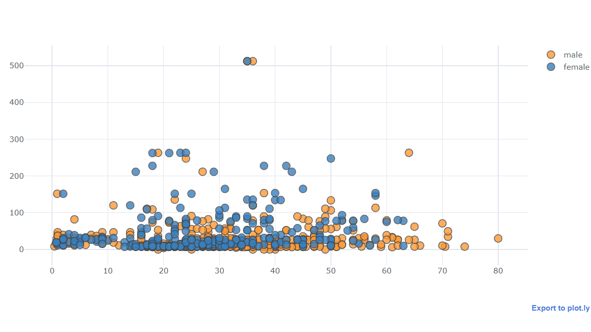

# Introduction to Plotly and Cufflinks

# Video Link : [Intoduction to Plotly and Cufflinks](https://drive.google.com/file/d/1Itgtqt6HHwswTjJS1CGe9MHz6cas4TMh/view)

# Introduction
Data is everywhere in today’s world of knowledge , and that we can only enjoy it if we will extract information from data. Data visualization is that the most visually appealing aspect of knowledge analysis because it allows us to interact with the info . It’s that magical technique for conveying information to large groups of individuals during a single glance and creating interesting stories out of knowledge . Pandas is one among the foremost popular and widely used data analysis tools in Python. It also features a built-in plot function for samples. When it involves interactive visualization, however, Python users who don’t have front-end engineering skills may have some challenges, like many libraries, like D3, chart.js, require some javascript knowledge. Plotly and Cufflinks are available handy at now .

Plotly is described as a Python library that's used to layout graphs, particularly interactive graphs. It can plot numerous graphs and charts like histogram, barplot, boxplot, spreadplot and lots of more.They are in particular utilized in information evaluation in addition to economic evaluation. plotly is defined as an  interactive visualization library.

Cufflink connects plotly with pandas to make graphs and charts of dataframes directly. It’s generally a plug-in.Cufflinks connects Plotly with pandas to offer the interactive understanding visualizations.

# Libraries Used
* Pandas
* Seaborn
* Matplotlib
* Plotly
* Cufflinks

# plotted Graphs
1. Histogram

2. Histogram2

3. Boxplot

4. Scatter Plots

5. Bubble Chart

6. Bar Graph

7. Surface plot

# Advantages of  Plotly and Cufflinks
* Dynamic Plots
* Hosting Service
* Requires only a single line of code to make plots
* It works 100% offline

# Conclusion
As we’ve seen, both Plotly and Cufflinks are often powerful tools in their title , although they are available with their own quirks and challenges. If we would like something quick to use within the Jupyter notebook, we might reach to the new Plotly and Cufflinks framework..
