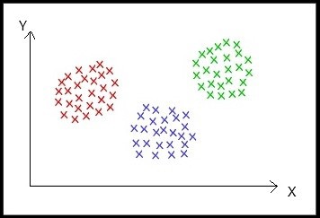
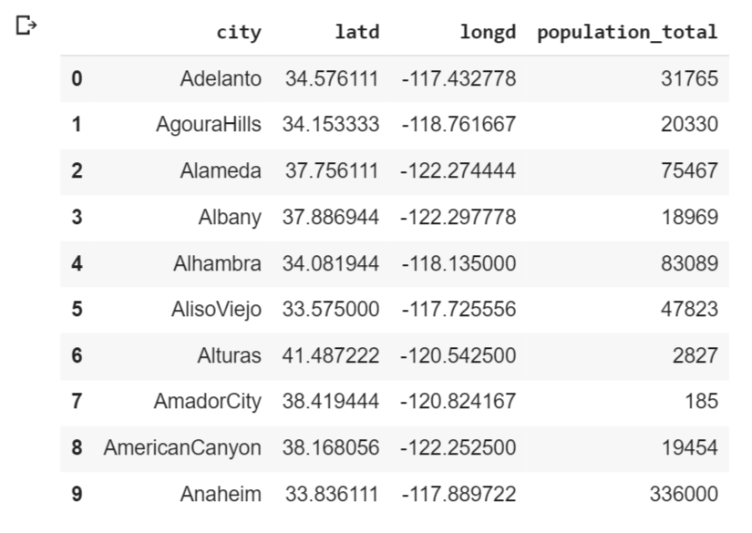
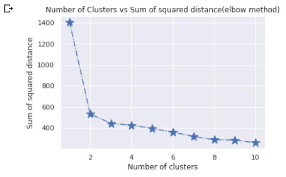
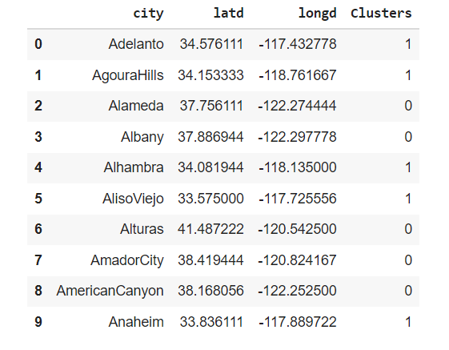
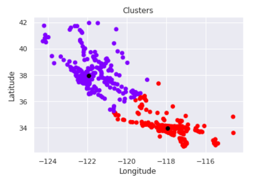
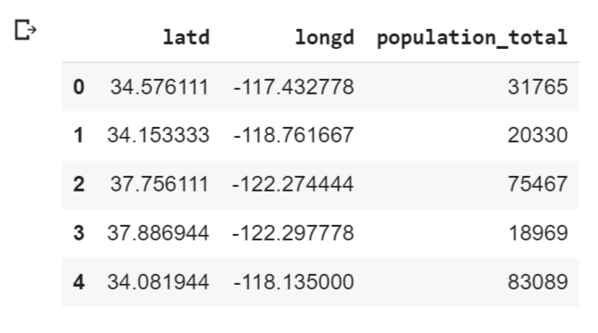
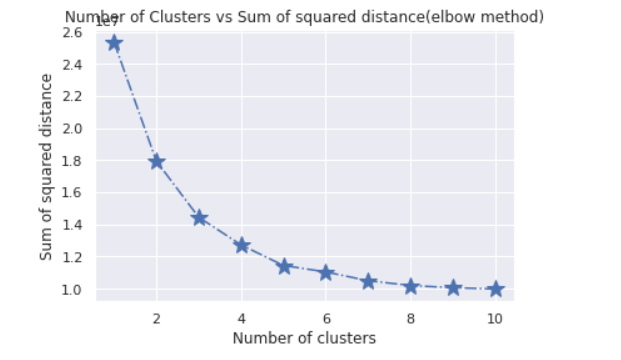
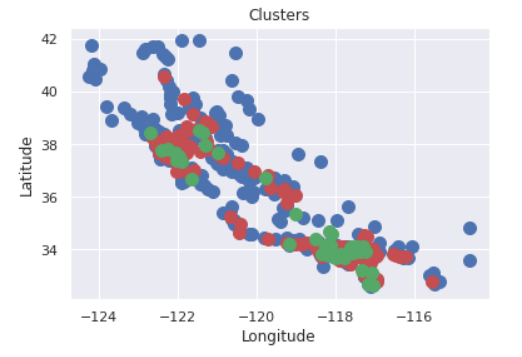

# K Medoid Algorithm
## Video Link: [K Medoid Algorithm](https://drive.google.com/file/d/1bV7gg0ftD9WnGoDLvxsLRDjDIVJ_Rmj6/view?usp=sharing)

Clustering is an unsupepervised learning method in which we form the dataset into cluster of items or group of items on the basis of similarity or dissimilarity between the items or objects. In other words, we form groups several groups of items or objects such that each group has its the similar items/objects while rest of the items which are dissimilar are in some other group. In an unsupervised method, we are not given any pre defined labels and we have to infer the given dataset to form labelled sets. Same is being done here. We will not be given any predefined label and we have to label our clusters in such a way that all similar objects should be toegther in each cluster and the data point from different cluster should be as different as possible.

Here, I will be trying to explain a basic and an important clustering algorithm called K Medoids clustering Algorithm.
## What is K Medoids Algorithm
K-medoids is a clustering algorithm which is median-based where we find the distance between the cluster centers and different points/objects. We assign a particular point/object to that cluster with which the distance the between point and cluster center is minimum. In K-Medoids, each cluster is represented by a medoid or the cluster median which is part of the dataset and not out of the dataset.



Example: Let us consider the example of a courier company which is currently having only one delivery center in a town/village. Now, the load on that delivery center is increasing as the parcels and letters are incoming and outgoing. The company wants to make few more centers so that they each center can target its own neighbourhood which is very near and doesn't need to interfere with parcels intended for other locality which is nearer to some other center. How can company do this? Here comes the k medoids clustering to rescue. The company will first see how many delivery center does it want in the town/village. Then it will form clusters that will be several areas and each cluster's medoid will be the delivery center. Like, in above image the three clusters will cater three different localities and will not interfere with each other and together three delivery center can divide the load instead of one center taking all load. The only difference between K means clustering and k medoids clustering is the centroid being cluster mean in k means and medoid be cluster median in k medoids.

## Algorithm/Working for K-Medoids clustering
- Step 1: Choose the number of clusters (k) you want.
- Step 2: Start with k medoids by selecting k random objects as medians.
- Step 3: Compute distance from every point from medoid and cluster them accordingly.
- Step 4: Adjust medoids such that they become center point of the cluster just formed.
- Step 5: Again re-cluster every point based on their distance with medoids.
- Continue above steps until stopping criteria is not met.
- As soon as stopping criteria is met, stop and the clusters present are final clusters or the results we require.

## Stopping Criteria for K Medoids Clustering
- Medoids of the newly points cluster have not changed
- Points in a clusters do not change their location.
- Maximum number of iterations are done.


## Requirements for implementing K medoids clustering
- pandas and numpy to handle dataframe
- Plotting libararies like matplotlib and seaborn to visualize data.
- KMedoids from sklearn_extra.clusters for implementing clustering and creating model
	- to download scikit learn extra, use ```!pip install scikit-learn-extra```
	- import statement for KMedoids is: ```from sklearn_extra.cluster import KMedoids```

#### Few important parameters of sklearn_extra.cluster.KMedoids() are:
- n_clusters: int, default=8  
The number of clusters to form as well as the number of medoids to generate.
- metric: string, or callable, optional, default: ‘euclidean’  
What distance metric to use
- init: {‘random’, ‘heuristic’, ‘k-medoids++’, ‘build’}, optional, default: ‘build’  
Specify medoid initialization method.
- max_iter: int, optional, default  
Specify the maximum number of iterations when fitting.
- random_state: int, RandomState instance or None, optional  
Specify random state for the random number generator

#### Few important attributes of sklearn_extra.cluster.KMedoids() are:
- cluster_centers_: array, shape = (n_clusters, n_features)  
Cluster centers, i.e. medoids (elements from the original dataset)
- medoid_indices_: array, shape = (n_clusters,)  
The indices of the medoid rows in X
- labels_: array, shape = (n_samples,)  
Labels of each point
- inertia_: float
Sum of distances of samples to their closest cluster center.

## Implementing K Medoids Algorithm

Importing necessary libraries
```
import pandas as pd
import matplotlib.pyplot as plt
import seaborn as sns
sns.set()
import numpy as np
from sklearn_extra.cluster import KMedoids
```

Reading csv file
```
data=pd.read_csv('california_cities.csv')
data.head(10)
```

## Clustering on basis of two variables

Plotting scatter plot for unclustered data

```
plt.scatter(data['longd'],data['latd'])
plt.ylabel('Latitude')
plt.xlabel('Longitude')
plt.title('California cities latitude and longitude')
plt.show()
```


Selecting numeric columns to apply k medoids
```
x=data.iloc[:,1:3]
x.head()
```


**Using elbow method to find optimal number of clusters**
```
ssd=[]
for i in range(1,11):
    kmed=KMedoids(n_clusters=i)
    kmed.fit(x)
    ssd_iter=kmed.inertia_
    ssd.append(ssd_iter)
```
```
number_clusters=range(1,11)
plt.plot(number_clusters,ssd,marker='*',linestyle='-.',markersize=15)
plt.title('Number of Clusters vs Sum of squared distance(elbow method)')
plt.xlabel('Number of clusters')
plt.ylabel('Sum of squared distance')
plt.show()
```


*From above plot, we can see that number of clusters equals 2 is the optimal number. Hence, building model with n_clusters=2*
```
kmed=KMedoids(n_clusters=2)
kmed.fit_predict(x)
```

Assigning new column as cluster label in the dataframe from the model we built and fit the data
```
clustered_data=data.iloc[:,0:3].copy()
clustered_data['Clusters']=kmed.labels_
```

Dataframe along with cluster label are:  
```
clustered_data.head(10)
```


**Plotting new scatter plot along with clustered data and medoids of cluster**
```
plt.scatter(clustered_data['longd'],clustered_data['latd'],c=clustered_data['Clusters'],cmap='rainbow')
plt.title("Clusters")
plt.xlabel("Longitude")
plt.ylabel("Latitude")
#plotting cluster medians
plt.scatter(kmed.cluster_centers_[:,1], kmed.cluster_centers_[:,0], c = 'black')
plt.show()
```


**The above steps was for dataset which needs to be clustered on the basis of only 2 parameters.**

## To cluster dataset on the basis of 3 or more parameters, follow below steps
Selecting numerical columns to apply k medoids 
```
x=data.iloc[:,[1,2,3]]
x.head()
```


**Using elbow method to find optimal number of clusters**
```
ssd=[]
for i in range(1,11):
    kmed=KMedoids(n_clusters=i)
    kmed.fit(x)
    ssd_iter=kmed.inertia_
    ssd.append(ssd_iter)
```
```
number_clusters=range(1,11)
plt.plot(number_clusters,ssd,marker='*',linestyle='-.',markersize=15)
plt.title('Number of Clusters vs Sum of squared distance(elbow method)')
plt.xlabel('Number of clusters')
plt.ylabel('Sum of squared distance')
plt.show()
```


*From above plot, we can see that number of clusters equals 3 is the optimal number. Hence, building model with n_clusters=3*

```
kmed=KMedoids(n_clusters=3)
y=kmed.fit_predict(x)
```

**Plotting Scatter plot for clustered data on basis of 2 or more attributes**
```
x=x.to_numpy()
plt.scatter(x[y==0,1],x[y==0,0],s=100,c='b')
plt.scatter(x[y==1,1],x[y==1,0],s=100,c='r')
plt.scatter(x[y==2,1],x[y==2,0],s=100,c='g')
plt.title("Clusters")
plt.xlabel("Longitude")
plt.ylabel("Latitude")
plt.show()
```


## Applications of K medoids clustering
- Firstly, the courier company example for deciding where to open delivery center area. :)
- It is used in the clustering of documents to identify the compatible documents in the same place. 
- It is helpful in the business sector for recognizing the portions of purchases made by customers, also to cluster movements on apps and website.
- Clustering forms a backbone of search engines. When a search is performed, the search results need to be grouped, and the search engines very often use clustering to do this.
There are many more applications. You can always refer internet to know more

## Advantages of K Medoids Clustering
- It is simple to understand and easy to implement.
- K-Medoid Algorithm is fast and converges in a fixed number of steps.
- K Medoid algorithm is less sensitive to outliers than other partitioning algorithms.

## Disadvantages of K Medoids Clustering
- Sometimes, it is quite tough to forecast the number of clusters, or the value of k.
- It may obtain different results for different runs on the same dataset because the first k medoids are chosen randomly.
- It is not directly applicable to categorical data

## Conclusion
At last, we can conclude that K medoids algorithm, like all other algorithms have its own set of applications, advantages and disadvantages. However, the presence of advantages itself are enough to give the importance this algorithm deserves and this algorithm has edge over k means as k means get affected because of outlier but this algorithm is less sensetive to outliers which is major advantage. At last,I would encourage everyone to learn this algorithm and implement it.  
Thankyou

*To learn more about KMedoids, you can visit [this link](https://scikit-learn-extra.readthedocs.io/en/stable/generated/sklearn_extra.cluster.KMedoids.html)*

***Contribution by : Shubham Patel***
