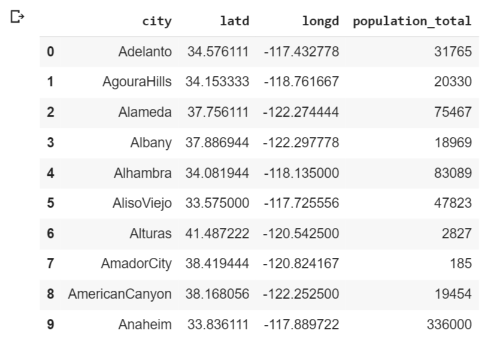

# K Means Clustering Algorithm
## Video Link: [K Means Clustering Algorithm](https://vimeo.com/620725562)

Clustering is an unsupepervised learning method in which we form the dataset into cluster of items or group of items on the basis of similarity or dissimilarity between the items or objects. In other words, we form groups several groups of items or objects such that each group has its the similar items/objects while rest of the items which are dissimilar are in some other group. In an unsupervised method, we are not given any pre defined labels and we have to infer the given dataset to form labelled sets. Same is being done here. We will not be given any predefined label and we have to label our clusters in such a way that all similar objects should be toegther in each cluster and the data point from different cluster should be as different as possible.

Here, I will be trying to explain the most basic and important clustering algorithm called K Means clustering Algorithm.
## What is K Means Clustering Algorithm
K-means is a clustering algorithm which is centroid-based or we can say is based on the center point of each cluster, along with distance-based or we can say the distance between the cluster center explained above and points in a cluster , where we calculate the distances to assign a point to a cluster. In K-Means, each cluster is represented by a centroid or the cluster mean.


Example: Let us consider the example of a courier company which is currently having only one delivery center in a town/village. Now, the load on that delivery center is increasing as the parcels and letters are incoming and outgoing. The company wants to make few more centers so that they each center can target its own neighbourhood which is very near and doesn't need to interfere with parcels intended for other locality which is nearer to some other center. How can company do this? Here comes the k means clustering to rescue. The company will first see how many delivery center does it want in the town/village. Then it will form clusters that will be several areas and each cluster's centroid will be the delivery center. Like, in above image the three clusters will cater three different localities and will not interfere with each other and together three delivery center can divide the load instead of one center taking all load.

## Algorithm/Working for K-Means clustering
- Step 1: Choose the number of clusters (k) you want.
- Step 2: Start with k centroids by putting them at random place.
- Step 3: Compute distance from every point from centroid and cluster them accordingly.
- Step 4: Adjust centroids such that they become center point of the cluster just formed.
- Step 5: Again re-cluster every point based on their distance with centroid.
- Continue above steps until stopping criteria is not met.
- As soon as stopping criteria is met, stop and the clusters present are final clusters or the results we require.

## Stopping Criteria for K Means Clustering
- Centroids of the newly points cluster have not changed
- Points in a clusters do not change their location.
- Maximum number of iterations are done.


## Requirements for implementing K means clustering
- pandas and numpy to handle dataframe
- Plotting libararies like matplotlib and seaborn to visualize data.
- KMeans from sklearn.cluster for implementing clustering and creating model
	- import statement is: ```from sklearn.cluster import KMeans```

#### Few important parameters of sklearn.cluster.KMeans() are:
- n_clusters: int, default=8  
The number of clusters to form as well as the number of centroids to generate.
- init: {‘k-means++’, ‘random’}, callable or array-like of shape (n_clusters, n_features), default=’k-means++’  
Method for initialization
- n_init: int, default=10  
Number of time the k-means algorithm will be run with different centroid seeds. The final results will be the best output of n_init consecutive runs.
- max_iter: int, default=300  
Maximum number of iterations of the k-means algorithm for a single run.
- random_state: int, RandomState instance or None, default=None  
Determines random number generation for centroid initialization. 

#### Few important attributes of sklearn.cluster.KMeans() are:
- cluster_centers_: ndarray of shape (n_clusters, n_features)  
Coordinates of cluster centers
- labels_: ndarray of shape (n_samples)  
Labels of each point
- inertia_: float  
Sum of squared distances of samples to their closest cluster center.
- n_iter_: int  
Number of iterations run.

## Implementing K Means clustering

Importing necessary libraries
```
import pandas as pd
import matplotlib.pyplot as plt
import seaborn as sns
sns.set()
import numpy as np
from sklearn.cluster import KMeans
```

Reading csv file
```
data=pd.read_csv('california_cities.csv')
data.head(10)
```

## Clustering on basis of two variables

Plotting scatter plot for unclustered data

```
plt.scatter(data['longd'],data['latd'])
plt.ylabel('Latitude')
plt.xlabel('Longitude')
plt.title('California cities latitude and longitude')
plt.show()
```


Selecting numeric columns to apply k means 
```
x=data.iloc[:,1:3]
x.head()
```


**Using elbow method to find optimal number of clusters**
```
ssd=[]
for i in range(1,11):
    kmeans=KMeans(n_clusters=i,init='k-means++',max_iter=300,n_init=10)
    kmeans.fit(x)
    ssd_iter=kmeans.inertia_
    ssd.append(ssd_iter)
```
```
number_clusters=range(1,11)
plt.plot(number_clusters,ssd,marker='*',linestyle='-.',markersize=15)
plt.title('Number of Clusters vs Sum of squared distance(elbow method)')
plt.xlabel('Number of clusters')
plt.ylabel('Sum of squared distance')
plt.show()
```


*From above plot, we can see that number of clusters equals 2 is the optimal number. Hence, building model with n_clusters=2*
```
kmeans=KMeans(n_clusters=2,init='k-means++',max_iter=300,n_init=10)
kmeans.fit_predict(x)
```

Assigning new column as cluster label in the dataframe from the model we built and fit the data
```
clustered_data=data.iloc[:,0:3].copy()
clustered_data['Clusters']=kmeans.labels_
```

Dataframe along with cluster label are:  
```
clustered_data.head(10)
```


**Plotting new scatter plot along with clustered data and centroids of cluster**
```
plt.scatter(clustered_data['longd'],clustered_data['latd'],c=clustered_data['Clusters'],cmap='rainbow')
plt.title("Clusters")
plt.xlabel("Longitude")
plt.ylabel("Latitude")
#plotting cluster centers
plt.scatter(kmeans.cluster_centers_[:,1], kmeans.cluster_centers_[:,0], c = 'black')
plt.show()
```


**The above steps was for dataset which needs to be clustered on the basis of only 2 parameters.**

## To cluster dataset on the basis of 3 or more parameters, follow below steps
Selecting numerical columns to apply k means 
```
x=data.iloc[:,[1,2,3]]
x.head()
```


**Using elbow method to find optimal number of clusters**
```
ssd=[]
for i in range(1,11):
    kmeans=KMeans(n_clusters=i,init='k-means++',max_iter=300,n_init=10)
    kmeans.fit(x)
    ssd_iter=kmeans.inertia_
    ssd.append(ssd_iter)
```
```
number_clusters=range(1,11)
plt.plot(number_clusters,ssd,marker='*',linestyle='-.',markersize=15)
plt.title('Number of Clusters vs Sum of squared distance')
plt.xlabel('Number of clusters')
plt.ylabel('Sum of squared distance')
plt.show()
```


*From above plot, we can see that number of clusters equals 3 is the optimal number. Hence, building model with n_clusters=3*

```
kmeans=KMeans(n_clusters=3,init='k-means++',max_iter=300,n_init=10)
y=kmeans.fit_predict(x)
```

**Plotting Scatter plot for clustered data on basis of 2 or more attributes**
```
x=x.to_numpy()
plt.scatter(x[y==0,1],x[y==0,0],s=100,c='b')
plt.scatter(x[y==1,1],x[y==1,0],s=100,c='r')
plt.scatter(x[y==2,1],x[y==2,0],s=100,c='g')
plt.title("Clusters")
plt.xlabel("Longitude")
plt.ylabel("Latitude")
plt.show()
```


This is one of the disadvantage of k means algorithm. There are outliers present because of which uneven clustering took place as you can see in the image above.

## Applications of K means clustering
- Firstly, the courier company example for deciding where to open delivery center. :)
- It is used in the clustering of documents to identify the compatible documents in the same place. 
- It is helpful in the business sector for recognizing the portions of purchases made by customers, also to cluster movements on apps and website.
- Clustering forms a backbone of search engines. When a search is performed, the search results need to be grouped, and the search engines very often use clustering to do this.
There are many more applications. You can always refer internet to know more

## Advantages of K Means Clustering
- It is very smooth in terms of interpretation and resolution.
- It can work on unlabeled numerical data.
- For a large number of variables present in the dataset, K-means operates quicker than other types of clustering.
- Uncomplicated to understand and yields the best outcomes when datasets are well distinctive (thoroughly separated) from each other.

## Disadvantages of K Means Clustering
- Sometimes, it is quite tough to forecast the number of clusters, or the value of k.
- K means is sensetive to outliers. Presence of outliers highly affect model.
- It is not directly applicable to categorical data since only operatable when mean is provided

## Conclusion
At last, we can conclude that K means algorithm, like all other algorithms have its own set of applications, advantages and disadvantages. However, the presence of advantages itself are enough to give the importance this algorithm deserves and I would encourage everyone to learn this algorithm and implement it.  
Thankyou

*To learn more about KMeans, you can visit [this link](https://scikit-learn.org/stable/modules/generated/sklearn.cluster.KMeans.html)*

***Contribution by : Shubham Patel***
