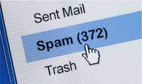
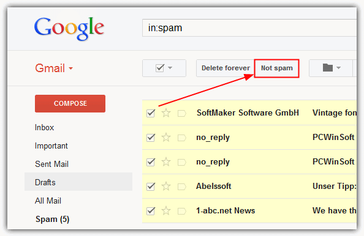

# Gmail Spam Detection

[Click here for the audio](https://drive.google.com/drive/folders/1HBRN420a-ZxXOX79oKJlPIjXlaTUXdbA?usp=sharing)

## What Is Gmail Spam?
No matter how long you’ve been using Gmail, you’ll have come across Gmail spam at some point. Despite their best efforts, some messages always make it through the sophisticated spam blocking processes.

The most common versions of Gmail spam are messages that try to get you to part with personal information or emails that contain malicious programs (usually in attachments) that try to steal your personal information.

Gmail uses a filtering functionality that attempts to identify these malicious emails and keep them away from your primary inbox. Not only does this keep you safe from cybercriminals, but it also stops you from wasting precious time and checking emails that aren’t legitimate.

## How Does Gmail Spam Work?
There are several ways in which Gmail tries to detect spam.

First, it checks the email of the sender against Gmail’s database of blacklisted domains.

If the email passes that (if the email or domain is unknown), Gmail will then check any links against its database of known malicious links and compare them to links in the incoming email.

After this, Gmail will also check for spelling and grammatical errors and go through its list of trigger words that are heavily featured in known spam emails.

Gmail also uses an in-house machine learning framework called Tensorflow – alongside some smart AI – to train new spam filters moving forward.

The introduction of this technology now means that Google can block an additional 100 million spam messages every day.

## Spam Detection
Whenever you submit details about your email or contact number on any platform, it has become easy for those platforms to market their products by advertising them by sending emails or by sending messages directly to your contact number. This results in lots of spam alerts and notifications in your inbox. This is where the task of spam detection comes in.

Spam detection means detecting spam messages or emails by understanding text content so that you can only receive notifications about messages or emails that are very important to you. If spam messages are found, they are automatically transferred to a spam folder and you are never notified of such alerts. This helps to improve the user experience, as many spam alerts can bother many users.



```
from sklearn.linear_model import LogisticRegression
from sklearn.metrics import accuracy_score

Spam_model = LogisticRegression(solver='liblinear', penalty='l1')
Spam_model.fit(message_train, spam_nospam_train)
pred = Spam_model.predict(message_test)
accuracy_score(spam_nospam_test,pred)
```
## How Do I Avoid Getting Marked as Spam by Gmail?
No software is perfect, and Gmail is no exception. While their spam filtering is arguably the best on the market, they can sometimes be a little overzealous and send emails to spam that don’t belong there.

So how do you avoid your emails going into spam? Here are five ways to help you prevent this issue:

- Check your domain name :

Gmail keeps a list of all malicious domain names. If your domain has been blacklisted, then you’re going to end up in spam automatically. You can check if your domain has been blacklisted.
- Check the content of the mail:

Gmail analyzes not only the spelling and grammar of emails to help spot spam, but also looks for trigger words like “cash,” “credit,” “passwords,” and many more. With this in mind, you should always proofread your emails before sending and check for too many trigger words. The odd one here and there isn’t going to result in your email landing in spam, but it’s always worth checking. Besides, poorly formatted emails with spelling errors never look good to the recipient.
- Forgo attachments and use cloud storage links:

Cybercriminals have long used attachments as a way of distributing malware. Gmail is well aware of this and has sophisticated methods of spotting these malicious attachments. That said, there are always some that slip through the next and end up in spam. If you use a service like Google Workspace, you may want to consider using shared links rather than large attachments.
- Getting whitelisted:

This is probably the only way you can ensure that your email doesn’t end up in spam. Unfortunately, you need to ask the recipient of the email to take action and add you to their whitelist. When they do, Gmail takes this as an obvious indication that the receiver of the email trusts you and your domain name.

## GMAIL, YAHOO AND OUTLOOK CASE STUDY
<b>Gmail</b>

Google data centers use thousands of rules to filter spam emails. They provide the weightage to different parameters, and basedc on that; they filter the mails. Google's spam classsifier is said to be a <i>state of an art technique</i> that uses various techniques like Optical character recognition, linear regression, and a combination of various neural networks.

<b>Yahoo</b>

Yahoo mail is the world's first free webmail service provider, which still has more than 320 million users. They have their own filtering techniques to categorize the emails. Yahoo's basic methods are URL filtering, email content and spam complaints from users. <b>Unlike Gmail, Yahoo filte r emails messages by domain and not the IP address. </b> Yahoo provides custom filtering options to users as well to directky send the mail in the junk folders.

<b>Outlook</b>

Microsoft-owned mailing platform widely used among professionals. In 2013, Microsoft renamed the Hotmail and Windows Live Mail to Outlook. At present, the outlook has mor ethan 400 million active users. Outlook has its own distinctive feature based on which it filters every incoming mail. Based on their official website, they have provided the list of spam filters they use to send any mail in the junk folder, which includes:
- Safe senders list
- Safe recipients list
- Blocked senders list
- Blocked Top-level domains list
- Blocked encodings list 

## RESOURCES AND REFERENCES
1. https://www.rightinbox.com/blog/gmail-spam-filter
2. https://towardsdatascience.com/spam-detection-with-logistic-regression-23e3709e522

## SUMMARY



As we saw, we used previously collected data in order to train the model and predicted the category for new incoming emails. This indicate the importance of tagging the data in right way. One mistake can make your machine dumb, e.g In your gmail or any other email account when you get the emails and you think it is a spam but you choose to ignore, may be next time when you see that email, you should report that as a spam. This process can help a lot of other people who are receiving the same kind of email but not aware of what spam is. Sometimes wrong spam tag can move a genuine email to spam folder too. So, you have to be careful before you tag an email as a spam or not spam.
