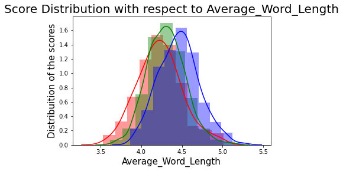

# Automated-Essay-Grading

## Abstract

Essays today are an important part of student evaluation. Nowadays , essays are being widely used to gauge students in various undergraduate/graduate level examinations. Evaluation and grading of essays comes as a major problem with human evaluation being slow , tedious , time taking thus making use of automated system imperative. In this paper, we will understand the essays and their evaluation criteria used for manual evaluation and attempts to develop similar algorithmic systems. We explore features and techniques to identify and differentiate essays and application of models based on machine-learning algorithms to grade these essays. We have used pre-trained neural network models in SpaCy to improve featurization. We have also used zipf’s law (a statistical formula based on discrete power law probability distribution) allowing us to compare differences between calculated scores of different essays and mirror the results with the law.Future scope involves improving relevance of feedback given to students and application of neural networks to make more accurate predictions.

## Introduction

The educational path of students involves assessments to evaluate their knowledge , essays being one of them. Essays allow students to express ideas and opinions hence are better suited over straight true/false questions. They help test the knowledge and the higher-order-thinking skills of students. Hence they are widely used means of assessing students , used by universities for enrollments. As manually grading the essay is costly , tedious and time consuming , it becomes imperative to use automated systems to make the evaluation efficient and allow faster and easier grading of the essays. Automated Essay Grading is a process of evaluating and grading essays using computer programs. [1]. These systems are used in many high stake assessments like GRE (Graduate Record Examination) , TOEFL (Test of English as a Foreign Language) , GMAT (Graduate Management Admission Test).These systems follow a supervised approach and build a model yielding quality of holistic grading comparable to that of humans. These systems learn the grading model based on a dataset of graded essays by humans. The dataset may have resolved scores (aggregate of essay scoring done by multiple people) or scores from individual human graders. These systems make use of certain properties of essays (called features) in order to estimate essay quality. In the grading process , these features are extracted and scores assigned according to manifestation of these features. Many kinds of features have been proposed for essay grading.[2]. They depend on degree of dependency to task , weakly dependent tend to be topic independent like length , connection , style while strongly dependent tend to follow the specific essay like the important words related to a topic. Association needs to be established between features and scoring values to estimate correct manifestation of these. Here , we aim to create a system that grades the essays consistent with methods and orientations of humans and achieve an efficient system of grading the essay replacing the humans thus leading to more efficient work.

## RELATED WORK

Automated Essay Grading has been rigorously studied from 1966 with Ellis page work on PEG and many more researchers from then have worked in the reduction of flaws in the essay grading models. In the researcher worked upon the edx Mooc courses and compared the holistic and rubric grading as compared to the instructor, this research gave credibility to the automated grading systems as the results showed that the difference between the holistic, rubric systems and the Instructor is minimal , while in . feature engineering was given emphasis on as they used PyEnchant spell checker with Linear regression model along with k-fold cross validation. In the researcher works with the SALDO lexicon for spell checking in Swedish language and also use a featurising metric OVIX lexical diversity measure along with Linear Discriminant Classifier and the results were effective as they got a good correlation as only 28 essays that comprises of 1.6% differ more than one step from the teacher’s grade although this work was done for the Swedish language the featurization can be used in the English language. The work came up with the classification of the features into strongly dependent and weakly dependent groups. Weakly Task dependent group contains length feature, occurrence of features, syntax , style , cohesion , error , readability , corpus similarity and task similarity while the strongly dependent features include the Set dependent features and Part of speech(POS). The task shows very low performance due to the much smaller amount of available training data, we get a mixed picture instead. It seems that even within a task, the full feature set overfits on specific words used in the training data. The kappa values are much lower for the English essays as was expected. The proposes a new way to automate the essay grading system using the neural networks. Learning vector Quantization is the method they used along with a feedback module. Now this paper also generalizes the fact that the feedback is necessary especially for the students who speak English as a foreign language. Uses a special word net feature like language fluency and they are trying to relate the word to the domain. Teachers don’t necessarily have all the domain knowledge and this feature can come in handy when the domain specific essays are to be evaluated. This current approach tries to model the language features like language fluency, grammatical correctness, domain information content of the essays, and put an effort to fit the best polynomial in the feature space using linear regression with polynomial basis functions

## PURPOSE

Automated grading means using machines to evaluate things typically evaluated by people. The automated portion refers to the use of machines, typically computers, while the scoring portion can be broadly defined. In the arena of education, scoring usually means numeric scores, classifications or grades for academic work, but can also include providing performance feedback; detailed analysis of the positive and/or negative characteristics of a response. Evaluating manullay consumes more time. Instead of manual evaluation if we use Automated grading system it takes less time to evaluate and increases efficiency.

## WORKING

With advances in computer technology, the possibility of grading essays with a computer has now become a reality. Automatic Essay Grading (AEg) allows teachers to assign scores to essays through computer analysis. It uses Natural Language Processing (NLP), a form of artificial intelligence enabling computers to comprehend and manipulate human language, to assess educational essays. An AEG program works by extracting features such as word count, vocabulary choice, error density, sentiment strength, sentence length variance, and paragraph structure of high scoring essays to create a statistical model of essay quality.  Comparing a student’s essay to that statistical model allows the system to estimate a score in 2 seconds or less.

## IMPLEMENTATION

### DATA AND EVALUATION

In this section we have discussed the detailed description of the datasets , tools and packages, preprocessing , featurization , feature selection and models used for the assessment of the essays in the dataset. The dataset used has almost 12976 essays with the average word length of 150-550 words per response. The basic architecture of the Automated Essay Grading model is shown in the Figure 1. First the essays is collected from the online platform and then the essay goes through basic cleaning then the essay is used for feature extraction from the corrected essay which is tokenized and then this essay will be lemmatized and and then feature selection is done to reduce the dimension of the data following it will be vectorised , then this the essay will be split into training and testing and then the model is trained through machine learning algorithms and then we can pass essays through the system for the assessment of the essays. Further description is stated in subsections.

 

## Dataset

We have taken the datasets from Hewlett foundation Competition in Kaggle . The dataset is divided into 8 sets , each having its own marking criteria , essay characteristics and qualities. Below , table 1 describes the different sets.

 

Different sets have different criteria followed for marking the essays

1.Set 1 - Essays are marked on providing elaboration and specific details , having strong organization and on fluency and transitional language.

2.Set 2 - Essays are marked for ideas and their unifying theme , structuring and flow into beginning , middle , end. Essays are also evaluated for vocabulary , writing techniques and presentation of perspectives to the audience.

3.Set 3 - Essays are marked for their ability to convey meaning based on demands , understanding of given questions and clarification beyond the literal.

4.Set 4 - Essays are marked for addressing the demands of the question , use of ideas/conclusions based on implication of question , ability to connect support to conclusion based on assertion made about the question.

5.Set 5 - Essays are marked for their clarity , completeness and accuracy of mood description created by the author.

6.Set 6 - Essays are marked for their accuracy of description for the specific topic from the excerpt (based on which they are written) stating all points/information related and mentioned in the excerpt. Emphasis is on including relevant and specific information.

7.Set 7 - Essays are marked for the story (as asked) on the topic given. Ideas and their cohesion with the topic is seen emphasizing all relevant details and specifics.

8.Set 8 - Essays are marked for clarity , focus and control. Emphasis is on main ideas that stand out. Also supporting resources are seen for credibility. Essay is viewed for explanation , inter-connections and insights and suitability of content for the audience.

## Software Tools and Packages

We chose to implement our model in Python 3 since there exist diverse set of open source libraries. We have used Natural Language Toolkit (NLTK) and SpaCy for most NLP tasks along with a language_check tool for the grammatical mistakes.Other Libraries such as sklearn,numpy, pandas,matplotlib,plotly,seaborne has been used for various tasks.

## Preprocessing

Essay grading requires to assess the error done by the students and to get the desired results the essays cannot be preprocessed on a lot of factors to maintain the originality of the essay , so only few steps are being taken into account for processing in the following order:

Lowercase: All of the words are changed to lowercase so that during part of speech tagging the model doesn’t change the meaning on different instances.

Special Characters are removed : Every special character except the ‘@’ symbol is removed from the essay as it is of no use in the essay assessment and featurization.

Removal of Stopwords: This processing step is used while correcting the essay as you can read in the next section after correcting the essay grammar then this step is used to identify and remove stopwords.

Lemmatization: The essay after correcting the errors and removal of stopwords is lemmatized to remove the inflectional endings and return the base or dictionary form of a word.

## Feature Extraction

We used mainly Spacy , language check and NLTK for the feature extraction. The essay grammatical errors were identified through the use of language check tool and the corrected essay was made as a feature of the dataset and then the following features were extracted from the corrected essay:

1.Grammatical errors: language check tool helps to identify the grammatical errors in the essay and then labels each error in a list.

2.Sentence : The corrected essay was tokenized to split the essay into a list of sentences using SpaCy sentence tokenizer.

3.Part of Speech : SpaCy is very efficient for such extraction ,it was used in place of NLTK as its pre-trained neural models help to efficiently identify the parts of speech for the corrected essays and to label them.

4.Named Entity Recognized: Essays prior to be used for the model had already been annotated by hiding the names of Entities using Stanford NLP and therefore converted them into several such entities identified by NER are: "PERSON", "ORGANIZATION", "LOCATION", "DATE", "TIME", "MONEY", "PERCENT" which start with a ‘@’ . Spacy was used for their identification .

5.TF-IDF: The corrected essays after the extraction of the prior stated features was then after lemmatizing with the help of Spacy was then vectorised with the help of sklearn library. It considers the importance of the word in the corpus and increases as the number of times that word occurs in the document.

6.Similarity Scores : The essays which were graded with higher marks in each set were compared with every other essay of the same set and the similarity score was generated by the help of SpaCy .

Several other features were extracted from these features such as token count , unique token count , not in stopword count (‘nostop_count’) , sentence count , named entity recognised count , comma , exclamation , quotation , ‘organisation’, ‘Caps’ , ‘location’, ‘money’, ‘time’, ‘date’, ‘percent’ , ‘noun’ , adjective (‘adj’) , pronoun (‘pron’), verb, conjunction (‘cconj’) , adverb (‘adv’) , Determiner (‘det’) , numeral (‘num’) , particle (‘part’) , interjection(‘intj’) counts.

## Feature Selection

After the extraction of the features from the essay the dimensionality of the model was reduced by the help of SelectKBest using Chi square method for each set of essay for which the result is stated in table 2.

 

To check the correlation of features within themselves such that the model prevents collinearity then visualization was used as stated in fig 2.

 

## RESULTS

 

 

 

 

 

## Models

We have experimented with four machine learning models i.e. Linear Support Vector Classification , Linear Regression , Random Forest Regressor and Elastic Net . Linear Support Vector derives a linear decision curve and does not accept a kernel whereas the simplest algorithm is the Linear Regression which uses stochastic gradient descent to find out the best fitting line for the model but it does not avoid overfitting as the dataset is tabulated with features Random forest regression can be very useful. To cure the problem of overfitting, Elastic Net can be used as it adds both types of regularization to Linear regression and the model can be very much useful.

## ADVANTAGES

AEG supervised by a human teacher is clearly advantageous. It takes much less time to score, ensuring that results and feedback can be provided instantly. This is especially important with university and college classes that are so large it would be almost impossible to give each student frequent, detailed, individualized feedback. Since feedback is immediate, students are able to submit work at any stage of the writing process, receive feedback, make improvements, and keep writing. They no longer need to wait the customary two weeks for a teacher to comment and suggest corrections.  As a result, students write more frequently and make more revisions—two essential keys to becoming a better writer.

Consistency of scoring is also an advantage. AEG grades each essay based on its own merits, and similar papers will receive the same grade. Computer scored essays are not subject to human bias and subjectivity. For example, when scored by a human rater, a student who is perceived as an “A” student may also receive an “A” on subsequent essays, even if they are not well-written. Likewise, a student who traditionally does not perform well on written assignments may receive a low grade, even though he/she constructed a well-written essay. Even the most well-meaning teacher can hold subconscious biases that affect students’ scores. An objective evaluation performed by computers can eliminate that bias. Many argue that AEG systems can be just as good at assessing writing as a human instructor. However, not everyone agrees.

## Conclusion

Automated essay scoring (AES) is the use of specialized computer programs to assign grades to essays written in an educational setting. Its objective is to classify a large set of textual entities into a small number of discrete categories, corresponding to the possible grades. Since feedback is immediate, students are able to submit work at any stage of the writing process, receive feedback, make improvements, and keep writing. They no longer need to wait the customary two weeks for a teacher to comment and suggest corrections.
