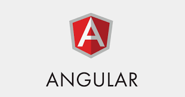

# Frontend Development By Angular

# Work to be done
 
## 1) Components (Week-1) 
- [x] Creating a component using the Angular CLI 
- [x] Creating a component manually 
- [x] Component LifeCycle 
- [x] Component Interaction 
- [x] Sharing Data between parent and child directives and components(@Input 
, @Output , Event Emitter) 
- [x] Dynamic Components 
 
## 2) Templates (Week-2) 
- [x] Interpolation 
- [x] Template Statements 
- [x] Pipes 
- [x] Property Binding 
- [x] Event Binding 
- [x] Two Way Data Binding 
 
3) Directives (Week-3) 
- [ ]  Built in Directives 
- [ ] Structural Directives 
- [ ] Attribute Directives 
 
4) Dependency Injection (Week-4) 
- [ ] Injecting Services 
- [ ] Dependency Injection tokens and Providers
- [ ] Dependency Injection in Actions
 
5) Routing and Navigation (Week-5) 
- [ ] How to generate an application with routing enabled? 
- [ ] Defining a route 
- [ ] Getting Router Info(Activated Route) 
- [ ] Wildcard routes 
- [ ] Setting up Redirects 
- [ ] Nesting Routes 
- [ ] Lazy Loading 
 
6) Forms (Week-6) 
- [ ] Types of Forms-Template, Reactive 
- [ ] Difference between both 
- [ ] Setup in Template Driven Forms 
- [ ] Setup in Reactive Forms 
- [ ] Form Control, Formbuilder 
 
7) HTTP Client (Week-7) 
- [ ] HttpClient Module 
- [ ] Setup for server communication 
- [ ] Observables 
- [ ] Requesting Data from server 
- [ ] Error Handling 
- [ ] Get,Post,Put requests 
- [ ] Interceptors 
 
8) CLI commands (Week-8) 
- [ ] Create a component 
- [ ] Create a service 
- [ ] Create a module 
- [ ] Build the application 
- [ ] Aot,jit
