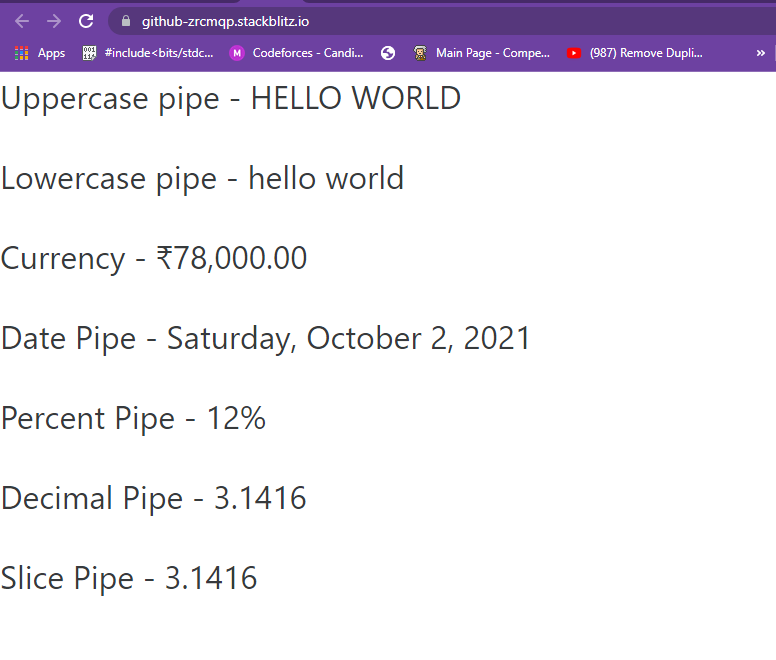
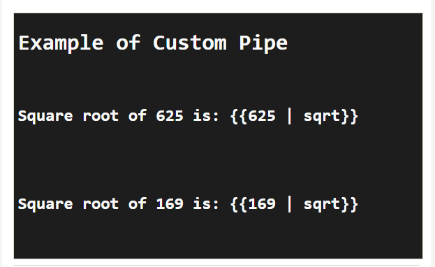

<p align="center"></p><br><br>

<h1 align="center"> Angular Pipes </h1>

## What are Angular pipes :-

The Angular Pipe takes the raw data as input and then transforms the raw data into some desired format. So in simple words, we can say that the angular pipes transform the data into a specific format before displaying them to the end-users.

Using the Pipe (|) operator, we can apply the pipes features to any of the property in angular application. There are so many built-in pipes provides by Angular Framework such as lowercase, uppercase, titlecase, decimal, date, percent, currency etc. It is also possible to create custom pipes.
___

## Angular Pipes Syntax :-

The syntax of the pipe is as follows :-

```javascript

Expression | pipeOperator[:pipeArguments]

```

### **Example :-**

Let us consider a few examples using pipes.

Here, we want to display the text given to uppercase. This can be done using pipes as follows −

In the app.component.ts file, we have defined the title variable −

**#app.component.ts**

```javascript

import { Component } from '@angular/core';
@Component({
   selector: 'app-root',
   templateUrl: './app.component.html',
   styleUrls: ['./app.component.css']
})

export class AppComponent {
   title = 'Angular 4 Project!';
}

```
The following line of code goes into the app.component.html file.

**#app.component.html**

```javascript

<b>{{title | uppercase}}</b><br/>
<b>{{title | lowercase}}</b>

```

### **Output :-**


<hr> 


## Why are they used? :-

As we already know every web application starts with a simple task: first get the data, then transform the data into some format, and finally, show the formatted data to the users.

Getting the data is very simple, you can create a local variable or a complex type to hold the data or even you may get the data from APIs.

Once you get the data, then you could show the raw data as it is to the end-user, but that will not make a good user experience. To get a good user experience we need to modify the raw data into some specific format and in such cases, Angular Pipes plays an important role.

<hr>

## Built in pipes :-

Angular provides some built-in pipes. The pipes are listed below −

* Lowercasepipe
* Uppercasepipe
* Currencypipe
* Datepipe
* Jsonpipe
* Percentpipe
* Decimalpipe
* Slicepipe

**Exmaple :-**

**#app.component.ts**

```javascript

import { Component, OnInit } from '@angular/core';  
  
@Component({  
  selector: 'app-custom-pipe-demo',  
  templateUrl: './custom-pipe-demo.component.html',  
  styleUrls: ['./custom-pipe-demo.component.css']  
})  
export class CustomPipeDemoComponent implements OnInit {  
  
  name:string="Jay";  
  
  salary:number=78000;  
  
  Date_Value = new Date();
  
  constructor() { }  
  
  ngOnInit() {  
  }  
  
} 

```

**#app.component.html**

```javascript  

<p>Uppercase pipe - {{ name | uppercase }}</p>

<p>Lowercase pipe - {{ name | lowercase }}</p>

<p>Currency - {{ salary | currency:'INR' }}</p>
  
<p>Date Pipe - {{ Date_Value | date: 'fullDate' }}</p>

<p>Percent Pipe - {{ 0.123456 | percent }}</p>
 
<p>Decimal Pipe - {{ 3.14159265 | number: '1.4-4' }}</p>
 
<p>Slice Pipe - {{ 3.14159265 | number: '1.4-4' }}</p>

```

### **Output :-**



<hr>

## Custom pipes :-

To create a custom pipe, create a new ts file and use the code according to the work you have to do. You have to import Pipe, PipeTransform from Angular/Core. Let's create a sqrt custom pipe.

Creating a Custom pipes :-  

### **Example :-**

**#app.component.ts**

```javascript

import {Pipe, PipeTransform} from '@angular/core';  
@Pipe ({  
  name : 'sqrt'  
})  
export class SqrtPipe implements PipeTransform {  
  transform(val : number) : number {  
    return Math.sqrt(val);  
  }  
}  

```

**#app.module.ts**

```javascript

import { BrowserModule } from '@angular/platform-browser';  
import { NgModule } from '@angular/core';  
import { AppComponent } from './app.component';  
import { NewCmpComponent } from './new-cmp/new-cmp.component';  
import { ChangeTextDirective } from './change-text.directive';  
import { SqrtPipe } from './app.sqrt';  
@NgModule({  
   declarations: [  
      SqrtPipe,  
      AppComponent,  
      NewCmpComponent,  
      ChangeTextDirective  
   ],  
   imports: [  
      BrowserModule  
   ],  
   providers: [],  
   bootstrap: [AppComponent]  
})  
export class AppModule { }  

```

**#app.component.html**

```javascript

<h1>Example of Custom Pipe</h1>  
<h2>Square root of 625 is: {{625 | sqrt}}</h2><br/>  
<h2>Square root of 169 is: {{169 | sqrt}}</h2>   

```

### **Output :-**



