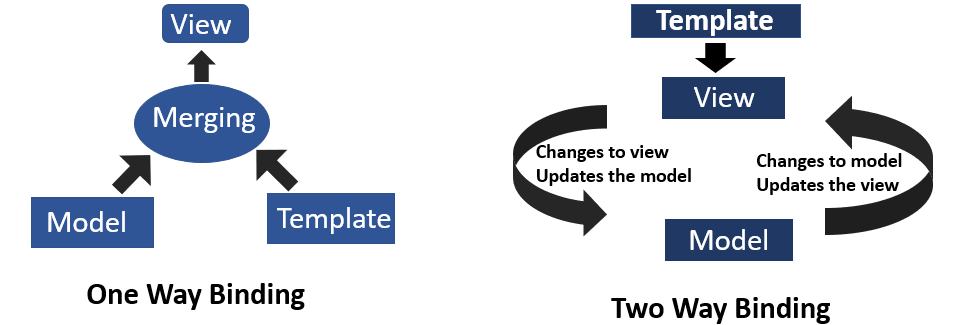

<p align="center">

</p>
<p>&nbsp;</p>

# What is Interpolation?

Before understanding interpolation we should first understand the concept of data binding because interpolation is a type of one-way data binding.
 <p>&nbsp;</p>

## **Data Binding**
>In simple words, data binding is a way of communication between the component and view.

Component refers to TypeScript file and view refers to HTML file. 
All the calculations, logics, etc. are written in the TypeScript file. If we want to display the result of these calculations to the user we want a way of communication between TypeScript file and the HTML file because the user can only see the HTML file.And for this purpose data binding is used.

There are two types of data binding := ```One-Way Data Binding  and  Two-Way Data Binding```
<p>&nbsp;</p>

In One-way data binding the data is binded from component to view (using property binding) or from view to component (using event binding).It is further divided into many types such as-
  1. String Interpolation
  2. Property Binding
  3. Event Binding
  4. Class Binding


In Two-way binding the data gets binded from component to view and from view to component
(basically, it is a combination of property and event binding).

<p>&nbsp;</p>
<p align="center">

</p>
<p>&nbsp;</p>

## **Understanding Interpolation and why it is used?**
This technique allows the user to bind a value to a UI element. By using interpolation we can dynamically change the application view. Double curly braces are used for displaying a component property in the respective view template.

<p>&nbsp;</p>

Suppose we have an Angular component that contains a variable given by organizationName: 
>src/app/app.component.ts

```
organizationName='GS';
``` 
<p>&nbsp;</p>
Now we can display the value of this variable in the corresponding component template by using interpolation:
<p>&nbsp;</p>

>src/app/app.component.html

```
<h3>Organization Name: {{organizationName}}</h3>

```
Here the result will be:
> Organization Name: GS
 <p>&nbsp;</p>
By using interpolation, we want angular to evaluate the content that is present inside the curly braces and display the value when the component gets rendered in the browser.

In the above example to change the value that is displayed in the application view, we just have to change the value of variable "organizationName" and that value will get updated automatically in the browser.

In TypeScript file:
>src/app/app.component.ts

```
organizationName='GirlScript';
``` 
<p>&nbsp;</p>
Here the value is changed from GS to GirlScript. Now in HTML file:

>src/app/app.component.html

```
<h3>Organization Name: {{organizationName}}</h3>

```

The HTML file is not changed but the result will be
> Organization Name: GirlScript


 
 This type of dynamic updation  is achieved using interpolation.

