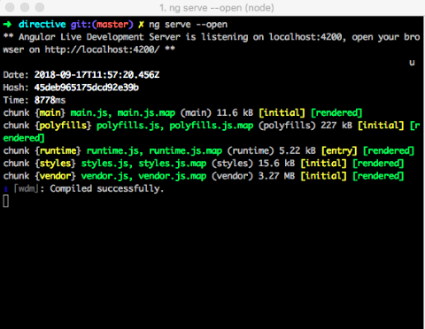
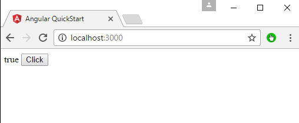
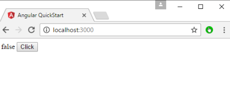

<p align="center"></p><br><br>

<h1 align="center"> Attribute Directives </h1>

## What is attribute directive?

An angular attribute directive can be simply described as a component without a template. Instead, it is directly using the element it is applied to.

Attribute directive also called custom directives are used when no additional template is needed. The directive can execute logic and apply visual changes to the element it is applied to. This is useful if you want to alter the behavior or style of existing HTML-elements, without wrapping them into a new component.

You can generate the attribute directive using the following command.

```javascript

ng g directive directive_name

```
___

## Building an attribute directive :-

* Install Angular using Angular CLI. First, create an angular project using the following command.

```javascript

ng new directive

```

* Now, go inside the folder.

```javascript

cd directive

```

* Generate the Angular Directive using the following command.

```javascript

ng g directive active

```

* The generated src/app/active.directive.ts is as follows:

```javascript

import { Directive } from '@angular/core';

@Directive({
  selector: '[appActive]'
})
export class ActiveDirective {

  constructor() { }

}

```
The imported Directive symbol provides the Angular @Directive decorator.

The @Directive decorator’s lone configuration property specifies the Directive’s CSS attribute selector [appActive].

* Import ElementRef from @angular/core. ElementRef grants direct access to the host DOM element through its nativeElement property.

* Add ElementRef in the directive's constructor() to inject a reference to the host DOM element, the element to which you apply appactive.

* Add logic to the activeDirective class that sets the background to yellow.

**#src/app/active.directive.ts**

```javascript

import { Directive, ElementRef } from '@angular/core';

@Directive({
  selector: '[appActive]'
})
export class ActiveDirective {

  constructor(el: ElementRef) {
    el.nativeElement.style.backgroundColor = 'Green';
  }
}

```

Now, we can use the Directive inside our HTML component. For example, write the following code in an app.component.html file.

```javascript

<p appActive>Active !!</p>

```

* Save the file and start the development server.

```javascript

ng serve --open

```



You can see that; we got the green background color of the text. This is cool because we have first created the custom directive and add that Directive to our HTML element.

Here, we have modified the DOM through the Angular Directive. In addition, we have changed the color of the p element through an angular attribute directive.
___

## Handle users events :-

In Angular, events such as button click or any other sort of events can also be handled very easily. The events get triggered from the html page and are sent across to Angular JS class for further processing.

Let’s look at an example of how we can achieve event handling. In our example, we will look at displaying a click button and a status property. Initially, the status property will be true. When the button is clicked, the status property will then become false.

* Change the code of the app.component.ts file to the following.

```javascript

import { 
   Component 
} from '@angular/core';  

@Component ({ 
   selector: 'my-app', 
   templateUrl: 'app/app.component.html' 
}) 

export class AppComponent { 
   Status: boolean = true; 
   clicked(event) { 
      this.Status = false; 
   } 
}

```

* Make the following changes to the app/app.component.html file, which is the template file.

```javascript

<div> 
   {{Status}} 
   <button (click) = "clicked()">Click</button> 
</div> 

```

* Save all the code changes and refresh the browser, you will get the following output.



* Click the Click button, you will get the following output.



<hr>

## How to pass value into an attribute directive?

* In active.directive.ts, import Input from @angular/core.

```javascript

import { Directive, ElementRef, Input, OnInit } from ‘@angular/core’;
 @Directive({
 selector: ‘[input-box]’
 })
 export class ActiveDirectives implements OnInit {
       @Input() name: string;
       @Input() value: string;
       constructor(private elementRef: ElementRef) {
       }
      ngOnInit() {
           console.log(“input-box keys : “, this.name, this.value);
      }
 }

```

now your directive has been created and you will have add this directive into your `app.module.ts` like below:

```javascript

 import { NgModule } from ‘@angular/core’;
 import { AppComponent } from ‘./app.component’;
 import { ActiveDirectives } from ‘../directives/Active.directive’;
 @NgModule({
      declarations: [
      AppComponent,
      TestDirectives
    ],
 imports: [],
 providers: [],
 bootstrap: [AppComponent]
 })
 export class AppModule { }

```

You will have to use your directive in your html and send data to the directive like in below code.
I am sending `name` and `value` to the `Active.directive.ts` .

```javascript

<div input-box [name]=”’lightcyan’” [value]=”’CYAN’”></div>

```

Now see the console or use data in the directive accordingly.
___

## Deactivate attribute directive processing :-

Add ngNonBindable to the host element. ngNonBindable deactivates interpolation, directives, and binding in templates.

In the following example, the expression {{ 10 + 10 }} renders just as it does in your code editor, and does not display 20.

```javascript

<p>Use ngNonBindable to stop evaluation.</p>
<p ngNonBindable>This should not evaluate: {{ 10 + 10 }}</p>

```

Applying ngNonBindable to an element stops binding for that element's child elements. However, ngNonBindable still lets directives work on the element where you apply ngNonBindable. In the following example, the appActive directive is still active but Angular does not evaluate the expression {{ 10 + 10 }}.

```javascropt

<h3>ngNonBindable with a directive</h3>
<div ngNonBindable [appActive]="'yellow'">This should not evaluate: {{ 10 + 10 }}, but will highlight yellow.
</div>

```
___
