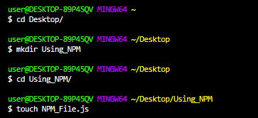

<p align="center">

</p>

<h1 align="center"> All About npm</h1>

# What is npm?
npm stands for Node Package Manager. It manage the packages that are created by developers and these packages can be used by anyone all around the world. The packages are bits of reusable code that someone else wrote. 

<p>&nbsp;</p>

# Why and Where should we use npm?
 The first question after getting the idea of what is npm will be why should we use it?
So the answer is simple it saves our time and effort that's required to write every bit of code on our own.

Using npm we can install various packages and resolve their various dependencies.

<p>&nbsp;</p>

## **Where should we use npm?**

Let us understand this by using a simple example :- Suppose you are building a house.The house must be having doors,fans,etc.Now what you can do is to take the raw materials like wood,nuts,bolts,etc and built the doors on your own or you can purchase a ready made door from the market.

Similarly while making an app either you can code every small component on your own or you can adapt packages of code for different components of your app using npm.Most commonly it is used to install,develop and publish node programs.


<p>&nbsp;</p>


# Installing Node.js and npm in local Machine using NVM

`npm actually gets bundled with Node,so installing node will lead to the installation of npm as well.`

To run different versions of node.js on your system without any hinderance you need to download the **node version manager**
<p>&nbsp;</p>

## **NVM Installation on Windows** 

To install or update nvm,you should run the [install script](https://github.com/nvm-sh/nvm#install--update-script) on your terminal.

If you face any problem with the installation you can check out the complete procedure [here](https://github.com/coreybutler/nvm-windows)

<p>&nbsp;</p>

To verify the installation use this command
```
command -v nvm
```

For installing node.js using nvm use this command
```
$ nvm install node 
```
For verifying the version of node use this command
```
$ node --version
```
<p>&nbsp;</p>

## **NVM Installation on OS X or Linux**
To install or update nvm,you should run the [install script](https://github.com/nvm-sh/nvm#install--update-script) on your terminal.

If you face any problem with the installation you can check out [this](https://github.com/nvm-sh/nvm#troubleshooting-on-linux).

<p>&nbsp;</p>

To verify the installation use this command
```
command -v nvm
```

For installing node.js using nvm use this command
```
$ nvm install node 
```
For verifying the version of node use this command
```
$ node --version
```
<p>&nbsp;</p>

# Using Node Installer for downloading Node.js

## **For Windows** 
Download the windows installer from the [Node.js](https://nodejs.org/en/download/current/) website.
Download the LTS(Long-Term Support) version.

<p>

</p>

Run the .msi file that you downloaded in previous step.
Accept the license agreement and and accept the default installation settings.


## **For macOs**
Download the Mac installer from the [Node.js](https://nodejs.org/en/download/current/) website.
<p>

</p>

Run the .pkg file that you downloaded in previous step.
Accept the license agreement and and accept the default installation settings.
<p>&nbsp;</p>

# npm CLI

There are a number of [npm CLI](https://docs.npmjs.com/cli/v7/commands) commands that are used by developers all around the world.

<p>&nbsp;</p>

## **Initialising npm from terminal**


Create a folder using the mkdir command.
</br>
Create a JavaScript file inside this folder using the touch command.

<p></p>

Now use this command for initialising npm 
```
npm init
```
After this you will get a number of entries to fill and you can fill them according to your preference. All this will lead to the creation of a file with name `package` in your main folder. Once you'll start installing external packages they'll also show up in this package file.

[Here](https://www.npmjs.com/) you can search your desired packages. 

<p>&nbsp;</p>

# Advantages of npm

- Contains 1.3 million packages that can be used by anyone around the world.
- You can publish your scoped public package to the npm registry.
- Manage multiple versions of code and code dependencies.
- Manage local dependencies of project tools.


