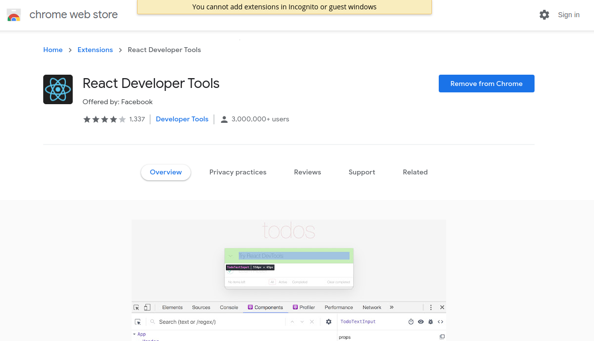

# React Dev Tools ⚛

## 1. What is React Dev Tools?

React Developer Tools is a Chrome DevTools extension for the open-source React JavaScript library.

React Developer Tools helps smoothly create interactive UIs and React is able to reconcile changes to the DOM in a performant way.

It helps to inspect and edit the React Component Tree (or component hierarchies) that builds the page, and for each component, one can check the props, the state, hooks, etc.

It works both with React DOM and React Native.

- --

## 2. Why is it needed?

Using React Dev Tools, it is possible to use breakpoints, step-through, and logging to debug a React app.

Following are the uses:

- Debug performance with the React Profiler and React Components.
- Detecting whether the application uses React.js:

  - Open the application, click on the extension tab and then on the React Developer Tools.
  - If the extension remained colorful that means it is built with React.js and if it’s colorless then that means the application hasn’t used React.js.

- Access React components and state from the console.
- --

## 3. Installation:

To download the Extension:

1. For Chrome: [Click here](https://chrome.google.com/webstore/detail/react-developer-tools/fmkadmapgofadopljbjfkapdkoienihi?hl=en) and for Mozilla: [Click here](https://addons.mozilla.org/en-US/firefox/addon/react-devtools/)

2. Click on **Add to Chrome**.

3. Now the tool has been added to Chrome. To remove the extension click on Remove from Chrome.

4. Go to the Extensions Tab at the right on the top, click on it. On the dropdown, one can see that the extension has been added.

- --

Clicking on the **Components**, the React Component Tree will show up.

Here, one can inspect, edit the props, the state and understand the structure.

Similarly, clicking on **Profiler**,

Profiler allows to record performance information.

- --
References:
1. [GeekforGeeks](https://www.geeksforgeeks.org/react-developer-tools/)

2. [Airbnb Website](https://www.airbnb.co.in/)
