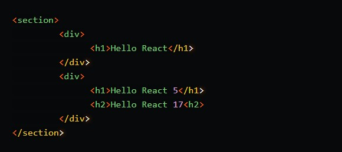
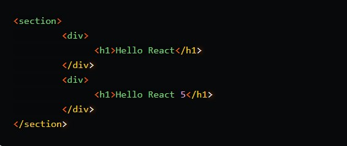
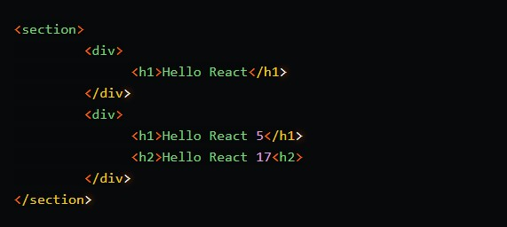
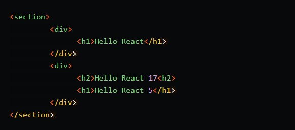
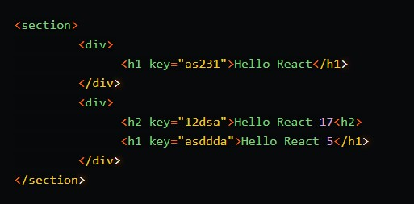

<h1 align="center"> Virtual DOM and Internals </h1>

## What is the Virtual DOM?
The virtual DOM is a representation of the real DOM that is stored in memory. Popular UI frameworks like React and Vue use a virtual DOM to speed up the *"diffing"* process of re-rendering UI components. Rendering engines can more efficiently identify what needs to be updated by comparing changes between a virtual DOM and the real DOM. Only the components that have changed are repainted, avoiding needless DOM node redrawing. Every element is redrawn without the virtual DOM, regardless of whether it has changed. Because redrawing elements is a time-consuming procedure, this gives DOM manipulation a significant speed gain.

In other terms, the virtual DOM (VDOM) is a programming concept in which a memory-based ideal, or "virtual," representation of a user interface is maintained and synchronised with the "real" DOM using a library like ReactDOM. The phrase "reconciliation" refers to the entire procedure.

This method makes it possible to use React's declarative API: You tell React what state you want the UI to be in, and it updates the DOM accordingly. This abstracts away the attribute manipulation, event handling, and manual DOM updates that you'd have to do otherwise to construct your app.

&nbsp;

## How Virtual DOM works ?
As a result, when the virtual DOM is updated, react compares the virtual DOM to a snapshot of the virtual DOM obtained just before the update.

With the assistance of this comparison, React determines which UI components require updating. Diffing is the term for this procedure. The diffing algorithm is the algorithm that is utilised in the diffing process.

React replaces the old DOM nodes with the modified DOM nodes after it determines which components have been changed.

Let's understand this with a Example.

&nbsp;

<strong>Initial DOM</strong>

&nbsp;

<strong>Updated DOM</strong>

&nbsp;

When the UI changes, react compares the new virtual DOM to the previous virtual DOM and notices that the content of the second `
` has changed, so it only updates the content of the second div in the actual DOM.

This procedure is quick since just one node has to be changed, rather than the entire UI being repainted.

But what happens if DOM components are added?

&nbsp;

Because just a node has been added to the second div in this case, React simply adds it to the real DOM.

But wait, the element was added at the very end of the div.

What if we add a top-level element?

&nbsp;

When compared to the pre-updated virtual DOM, the virtual DOM would repaint the entire second div since the first child in the second div was h1 and now it is h2, thus it doesn't simply add the new element, it replaces the entire div element.

Imagine there are 1000s of hierarchical components inside the second div tag instead of simply two. It will re-render the tens of thousands of components that haven't changed.

To resolve this problem, A key attribute is supported by React. React uses the keys to match children in the pre-updated virtual DOM when the children of React components have keys.

Let's examine how these keys help us solve our difficulty in the case above.

&nbsp;

In the second div, the react diffing algorithm now matches the component with the old key `asdda` and a new element with key `12dsa`. In this case, react just marks the new element, which is then added to the actual DOM. This eliminates the need for needless re-rendering of components that haven't changed.

&nbsp;

## How is Virtual DOM faster?

A virtual DOM, which is represented as a tree, is formed when new components are added to the UI. On this tree, each element is a node. A new virtual DOM tree is produced if the state of any of these components changes. This tree is then compared to the preceding virtual DOM tree, or `"diffed"`.

After that, the virtual DOM determines the most efficient way to make these modifications to the real DOM. This guarantees that just the most basic actions are performed on the actual DOM. As a result, the performance cost of updating the actual DOM is reduced.

The virtual DOM tree and the diffing procedure are depicted in the figure below.

&nbsp;

&nbsp;

The red circles represent the nodes that have changed. These nodes represent the UI elements that have had their state changed. The difference between the previous version of the virtual DOM tree and the current virtual DOM tree is then calculated. The whole parent subtree then gets re-rendered to give the updated UI. This updated tree is then batch updated to the real DOM.

&nbsp;

## Advantages of Virtual DOM

- ### *Optimized Memory Usage*

    Because it does not store observables in memory, the Virtual DOM makes better use of memory than other systems. Because of the Virtual DOM, every change in the data model might cause the virtual user interface to completely refresh. This is in stark contrast to other libraries' methods, which update documents as needed based on their current state.

- ### *CPU-Intensive*

    To make DOM changes visible to developers, the Virtual DOM adds a layer of scripting to the browser's optimizations. This approach of introducing an extra layer of abstraction makes React significantly more CPU-intensive than any other methods of updating the DOM.

- ### *Simplicity*

    From the standpoint of a coder, React and its Virtual DOM are more straightforward than most other ways to making JavaScript reactive. While React changes the DOM, pure JavaScript code updates React components. The data binding is not linked to the application in any way.

- ### *Greater Performance*

    In React.js, updating the Virtual DOM always improves speed. React.js builds the whole virtual DOM from scratch with the setStare() function. Because creating a complete tree takes such little time, it significantly improves performance. It might be argued that re-rendering the whole Virtual DOM every time there's a chance something has changed is inefficient. It's worth noting that React keeps two Virtual DOM trees in memory.

- ### *Efficiency*

    The Virtual DOM in React allows a web application's display to be updated more quickly. A new Virtual DOM representation of the user interface is produced each time the underlying data in a React project changes. The Virtual DOM is always quicker than the actual browser DOM when rendering the UI.

&nbsp;

## Is the Shadow DOM the same as the Virtual DOM?
`No, they're not the same`. The Shadow DOM is a browser feature that allows you to scope variables and CSS in web components. The virtual DOM is a notion that is implemented using JavaScript libraries on top of browser APIs.

&nbsp;

## What is “React Fiber”?
`React Fiber is a full rebuild of the React core that is backwards compatible. In other words, it's a reimplementation of previous React reconciler versions.`

Fiber Reconciler is a new reconciliation mechanism in React that was introduced in React 16. Fiber is a phrase that refers to React's data structure (or architecture), and it comes from the word 'fibre,' which is a representation of a DOM node.

### React Fiber's purpose

- #### *Improved performance*

    The goal of React Fiber is to boost the perceived performance of complicated React applications. It accomplishes this by allowing React to exceed the call stack's limitations. This allows it to halt or resume rendering activity as needed.

- #### *Better suitability for advanced UI*

    React Fiber additionally improves the React library's appropriateness for creating animations, layouts, and gestures.

- #### *Control over the "priority" of work*

    React Fiber's incremental rendering functionality allows developers to break down rendering tasks into smaller parts and spread them across many frames. This effectively gives consumers discretion over task "priority."

- #### *More fluid experience*

    React Fiber helps apps provide a more fluid experience by dividing work into smaller pieces that may be interrupted, restarted, or aborted depending on a specified priority order. Fiber allows React to fine-tune the rendering such that the most common use-cases (or) the most critical updates are computed first.
    
    It specifically aids the efficiency of rendering components at startup by allowing them to be made accessible to the browser before the full bundle is downloaded.

---
### External References 
- [Virtual DOM](https://reactjs.org/docs/faq-internals.html)

- [How Virtual DOM works](https://www.youtube.com/watch?v=BYbgopx44vo)

- #### React Fiber

    - [What is React Fiber ?](https://github.com/acdlite/react-fiber-architecture)

    - [React Fiber Architecture](https://github.com/acdlite/react-fiber-architecture)

    - [What Does React 16 Mean for You?](https://github.com/facebook/react/issues/10294)
