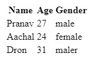

# Mapping in React

## What is Map

The Map is an Advanced Function that is used to perform a specific task to all the elements in a list. A Map cannot have duplicate keys so it can only be a map once. As a consequence, we can easily iterate over a list without duplication.

## Syntax

```javascript
list.map((data) => {
  return <h1>(data)</h1>;
});
```

## Use Of Map in React

1. The main use of react is to render multiple components

```jsx
const Fruits = ["Apple", "Orange", "Mango"];
const mapped = Fruits.map((fruits) => {
  return <p>{fruits}</p>;
});
```

We can use this mapped variable in the render() function directly

```jsx
render() {
    <p>List of Fruits</p>
    {mapped}
}
```

2. Now let see how to map a data from API which is in JSON format

lets assume a json as below given by an API `www.api.com`

```json
[
  {
    "name": "Pranav",
    "age": 27,
    "gender": "male"
  },
  {
    "name": "Aachal",
    "age": 24,
    "gender": "female"
  },
  {
    "name": "Dron",
    "age": 31,
    "gender": "male"
  }
]
```

Lets map it in our function based component

```jsx
import React, {useEffect, useState} from 'react'

export default Learn_Mapping = () => {
    const [Jdata, setdata] = useState("")
    useEffect(
        axios.get('www.api.com').then((data) =>{
            setdata(data)
        })
    ), [])

    return(
      <table>
        <tr>
            <th>Name</th>
            <th>Age</th>
            <th>Gender</th>
        </tr>
        {Jdata.map((d) => {
            return(
                <tr>
                    <td>{d.name}</td>
                    <td>{d.age}</td>
                    <td>{d.gender}</td>
                </tr>
      </table>
            )
        })}
    )
}
```

The Output will be as shown Below:
<p align="center" ></p>