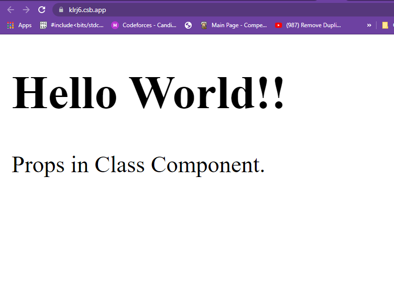
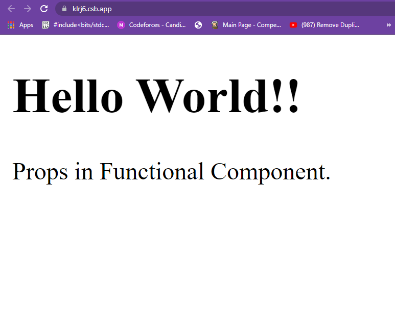
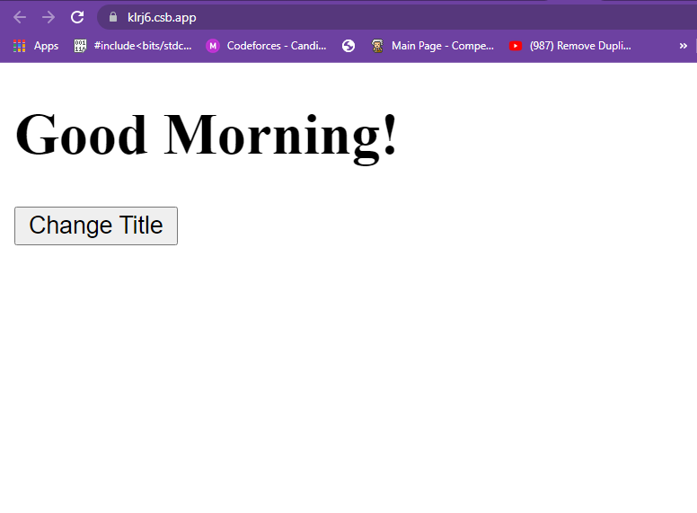
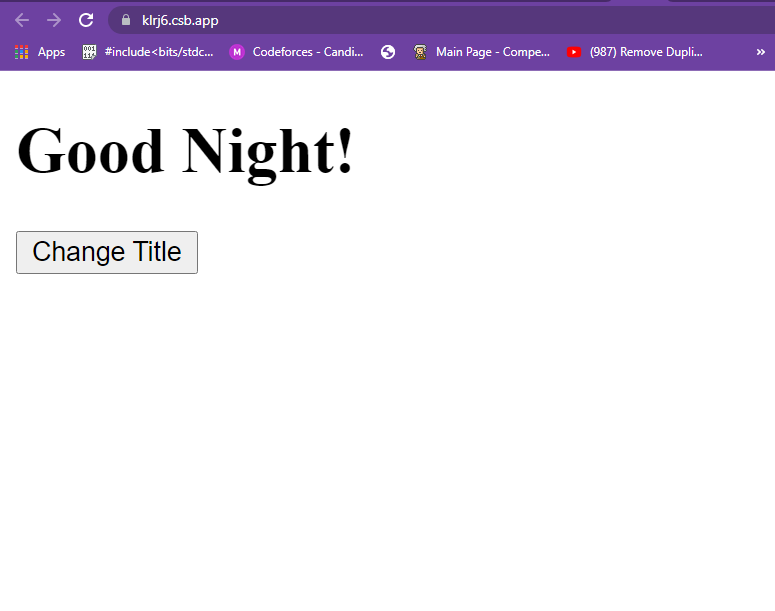

<p align="center"></p><br><br>

<h1 align="center"> React Props vs State </h1>

## React Props :-
<br>

    We know that components in React are used again and again in the UI, but we don’t normally render the same component with the same data. Sometimes we need to change the content inside a component. Props come to play in these cases, as they are passed into the component and the user. Let’s see how they work: 
___
<br>

## Props in Class Component :-
<br>

### **Example :-**
<br>

#App.js

```javascript

import React, { Component } from 'react';  
class App extends React.Component {  
   render() {     
      return (  
          <div>  
            <h1> Hello { this.props.name } </h1> 
            <p> 
                { this.props.title } in Class Component.
            </p>            
          </div>  
      );  
   }  
}  
export default App;

```
<br>

#Index.js

```javascript

import React from 'react';  
import ReactDOM from 'react-dom';  
import App from './App.js';  
  
ReactDOM.render(
    <App 
        name = "World!!",
        title = "Props"    
     />,
     document.getElementById('root')
     );

```

    A simple component and then we passes the props as attributes and then access them inside our component using this.props. So props makes components reusable by giving components the ability to receive data from the parent component in the form of props. They are immutable.

### **Output :-**
<br>



<hr>

## Props in Functional Component :-
<br>

### **Example :-**
<br>

#App.js

```javascript

function App(props) {
  return (
    <div>  
        <h1> Hello { this.props.name } </h1> 
        <p> 
            { props.title } in Functional Component.
        </p>            
    </div>
  );
}

```
<br>

#Index.js

```javascript

import React from 'react';  
import ReactDOM from 'react-dom';  
import App from './App.js';  
  
ReactDOM.render(
    <App 
        name = "World!!",
        title = "Props"    
     />,
     document.getElementById('root')
     );

```

    we passes the props as attributes and then access them inside our component using props.title, So props makes components reusable by giving components the ability to receive data from the parent component in the form of props. They are immutable.

### **Output :-**
<br>



<hr>
<br>

## React State :-
<br>

* React components has a built-in state object.

* The state object is where you store property values that belongs to the component.

* When the state object changes, the component re-renders.

## Creating the state Object :- 
<br>

```javascript

class Car extends React.Component {
  constructor(props) {
    super(props);
    this.state = {title: "Morning"};
  }
  render() {
    return (
      <div>
        <h1>Good Morning!</h1>
      </div>
    );
  }
}

```
<br>

## Using the state Object :-
<br>

```javascript

class Car extends React.Component {
  constructor(props) {
    super(props);
    this.state = {title: "Morning"};
  }
  render() {
    return (
      <div>
        <h1>Good {this.state.title}!</h1>
      </div>
    );
  }
}

```
<br>

## Changing the state Object :-
<br>

```javascript

class App extends React.Component {
  constructor(props) {
    super(props);
    this.state = {title: "Morning"};
  }
    changeTitle = () => {
    this.setState({Title : "Night"});

  render() {
    return (
      <div>
        <h1>Good {this.state.title}!</h1>
      </div>
      <button type="button" onClick={this.changeTitle}>Change Title</button>
    );
  }
}

```
<br>

### **Output :-**
<br>

### **Before Changing the State :-** 
<br>

<br>

### **After changing the state :-** 
<br>

<br>

<hr>
<br>

## React Props vs State :-

### **State :-**

* State changes can be asynchronous.
* State is mutable.
* State holds information about the components.
* State cannot be accessed by child components.
* States can be used for rendering dynamic changes with the component.
* Stateless components cannot have State.
* State cannot make components reusable.
* The State is internal and controlled by the React Component itself.

### **Props :-**

* Props are read-only.
* Props are immutable.
* Props allow you to pass data from one component to other components as an argument.
* Props can be accessed by the child component.
* Props are used to communicate between components.
* Stateless component can have Props.	
* Props make components reusable.
* Props are external and controlled by whatever renders the component.

___