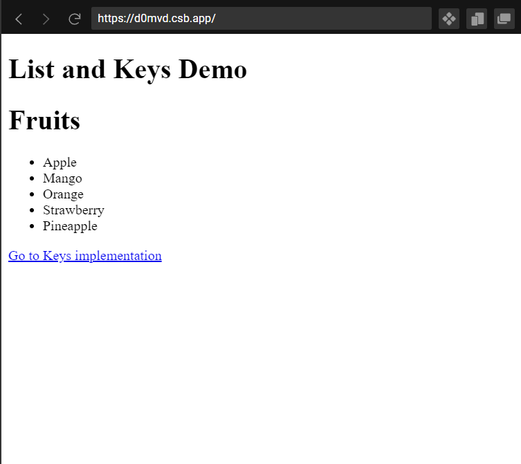
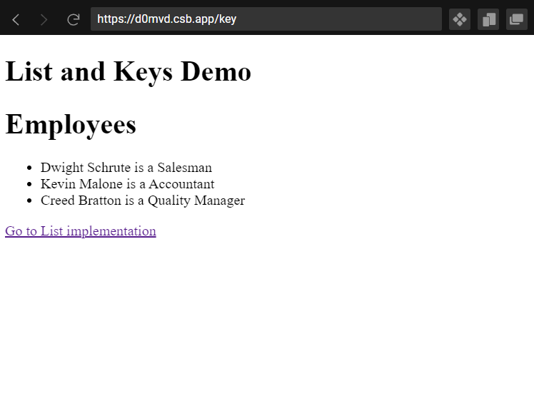

# 3.1 List and Keys in React.js
*To interact with the codes in this documentation, visit this [code sandbox link](https://codesandbox.io/s/list-and-keys-d0mvd?file=/src/List.js)*
### List:
List in React.js help us display a collection of data. Let's say we fetch a list of fruits and want to display it in a component. We can create a new list where each fruit is wrapped with an `<li>` tag. This can be achieved if we use the [map()](https://developer.mozilla.org/en-US/docs/Web/JavaScript/Reference/Global_Objects/Array/map) JavaScript method.

The code would look like this:

(*Inside the List.js file in the Code Sandbox link*)

```javascript
import React from "react";
import { Link } from "react-router-dom";

//The list fruits here contains the name of some fruits
const fruits = ["Apple", "Mango", "Orange", "Strawberry", "Pineapple"];
//We are wrapping these fruit names with the <li> tag with this map function
const fruitList = fruits.map((fruit) => <li>{fruit}</li>);

const List = () => {
  return (
    <div>
      <h1>Fruits</h1>
      {/* We call the fruitList list here under the 
      <ul> tag, so that each element in this list can be
      rendered*/}
      <ul>{fruitList}</ul>
      {/* This is just a Link tag to go to the page that has
      List with keys implementation, and it is not necessary 
      to know about it for this section */}
      <Link to="/key">Go to Keys implementation</Link>
    </div>
  );
};
export default List;
```

This code would render the following page:


### Keys:
Keys in React help to identify an element with its unique identifier. It helps React recognize the changes like addition, deletion that have happened in the list.
The key should be unique for each element within the list. 

When you don't specify the key, React automatically uses the indices of the list elements.  You can also directly specify the indices as the keys, but this is not a good practice (*yes, the previous example would have index of each element as its key*). To learn more about why you should not use index as the key, refer to this [article](https://robinpokorny.medium.com/index-as-a-key-is-an-anti-pattern-e0349aece318)

You can use a unique string that identifies a particular element inside the list as its key. 

Let's take a look at one such example.

(*Inside the Keys.js file in the Code Sandbox link*)
```javascript
import React from "react";
import { Link } from "react-router-dom";
//This employees list is a list of objects 
//Each object has a unique field called id, this is the best candidate to be used as a key for our list
const employees = [
  {
    id: "emp1",
    Name: "Dwight Schrute",
    Designation: "Salesman"
  },
  {
    id: "emp2",
    Name: "Kevin Malone",
    Designation: "Accountant"
  },
  {
    id: "emp3",
    Name: "Creed Bratton",
    Designation: "Quality Manager"
  }
];
const employeeList = employees.map((employee) => (
  //This is where we have added the key explicitly
  <li key={employee.id}>
    {employee.Name} is a {employee.Designation}
  </li>
));
const Keys = () => {
  return (
    <div>
      <h1>Employees</h1>
      <ul>
        {employeeList}
      </ul>
      <Link to="/">Go to List implementation</Link>
    </div>
  );
};
export default Keys;
```

This code would render the following page:


# Usage of List and Keys:
- Lists are very useful and it is possible that your application may need it in the form of a menu, some to-do tasks and other similar features.  
- Keys in List help React keep a track on all the changes that occur within the list and only re render the components that encountered a change and not the whole set of components
  
# Additional Resources:
To know more about List and Keys, refer the following articles:
1. The official [documentation](https://reactjs.org/docs/lists-and-keys.html) of List and Keys
2. A clean and simple [explanation](https://www.javatpoint.com/react-keys) for List and Keys
3. Another simple [documentation](https://www.tutorialspoint.com/working-with-lists-and-keys-in-react-js)
