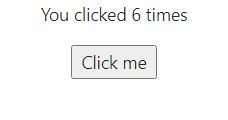
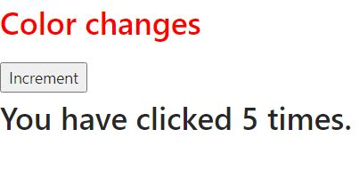
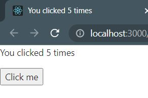
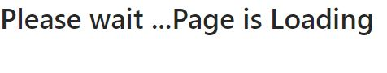
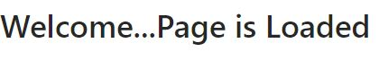
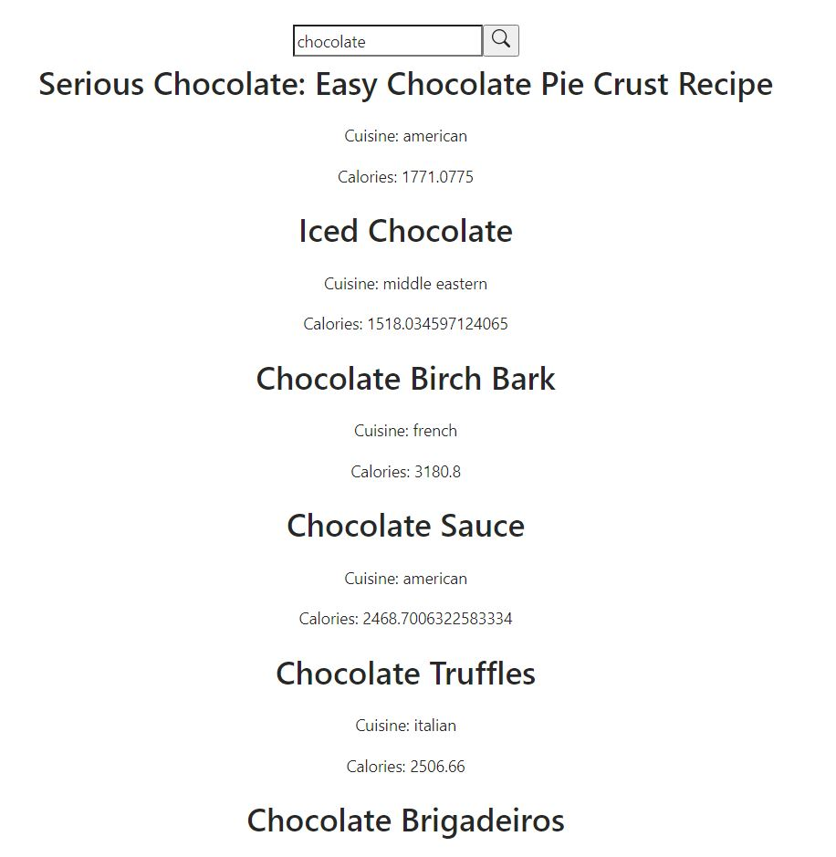

<h1 align="center">  Basic Hooks in React </h1>

## What are Hooks in React?

- Hooks were introduced in 16.8 version of React.
- They are basically logical,functional components that allow to access various lifecycle features of React like states without having to define a class.
- Hooks are also backward-compatible i.e. they are devoid of any breaking changes.
  Example: useState,useEffect and useReducers are some popularly known and used React Hooks.

## What is useState in React ?

- useState in React is a type of Hook that declares a state variable.
- It acts as a storage to preserve the value of that state during numerous function calls.
- The initial value of the state is passed as an argument to the useState Hook.
- useState returns the current state along with the function that updates it.

## When do we use useState ?

- When we want to add a state to our functional component.
- When we want the state to keep updating its value during function calls.
- To create a piece of state without using a class component.

#### Example 1: Implementing a Counter using useState

```
//To use useState you need to import useState from react as shown below:
import React, { useState } from 'react';

function App() {
  // Declare a new state variable, which we'll call "count"
  const [count, setCount] = useState(0);

  return (
    <div>
      <p>You clicked {count} times</p>
      <button onClick={() => setCount(count + 1)}>
        Click me
      </button>
    </div>
  );
}

export default App;

```

This code would render the following output:



###### Explanation:

- The only argument to the useState() Hook is the initial state.
- We set the value of the initial state to 0.
- count is the state variable, indicating the number of times an user clicked.
- React will remember the current value of count between re-renders, and provide the most recent one to our function.
- We can display its value using {count}.
- When the user clicks, we call setCount with a new value,thereby updating it.

#### Example 2: Using Multiple State Variables and adding a Toggle Button using useState

```

import React, { useState } from "react";
function App() {
  const [isRed, setRed] = useState(false);
  const [count, setCount] = useState(0);

  const increment = () => {
    setCount(count + 1);
    setRed(!isRed); //toggle
  };

  return (
    <>
      <h1 style={{ color: isRed ? "red" : "" }}>Color changes</h1>
      <button onClick={increment}>Increment</button>
      <h1>You have clicked {count} times.</h1>
    </>
  );
}

export default App;

```

This code would render the following output:



###### Explanation:

- Declaring state variables as a pair of [something, setSomething] is also handy because it lets us give different names to different state variables in this case.
- In the above component, we have isRed and count as state variables, and we can update them using setRed and setCount respectively.
- count is the state variable, indicating the number of times an user clicked and isRed indicates whether the color is Red or not.
- When the user clicks, we call increment function to update the values of isRed and count.

## What is useEffect in React ?

- useEffect in React is a type of Hook that lets us perform side effects in functional components.
- Various examples of such side Effects include data fetching, setting up a subscription, and manually changing the DOM in React components.
- Placing useEffect inside the component lets us access a state variable or any props right from the effect.

## When do we use useEffect ?

- When we want our component to do something even after rendering.
- When we want to perform Data Fetching.
- When we want to call an API.

#### Example 1: Changing DOM using useEffect

```
import React, { useState, useEffect } from 'react';

function App() {
  const [count, setCount] = useState(0);

  useEffect(() => {
    document.title = `You clicked ${count} times`;
  });

  return (
    <div>
      <p>You clicked {count} times</p>
      <button onClick={() => setCount(count + 1)}>
        Click me
      </button>
    </div>
  );
}

export default App;

```

This code would render the following output:



###### Explanation:

- We declare the count state variable and pass our effect in the useEffect() Hook.
- Inside our effect, we set the document title using the document.title browser API.
- We can read the latest count value inside the effect because it is in the scope of our function.
- When React renders the App component, it will remember the effect we used, and then run our effect after updating the DOM which happens for every render, including the first one.

#### Example 2: Timed change of State using useEffect

```
import React, { useState, useEffect } from "react";

function App() {
  const [isLoading, setIsLoading] = useState(true);

  useEffect(() => {
    // Wait for 3 seconds
    setTimeout(() => {
      setIsLoading(false);
    }, 3000);
  }, []);

  return isLoading ? (
    // If page is still loading
    <h1>Please wait ...Page is Loading</h1>
  ) : (
    <h1>Welcome...Page is Loaded</h1>
  );
}

export default App;


```

###### Explanation:

- We declare the isLoading state variable and pass our effect in the useEffect() Hook .
- Inside our effect, we set the state value to false for 3 sec using setTimeout() function.
- When React renders the App component, it will remember the effect we used, and then run our effect after updating the DOM which happens for every render/refresh, including the first one.
- We then conditionally render different UI depending on the value of isLoading.
- This is useful in creating a Splash Screen in a real-life application.

This code would render the following output:





#### Example 3: API Calls and Data Fetching using useEffect

```
import React, { useState, useEffect } from "react";
const App = () => {
  const APP_ID = "Your ID";
  const APP_KEY = "Your API Key";

  const [recipes, setRecipes] = useState([]);
  const [search, setSearch] = useState("");
  const [query, setQuery] = useState("");

  useEffect(() => {
    getRecipes();
  }, [query]);

  const getRecipes = async () => {
    const response = await fetch(
      `https://api.edamam.com/search?q=${query}&app_id=${APP_ID}&app_key=${APP_KEY}`
    );
    const data = await response.json();
    console.log(data);
    setRecipes(data.hits);
  };

  const updateSearch = (e) => {
    setSearch(e.target.value);
  };

  const getSearch = (e) => {
    e.preventDefault();
    setQuery(search);
    setSearch("");
  };
  return (
    <div >
      <br></br>
      <form  onSubmit={getSearch}>
        <input

          type="text"
          onChange={updateSearch}
          placeholder="Enter item to search recipe"
        />
        <button  type="submit">
          <svg
            xmlns="http://www.w3.org/2000/svg"
            width="16"
            height="16"
            fill="currentColor"
            className="bi bi-search"
            viewBox="0 0 16 16"
          >
            <path d="M11.742 10.344a6.5 6.5 0 1 0-1.397 1.398h-.001c.03.04.062.078.098.115l3.85 3.85a1 1 0 0 0 1.415-1.414l-3.85-3.85a1.007 1.007 0 0 0-.115-.1zM12 6.5a5.5 5.5 0 1 1-11 0 5.5 5.5 0 0 1 11 0z"></path>
          </svg>
        </button>
      </form>
      <div >
        {recipes.map((recipe) => (
          <div>
            <h1>{recipe.recipe.label}</h1>
            <p>Cuisine: {recipe.recipe.cuisineType}</p>
            <p>Calories: {recipe.recipe.calories}</p>
          </div>
        ))}
        <br />
        <br />
      </div>
    </div>
  );
};
export default App;

```

This code would render the following output:



###### Explanation:

- We declare the query state variable and pass it as a dependency to the useEffect() Hook.
- The function getRecipes() gets called everytime the value of query is changed.
- When React renders the App component, it will remember the effect we used, and then run our effect after updating the DOM which happens for every render/refresh/search, including the first one.
- We then pass this query as parameter to the API call.
- We then use .map() to render the data fetched from the API.

## Some Rules and Facts of Using Hooks

- Always call React Hooks only at the Top level i.e. before any early returns.
- Always call Hooks from Functional Components and not from class components.
- Don’t call Hooks inside loops, conditions, or nested functions.
- React relies on the order in which Hooks are called.
- We can use multiple State or Effect Hooks in a single component.

## Additional Resources:

To know more about Basic React Hooks, refer the following article:
The official [documentation](https://reactjs.org/docs/hooks-intro.html) of Basic React Hooks.
