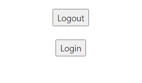
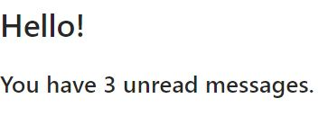
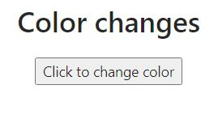
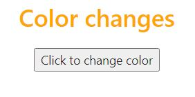
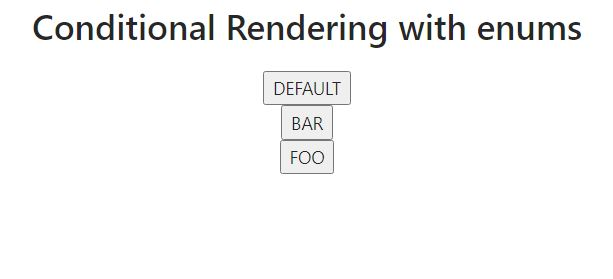

<h1 align="center">  Conditional Rendering in React </h1>

## What is Conditional Rendering in React ?

React enables us to create distinct components that encapsulate their own unique behaviour depending on our requirements.Conditional Rendering in React refers to the rendering of such components based on certain conditions defined by us.Conditional Rendering works the same way conditions work in Javascript.

## Benefits of Conditional Rendering

- Performance Optimization : Conditional Rendering plays a major role to make sure the different user interfaces load faster on the frontend.
- Code Readability : Conditional Rendering makes it easier to read and understand several lines of code easily which is highly beneficial during editing and/or debugging the code.
- Single Return Statement : Using Conditional Rendering,code in react generally steers clear of multiple return statements.

## Where we use conditional Rendering ?

- Where we want to render more than one component but depending on some sort of conditional logic.
- To improve the performance of the frontend in case of usage of large UI components.
- To enhance simplicity and readability when we are dealing with complex conditional logic of rendering different UI.

## Ways to implement Conditional Rendering in React

#### Example 1:Using useState

```
import React, { useState } from "react";

const App = () => {
  const [isLoggedIn, setIsLoggedIn] = useState(false);
  const [buttonText, setButtontext] = useState("Login");
  const [message, setMessage] = useState("Welcome!Login to continue");

  const change = () => {
    if (isLoggedIn) {
      //If user is logged in
      setButtontext("Logout");
      setMessage("You're Logged In");
    } else {
      // If user is logged out
      setButtontext("Login");
      setMessage("Welcome!Login to continue");
    }
    setIsLoggedIn(!isLoggedIn); //toggle
  };

  return (
    <div>
      <h1>{message}</h1>
      <button onClick={change}>{buttonText} </button>
    </div>
  );
};

export default App;


```

This code would render the following output:

 

#### Example 2:Using props and if-else Statements

AuthButton.js

```
import React from "react";

const AuthButton = props => {
  let { isLoggedIn } = props;

  if (isLoggedIn) {
    return <button>Logout</button>;
  } else {
    return <button>Login</button>;
  }
};

export default AuthButton;

```

App.js

```
import React from "react";
import AuthButton from "./components/AuthButton";

const App = () => {
  return (
    <div >
      <br />
      <AuthButton isLoggedIn={true} />
      <br />
      <br />
      <AuthButton isLoggedIn={false} />
    </div>
  );
};

export default App;

```

This code would render the following output:



#### Example 3:Using inline if with logical && operator

```
import React from "react";

const App = () => {
  const messages = ["React", "Conditional", "Rendering"];

  return (
    <div>
      <h1>Hello!</h1>
      {messages.length > 0 && (
        <h2>You have {messages.length} unread messages.</h2>
      )}
    </div>
  );
};

export default App;

```

This code would render the following output:



#### Example 4:Using switch case

Role.js

```
import React from "react";

const Role = ({ role }) => {
  switch (role) {
    case "author":
      return <h1>What will you write today?</h1>;
    case "admin":
      return <h1>Your latest reports </h1>;
    case "moderator":
      return <h1>Your ongoing events</h1>;
    default:
      return <h1>Your current feed</h1>;
  }
};

export default Role;

```

App.js

```
import React from "react";
import Role from "./components/Role";

const App = () => {
  return (
    <div>
      <Role />
      <br />
      <Role role="author" />
      <br />
      <Role role="moderator" />
      <br />
      <Role role="admin" />
    </div>
  );
};

export default App;

```

This code would render the following output:


#### Example 5:Using ternary operator

```
import React, { useState } from "react";

const App = () => {
  const [isOrange, setOrange] = useState(false);
  return (
    <div>
      <h1 style={{ color: isOrange ? "orange" : "" }}>Color changes</h1>
      <button onClick={() => setOrange(!isOrange)}>
        Click to change color
      </button>
    </div>
  );
};

export default App;


```

This code would render the following output:

 

#### Example 6:Using Enums

```
import React from "react";

const App = () => {
  const Foo = () => {
    return <button>FOO</button>;
  };
  const Bar = () => {
    return <button>BAR</button>;
  };
  const Default = () => {
    return <button>DEFAULT</button>;
  };
  const ENUM_STATES = {
    foo: <Foo />,
    bar: <Bar />,
    default: <Default />,
  };
  function EnumState({ state }) {
    return <div>{ENUM_STATES[state]}</div>;
  }
  return (
    <div>
      <h1>Conditional Rendering with enums</h1>
      <EnumState state="default"></EnumState>
      <EnumState state="bar"></EnumState>
      <EnumState state="foo"></EnumState>
    </div>
  );
};

export default App;


```

This code would render the following output:



Using Enhanced JSX libraries like Babel

Give some example of the Conditional Rendering
also give some theory explanation with code.

## Additional Resources:

To know more about Conditional Rendering, refer the following article:
The official [documentation](https://reactjs.org/docs/conditional-rendering.html) of Conditional Rendering in React.
