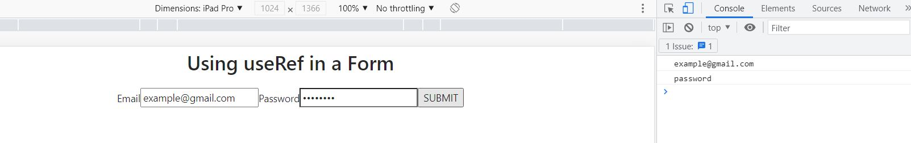
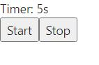

<h1 align="center">  Introduction to useRef </h1>

## What is useRef?

useRef() is a built-in React hook that accepts one argument as the initial value and returns a reference i.e. a ref. A reference is an object having a special property called current that holds the current value of an element.

## Why use useRef?

- The value of the reference remains persisted between component re-renders.
- Updating a reference doesn’t trigger a component re-rendering.
- useRef can prove to be very useful in case we are performing a lot of manipulation in a chaining fashion, but wouldn't want to trigger a re-render until the end.

Example 1: Use of useRef while filling a form

```javascript
import { useRef } from "react";
const App = () => {
  const emailInputRef = useRef();
  const passwordRef = useRef();

  const submitHandler = (event) => {
    event.preventDefault();
    const email = emailInputRef.current.value;
    const password = passwordRef.current.value;
    console.log(email);
    console.log(password);
  };

  return (
    <div>
      <h1>Using useRef in a Form</h1>

      <form onSubmit={submitHandler}>
        <label htmlFor="email-input">Email</label>
        <input
          id="email-input"
          type="email"
          name="email"
          placeholder="Enter your email here"
          ref={emailInputRef}
        />
        <label htmlFor="password-input">Password</label>
        <input
          id="password-input"
          name="password"
          placeholder="******"
          type="password"
          ref={passwordRef}
        />
        <button type="submit">SUBMIT</button>
      </form>
    </div>
  );
};
export default App;


```

This code would render the following output:



##### Explanation

- The email input value has reference to the emailInputRef.
- The password input value has reference to the passwordRef.
- We extract the input value from InputRef.current.value
- When the user submits the form,we see the submitted values in the console.
- The component is re-rendered only on refresh or on form submission,not while the user is entering the values.

Example 2: Implementing a StopWatch using useRef

```javascript
import { useRef, useState, useEffect } from "react";
const App = () => {
  const timerIdRef = useRef(0);
  const [count, setCount] = useState(0);
  const startHandler = () => {
    if (timerIdRef.current) {
      return;
    }
    timerIdRef.current = setInterval(() => setCount((c) => c + 1), 1000);
  };
  const stopHandler = () => {
    clearInterval(timerIdRef.current);
    timerIdRef.current = 0;
  };
  useEffect(() => {
    return () => clearInterval(timerIdRef.current);
  }, []);
  return (
    <div>
      <div>Timer: {count}s</div>
      <div>
        <button onClick={startHandler}>Start</button>
        <button onClick={stopHandler}>Stop</button>
      </div>
    </div>
  );
};
export default App;

```

This code would render the following output:



##### Explanation

- The timer id is stored into a reference timerIdRef.
- We use the setInterval() timer function to increase each second the counter of a stopwatch.
- When the user clicks the Start button,startHandler() function is invoked.It starts the timer and saves the timer id in the reference timerIdRef.current.
- When the Stop button is clicked,stopHandler() accesses the timer id from the reference and stops the timer.

## Advantages of useRef

- useRef is very handy for keeping any mutable value around.
- useRef gives the same ref object on every render by creating a simple Javascript object.
- useRef() gives us something more permanent a lot like useState() but updating doesn't trigger re-render of the entire component which saves a lot of the loading time and gives a faster user experience.
