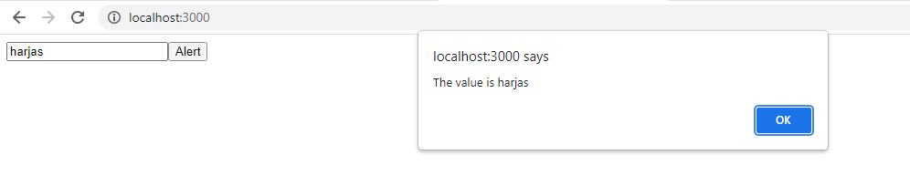
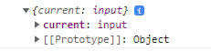

<h1 align="center">Refs In React</h1>

### _Defination_ - Whenver we want to access a element directly from the DOM tree and perform manipulations on it, we need its reference and Refs are exactly those objects which provide us the ability to do so while using ReactJS.

---
## When To Use Refs
Although, the the general rule is to let React states manage all the renders and updations for us, Sometimes situations arise where the former method becomes too complex to execute.
<br/>
In Such cases we are better off manipulating the elements in the dom tree directly like we do in VanillaJS.

---
## When To Not Use Refs
In cases where we can achieve our goal using states in React, using performing DOM manipulation and using Refs is not adviced as it defeats the whole purpose of React's Virtual DOM Tree and decreases the speed our App. 
<br/>
Even the official React Documentation advises us to use Refs as less as Possible.

---
## Creating Refs
Refs can be used both in Class Components and Functional Components. However,the syntax is a little different.
<br/>
In This tutorial we will be using class components and we will be doing so with the help of a task.

### _Task_ - Alert the value entered inside the input tag whenever a button is pressed.

First lets see how we will do this without using refs.

```javascript
import React from 'react'

class RefsDemo extends React.Component{
    
    state={
        inpValue:""
    }

    render(){
        return (
            <>
            <input value={this.state.inpValue} onChange={(e)=>{
                this.setState({inpValue : e.currentTarget.value});
            }}/>
            <button onClick={()=>{
                alert("The value is "+this.state.inpValue);
            }}>Alert</button>
            </>
        )
    }
}
export default RefsDemo;
```
The Output of the above code is :-



In the code above we have a simple input tag with onChange Listener attached to it which updates the value of state as soon as we enter something in the input field.
<br/>
And the button then alerts that value by accessing its state.

Although the above is possible without Refs, React reccommends that we use Refs and for that we will restructure our Code a bit.

```javascript
constructor(props){
        super(props);
        this.inpRef = React.createRef();//we call this function to create a ref.
    }
``` 
We will add a constructor Function to our Class and Declare a Ref inside it by using "this" keyword so we can access it anywhere in the class.

---
## Assigning Value To Ref
Now that we have created a Ref,we need to assign a value to it.What i mean by this is that we still need to assign a DOM element to ref so that it can attch itself to that element.
<br/>
We do that by using the "ref" attribute in HTML code of our element and assigning it value like so :-
```html
<input ref={this.inpRef} />
<!-- pass the ref as attribute value -->
``` 

----
## Accessing Refs
Now, to better understand the next part lets log out inpRef object.
<br/>
For this we will add a ComponentDidMount function to our code like so :-
```javascript
componentDidMount=()=>{
    console.log(this.inpRef);
}
```


As we can see there is a "current" key inside our inpRef object. This current key actually points to the element to which we attach our ref to. In our case, it points to the input Element. This Current Key actually holds all the information about our element like its value,refference,classList etc.

Now , to achieve our task, we will attach a event listener to our button and access the current key to get the value inside the input tag and the whole code will be like so :-
```javascript
import React from 'react'

class RefsDemo extends React.Component{
    
    constructor(props){
        super(props);
        this.inpRef = React.createRef();
    }

    render(){
        return (
            <>
            <input ref={this.inpRef}/>
            <button onClick={()=>{
                alert("The value is "+this.inpRef.current.value);
            // using the value key inside the current key to get the value on input tag
            }}>alert</button>
            </>
        )
    }
}
export default RefsDemo;
```

And Our Code works without accessing the DOM tree.


---
<br/>

## Callback Refs
The createRef() function we used above was added to react in a later update to make the use of refs a little easier by simplifying the syntax.
<br/>
Before this we had Callback ref. The Concept of refs stays the same only the syntax changes a little. So lets now see how to use Callback ref :-

```javascript
constructor(props){
        super(props);
        this.inpRef = null;//create a null variable
        this.refCallback=(elementToAttachTo)=>{
            this.inpRef=elementToAttachTo;//assign value to variable
        }
    }
```
This time in the Constructor function, We will create a Variable in which we want to store the Refference of our element in, Here i have used "inpRef".
<br/>
Next step is to create a function which will get the the desired element as a paramaeter and we will assign that element to our inpRef variable when our component will mount.
<br/>
Next we will pass this function as a callback function in the "ref" attribute of out HTML element and react will automatically call this function as a callback function and give us the refference of input element

```html
<input ref={this.refCallback}/>
<!-- pass function as attribute -->
```

Now, unlike before, where we had to use the "current key" to access the variable, this time we can directly access the element inside our button element like so :-

```html 
<button onClick={()=>{
    alert("The value is "+this.inpRef.value);
}}>alert</button>
```
And the final code will be like :-
```javascript 
import React from 'react'

class RefsDemo extends React.Component{
    
    constructor(props){
        super(props);
        this.inpRef = null;
        this.refCallback=(elementToAttachTo)=>{
            this.inpRef=elementToAttachTo;
        }
    }

    render(){
        return (
            <>
            <input ref={this.refCallback}/>
            <button onClick={()=>{
                alert("The value is "+this.inpRef.value);
            }}>alert</button>
            </>
        )
    }
}
export default RefsDemo;
```
Our Code works just like before and that was all about how to use Refs and callback Refs in React.

---
### References-
 * https://reactjs.org/docs/refs-and-the-dom.html
 * https://youtu.be/FXa9mMTKOu8
