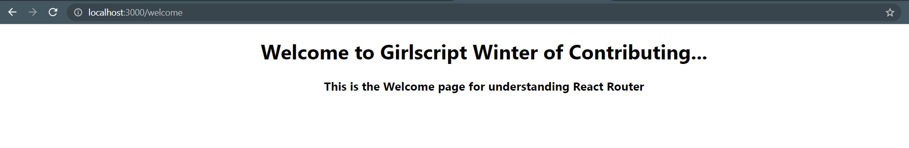
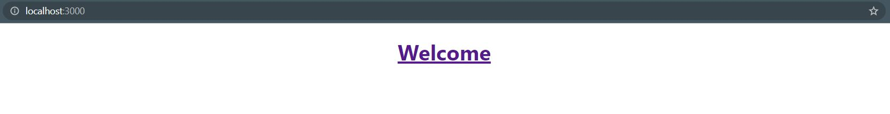
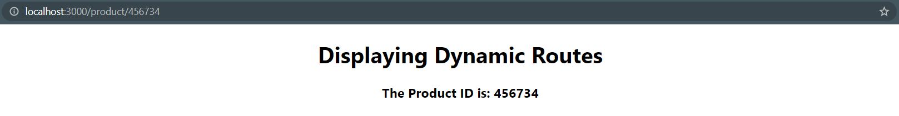
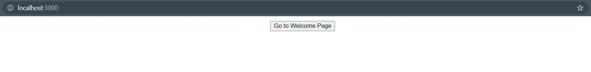
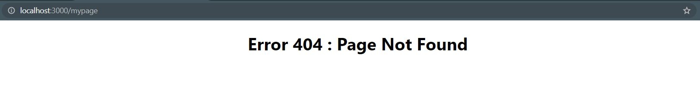

<h1 align="center">  Multi Page React App </h1>

## What is Multi Page React App ?

React Apps are structured to have a single index.html page.But sometimes we need to have more than one page/multi pages in case of a complex website.Since, React is not designed to have multiple html pages,we use multiple routes to handle multiple pages(views) and build a multi page application.Such an app is known as a Multi Page React App.

## How to create Multi Page React App ?

- When building complex user interfaces,we typically build Single Page Applications or S.P.As.In this method, there is only one initial HTML request and response.
- In Multi-Page React Applications, page(url) changes are handled by client-side(React) code.This method changes the visible content without fetching a new HTML file.
- To do so, we need to install React Router using the following npm command.

```javascript
    npm install react-router-dom
```

**Example 1:Working with Routes and Links in BrowserRouter**

index.js

```javascript
import React from "react";
import ReactDOM from "react-dom";
import "./index.css";
import App from "./App";
import { BrowserRouter } from "react-router-dom";

ReactDOM.render(
  <BrowserRouter>
    <App />
  </BrowserRouter>,
  document.getElementById("root")
);
```

App.js

```javascript
import { Route, Link } from "react-router-dom";
import Welcome from "./components/Welcome";

const App = () => {
  return (
    <div>
      <Route path="/welcome">
        <Welcome />
      </Route>
      <Link to="/welcome"></Link>
    </div>
  );
};
export default App;
```

Welcome.js

```javascript
import React from "react";

const Welcome = () => {
  return (
    <div>
      <h1>Welcome to Girlscript Winter of Contributing...</h1>
      <h3>This is the Welcome page for understanding React Router</h3>
    </div>
  );
};

export default Welcome;
```

This code would render the following output:



##### Explanation

- <BrowserRouter> helps to keep the UI in sync with the URL and is placed in index,js, so we can control Routes from anywhere inside the app like App.js .
- <Route> serves as the most important part in React Router and renders the respective UI when its path matches the current URL.
- <Link> provides declarative, accessible navigation through the react application and makes sure no new requests are sent.
- Here we have defined a route called "/welcome" to render the Welcome Page when the URL changes accordingly.

**Example 2: Using NavLinks**

```javascript
import { Route, NavLink } from "react-router-dom";
import Welcome from "./components/Welcome";

const App = () => {
  return (
    <div>
      <Route path="/welcome">
        <Welcome />
      </Route>
      <h1>
        <NavLink to="/welcome">Welcome</NavLink>
      </h1>
    </div>
  );
};
export default App;
```

This code would render the following output:



##### Explanation

- <NavLink> is nothing but a special styled version of the <Link> component in React Router.
- It add styling attributes like hyperlink to the text and redirects to the specific UI when it matches the current URL.
- When the user clicks on Welcome, the app renders the Welcome Page and the URL is changes to "/welcome".

**Example 3: Adding Nested Dynamic Routes with Params**

App.js

```javascript
import { Route } from "react-router-dom";
import Product from "./components/Product";

const App = () => {
  return (
    <div>
      <Route path="/product/:productId">
        <Product />
      </Route>
    </div>
  );
};
export default App;
```

Product.js

```javascript
import React from "react";
import { useParams } from "react-router";

const Product = () => {
  const params = useParams();
  return (
    <div>
      <h1>Displaying Dynamic Routes</h1>
      <h3>The Product ID is: {params.productId}</h3>
    </div>
  );
};

export default Product;
```

This code would render the following output:



##### Explanation

- Dynamic Routes help to render different pages depending on the URL that is not pre-defined.
- Nesting helps to show modified URLs like "/product/:productId" here.
- Here :productId is the dynamic route params in the Route definition.
- The productId get passed to the component via useParams() and we render it using {params.productId}.

**Example 4: Configuring Routes**

App.js

```javascript
import { Route, Switch } from "react-router-dom";
import Product from "./components/Product";
import Welcome from "./components/Welcome";

const App = () => {
  return (
    <div className="App">
      <Switch>
        <Route path="/product/:productId">
          <Product />
        </Route>
        <Route path="/welcome">
          <Welcome />
        </Route>
      </Switch>
    </div>
  );
};
export default App;
```

This code would render the following output:

 

##### Explanation

- <Switch> is a unique component in React Router that renders a route exclusively.
- It Renders the first child <Route> or <Redirect> that matches the URL.
- It will only allow one route at a time but will render whichever matches first.

**Example 5: Redirecting the User**

App.js

```javascript
import { Route, Redirect } from "react-router-dom";
import Welcome from "./components/Welcome";

const App = () => {
  return (
    <div>
      <Route path="/" exact>
        <Redirect to="/welcome" />
      </Route>
      <Route path="/welcome">
        <Welcome />
      </Route>
    </div>
  );
};
export default App;
```

This code would render the following output:


##### Explanation

- Rendering a <Redirect> will navigate to a new location.
- The new location will override the current location in the history stack of the Browser.
- So, when the entered URL is "/" here, it gets redirected to "/welcome" and the Welcome Page is rendered.

**Example 6: Implementing Programmatic Navigation**

```javascript
import { Route, useHistory } from "react-router-dom";
import Welcome from "./components/Welcome";

const App = () => {
  const history = useHistory();

  function handleClick() {
    history.push("/welcome");
  }
  return (
    <div>
      <button type="button" onClick={handleClick}>
        Go to Welcome Page
      </button>
      <Route path="/welcome">
        <Welcome />
      </Route>
    </div>
  );
};
export default App;
```

This code would render the following output:

 

##### Explanation

- React Router acts like a wrapper around the browser history.
- useHistory() handles interaction with the browser's window.history.
- While history.push() adds a new page to the stack , history.replace() adds a page redirect.
- Here the Welcome page is added to the stack , so we can navigate to it after visiting and clicking on the back button.

**Example 7: Adding a Not Found Page**

App.js

```javascript
import { Route, Switch } from "react-router-dom";
import Welcome from "./components/Welcome";
import NotFound from "./components/NotFound";

const App = () => {
  return (
    <div>
      <Switch>
        <Route path="/welcome">
          <Welcome />
        </Route>
        <Route path="*">
          <NotFound />
        </Route>
      </Switch>
    </div>
  );
};
export default App;
```

NotFound.js

```javascript
import React from "react";

const NotFound = () => {
  return (
    <div>
      <h1>Error 404 : Page Not Found</h1>
    </div>
  );
};

export default NotFound;
```

This code would render the following output:



##### Explanation

- <Route path="*"> means all paths except the pre-defined ones. It helps to render a 404 page if there is no pre-defined route matching the URL.
- We have to make sure to place the <Route> for the NotFound Page at the end of all routes, so that router will check all the routes and fallback if no match is found.
- So, by visiting any random URL like "mypage", the user will see the default NotFound page.

## Benefits of the multi page react app ?

- In Multi Page React App,we can render different views where each page is different for every route.
- Using the useHistory() functionality, the user can navigate backwards/forwards and restore different linked UIs.
- Routing provides a standarized structure and behaviour to the app that helps a lot while working in a team and provides the user easy and faster navigation.
- A Multi Page React App helps to add various other advanced functionalities like Lazy Loading,Flexible Routing Code with query params and Dynamic as well as Nested Routes for enhancing user experience and app performance.

## References

- https://reactrouter.com/web/guides/quick-start
- https://learnwithparam.com/blog/dynamic-pages-in-react-router/
