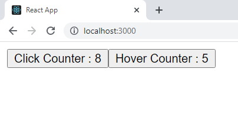
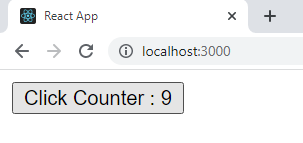
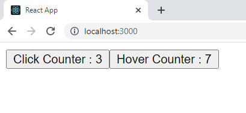

<h1 align='center'>Render Props In React</h1>

### _Defination_ - Render Props in React is a technique to pass a function as a prop to a component and then call that function from the component.This is done in order to minimise code repetition.
A component with a render prop takes a function that returns a React element and calls it instead of implementing its own render logic.

---
## Where Do we use Render Props
If a situation arises where we have to repeate the same logic mutilple times, We will have to Copy and paste a lot of code. 

Render Props helps us minimise this and helps us to utilise the already written code by letting us pass the logic as a function through props to other components.

Another situation where we can use Render Props is, when the use Higher Order Components becomes very complicated.

---
## Benefits of Using Render Props
* Sharability of functionality among components increases.
* DRY principal- Dont Repeat Yourself
* Bug Fixing becomes easy

---
# Implementation Of Render Props
The Implementation of Render Props in React can be very confusing at first but becomes easy later.

So ,To better understand the concept, we will be doing a task
### _Task_ - Let's create 2 buttons which have a counter each. One Button increments its counter when we click it and the other Button Increments its counter when we hover over it.

<br/>
First Lets Implement this without Render Props and try to Identify the problem.

So, The first button will have the following code :-
```jsx
import React from "react";

class Button1 extends React.Component {

    constructor(props){
        super(props)
        
        this.state = {
            counter: 0
        }
    }


    HandleCounter = () => {
        this.setState({ counter: this.state.counter + 1 });
    }

    render() {

        return (
            <button onClick={() => {
                this.HandleCounter();
            }}>Click Counter : {this.state.counter}</button>
        )
    }
}
export default Button1;
```
And, The code for second button will be 
```jsx
import React from "react";

class Button2 extends React.Component {
   
   constructor(props){
        super(props)
        
        this.state = {
            counter: 0
        }
    }

    HandleCounter = () => {
        this.setState({ counter: this.state.counter + 1 });
    }

    render() {

        return (
            <button onMouseOver={() => {
                this.HandleCounter();
            }}>Click Counter : {this.state.counter}</button>
        )
    }
}
export default Button2;
```

The Output of the above Two Components is :-



The above Code works fine. But there is one problem of repeating our logic inside both components 
```jsx
    constructor(props){
        super(props)
        
        this.state = {
            counter: 0
        }
    }

    HandleCounter = () => {
        this.setState({ counter: this.state.counter + 1 });
    }
```
This Block of Code is Exactly the Same for both components, And although this might not represent much But we can avoid this using render props.
<br/>
<br/>

## How To Use Render Props :-
The idea behind using Render Props is to create a Wrapper Class.

This Wrapper class has its state components just like above elements but unlike above elements, it does not render any component directly

Instead, It calls a Function which , in turn renders the required components.

The theory might be a little confusing so lets just start with the code

### Steps :-
* I will start by removing creating a file called "Wrapper.jsx" and create a react class component in it like So :-
```jsx 
import React from 'react';

class Wrapper extends React.Component {
    render() {

    }
}

export default Wrapper;
```
* Next, I will remove The common Logic from above two components and paste it into the Wrapper class like so :-
```jsx
import React from 'react';

class Wrapper extends React.Component {
    constructor(props) {
        super(props)

        this.state = {
            counter: 0
        }
    }

    HandleCounter = () => {
        this.setState({ counter: this.state.counter + 1 });
    }
    
    render() {

    }
}

export default Wrapper;
```
* Now we will import this wrapper in app.js file :-
```jsx
import Button1 from "./Button1"
import Button2 from "./Button2"
import Wrapper from './Wrapper'

function App() {
  return (
    <div>
      
    </div>
  );
}
export default App;
```
Now, The Next step to use render props method is a little complicated to understand at first but becomes really easy later.

We need to render the Wrapper component inside the app.js file and according to the defination of render props, We need to pass a function as a prop to the component.

We will do exactly that. We will pass a function that recieves the counter state and the handleCounter function and returns our button component.

Like so :-
```javascript
import Button1 from "./Button1"
import Button2 from "./Button2"
import Wrapper from './Wrapper'

function App() {
  return (
    <div>
      <Wrapper render={(counter, handleCounter) => {

        // passing a function as a prop by the name if render
        
        // the function recieves the state counter variable and handleCounter function as arguements

        return <Button1 counter={counter} handleCounter={handleCounter} />
        
        // and then we pass the recieved arguements as props to the component we are trying to render so that the child 
        component will have access to it
      }} />
    </div>
  );
}
export default App;
```

Now We will go to our Wrapper File and call this function from there and pass the state and handleCounter function as parameters. 

```javascript
import React from 'react';

class Wrapper extends React.Component {
    constructor(props) {
        super(props)

        this.state = {
            counter: 0
        }
    }

    HandleCounter = () => {
        this.setState({ counter: this.state.counter + 1 });
    }

    render() {
        return (
            //passing arguements to the function so we will have access to them.
            this.props.render(this.state.counter, this.HandleCounter)
        )
    }
}

export default Wrapper;
```

Now that we have moved all the logic from our button components to the wrapper component, we will refactor it a little so our code can work again,
```javascript
import React from "react";

class Button1 extends React.Component {

    render() {

        return (
            <button onClick={() => {
                this.props.handleCounter();

                //instead of this.handleCounter we will now use the above syntax as now , this function is given to us as a prop from Wrapper class and earlier it used to be a local function

            }}>Click Counter : {this.props.counter}</button>

            // now we will use this.props.counter instead of this.state.counter as now the value is the state value of Wrapper classand is passed to us as props and not this class.

        )
    }
}
export default Button1;
```
Output of this code will be :-

;

Now , We Can do the same for Button2 Class.
```javascript
import React from "react";

class Button2 extends React.Component {

    render() {

        return (
            <button onMouseOver={() => {
                this.props.HandleCounter();
            }}>Hover Counter : {this.props.counter}</button>
        )

    }
}
export default Button2;
```

And we will add another Wrapper Element to the app.js file like so :-
```javascript
import Button1 from "./Button1"
import Button2 from "./Button2"
import Wrapper from './Wrapper'

function App() {
  return (
    <div>

    // "render" prop can be named anything. But the general practise is to name it "render" only when we are using render props technique

      <Wrapper render={(counter, handleCounter) => {
        return <Button1 counter={counter} handleCounter={handleCounter} />
      }} />

      <Wrapper render={(counter, handleCounter) => {
        return <Button2 counter={counter} handleCounter={handleCounter} />
      }} />

    </div>
  );
}
export default App;
```

And our Code works again :-


---
## Flow Of The Above Code
<br/>
This was a complex topic. So lets look at the flow and recap the code.


First we Created the function in app.js file while calling the Wrapper Component which had the refference of state variable and the updation function of Wrapper Component.

Then inside the above function, we returned our button element and passed the state variable and the updation function of its parent class to it.

Then we called that render function inside the Wrapper Component as it was passes to it as prop.

Then we got our button element  and the flow is :-

### <b>Whenver the button is clicked -> the button updates the state of its parent -> this makes the parent component to re-render -> the re-render makes the Wrapper component call the wrapper function again -> now new state and updation function are passes to the button elemnt -> the button element displays the new state it recieved as prop.</b>

<br/>
This cycle happens everytime the button is clicked.
<br/>
<br/>

## And that was all About Render Props In React.
---
### Refferences
* https://reactjs.org/docs/render-props.html
* https://www.youtube.com/watch?v=NdapMDgNhtE
* https://www.youtube.com/watch?v=EZil2OTyB4w
