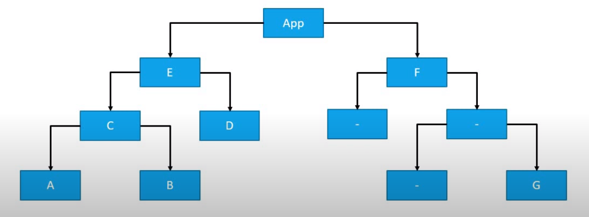
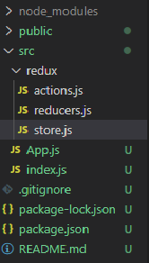
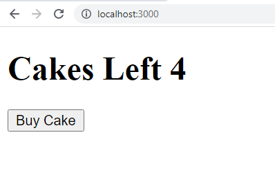
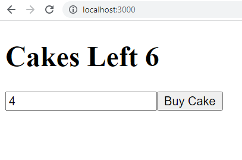
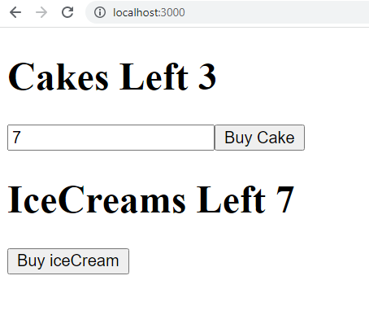
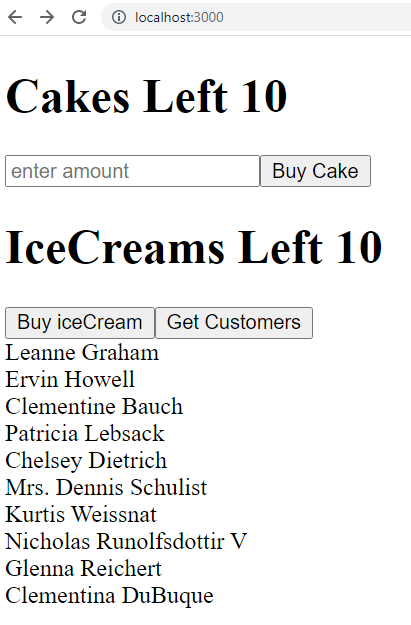

<h1 align="center">Redux In React</h1>

### ___Defination -___ Redux is a package that helps us to manage the states of the components in our app with ease.

<br/>
You are familiar with states in react. Redux helps us to manage those states and helps us avoid problems like lifting the state up and prop drilling. We will go over these in detail in the next section.

One thing to note is that redux is not exclusively made for react only. It can be used with other frontend frameworks like angular ,vue and vanillaJS as well.

---
## Benefits of using Redux 
To better understand the benifits, lets imagine a scenario in which you create a app which has a structure similar to this -




Lets assume in Component "A" , you have a state variable which stores the user's name. Now, A few Days later you decide that you need the username state in component "B" as well.

In This case, You will have to lift the State up to Parent Component which is "C" and then pass the state as prop to both "A" and "B".

Now, suppose you need username in "G" component as well, you will again have to do the above process, and lift up your state all the way till the "App" component and then start passing the state as prop to the children element.

You will have to pass this state as prop even to those components which do not need it for Eg- "F" because only then it will be able to reach "G" component.

<br/>
In the above Scenario, we have made two mistakes :-

* The first is that we are repeatedly taking the state a level up. This makes us refactor our code alot and in large projects which have 100's of components and complex tree structures it will be difficult for us to keep track and this will cause errors in our code.
* And The second problem is Prop-Drilling, which is when we pass props to components which do not even need them ,just so they could be passed to their children components. Also, these components also re-render un-neccesarily beacause the prop value changes . Like in "F" component , which does not need the username prop but it has access to it only to pass to "G" component and if the values changes, "F" will re-render even though it did not need to.

<br/>
Redux can help us solve this problem very easily as in redux, all the states are stored in a single location and any component can access them whenever it wants.

---
## Why Learn Redux in React
After looking at the above scenario, you might be thinking that the above can also be achieved with using The "Context" in react and its true.

However, this was not always the case. Redux library was created in 2015. And at that time the "Context" did not exist and hence, Redux was opted as a go to option by developers for their projects and is still widely used because of that reason. Hence, it becomes important to learn Redux.

---
## Where we use Redux in React
The use of Redux depends solely on the developer as other solutions to the problem also exist.

You need to realise if your app is going to have a lot of components which are going to be sharing state data among them(like in the above example) and then make the decision.

If not, then the use of Redux does not seem like a good idea as it not only increases the complexity of code, it also increases the size of your app and makes your website slower for no good reason. 

---
## Setup
<u>Redux library has a learning curve. So, we will first learn about the fundamentals, structure of redux and its use with VanillaJS first.</u>

Then after understanding the library, we will move on to in-corporating it with react. This will help us understand the concepts better as some of the steps do not have any particular reason behind folowing them apart from the fact that it is how the library was desingned.

<br/>
So, To start ensure that you have NodeJS installed on your system.

Next we will create a folder with the name "ReduxDemo" and inside the folder , Open up the terminal add write the following commands :-

```console
npm init -y
```

```console
npm install redux
```

Next, create a script.js file and you are ready to use redux.

---
## Terminology

___Before writing code, lets look at some Terms -___

* <u>Action</u> - An Action is a javascript object in redux which tells redux what to do.

* <u>Action Creator</u> - A javascript function that returns a actions. 
  
*  <u>Reducer</u> - A Reducer in Redux is a function which performs the task which the Action tells it to do. 
   
*  <u>Store</u> - In Redux, All the states of our app are stored inside a container and this container by convention is called a "Store". Only Reducer functions have the abillity to change the states inside the store.
  
---
## Principles Of Redux
<br/>
Redux library works on 3 Principles :-

 * All the states of your application are stored in an object tree within a single store.

 * The only way to change the state is to emit an action, an object describing what to do - Only a action can call a reducer function

 * To specify how the state tree is transformed by actions, you write pure reducers - Only reducers can change states.

---
## Flow
 * We create a action object.
 * We then dispatch the action object when a event occurs (eg- click on a particular button)
 * The dispatched action calls the reducer function and tells it what to do
 * The reducer function takes the state out of the store and changes it's value and puts it back inside the store.
 * The new state is updated in all components where it is used.
---
## Redux In VanillaJS
Now That we have a understanding of terms ,principles and the theory of redux , lets focus on the code.

Open the script.js file and require the previously installed redux module in it.

```javascript
const redux = require('redux');
```

Now lets see how to create actions and look in depth what they contain :-

___Actions___ - in redux are plain javascript objects which have a "type" key. As you know only Actions can call reducer functions in redux and this type key lets the reducer know which type of actions needs to be performed.

Now lets see the code to create a action.
```javascript
function incrementAction(){//function returns a action object
    return {
        type:"INCREMENT_COUNTER" //type key tells reducer what to do
    }
}
// functions which return action objects are calles "Action Creators" and the object they return is called "Action"

```
Now you might be thinking, why we are using a object to create and return a object and not directly intialising the object. Well, the answer is because if later we want to change the type key, we only need to change it at one place instead of all the places where we create the object. Also this is the convention followed by everyone.

Similarly you can create multiple action creators . Lets create one to decrement counter action.

```javascript
function decrementAction(){
    return {
        type:"DECREMENT_COUNTER" //this type key string pair will let the reducer know what to do
    }
}
```

Now, From the principles, we know that only reducer functions can change a state, So, lets see what reducers are :-

___Reducers___ - As we know reducers are the only thing which have the ability to change states, lets see how to create a reducer and the state that it will change.

First lets create the state object just like we do in react components.
```javascript
let initialState={
    counter:0
};
// intialState is a object with a counter key, which we will change using reducers.
```

Now lets see how we declare a Reducer
```javascript
const counterReducer = (state = initialState, dispatchedAction) => {
    // the reducer function accepts two arguemnets
    // the first arguement is the state which it takes out of the store 
    // as a default value, we assign it as our initialState object.
    // and second is the action object which we dispatch.
}
```
Now lets see the logic we need to write inside the Reducer function so it can change the state :-

```javascript
const counterReducer = (state = initialState, dispatchedAction) => {
    // we use switch syntax to find out which action of the above two called the reducer, and then do the needfull.

    switch (dispatchedAction.type) {// we put the type key while declaring our actions.
        case "INCREMENT_COUNTER":
            return {
                counter: state.counter + 1
            }
        case "DECREMENT_COUNTER":
            return {
                counter: state.counter - 1
            }

// in each of the above case, we take the old value of the state from our arguement state and return a new state object in its place. this new object contains the new counter value.


        default:
            return state
    }
    // we will look at the reason for this default case in the later section. 
}
```

The new object that our reducer function returns is set into the Redux Store in the place of the old counter state object and the components which use this counter value are updated.

<br/>
We have created the actions,which call the reducer, and the reducer function which actually changes the state after getting it from our redux Store.

<br/>

___Redux Store___ - 

Now, Lets see how to create the actual store and put our state values in it.

To create a store we :-
```javascript
let createStore=redux.createStore;
// this gives us a function which will actually create the store.

// now we call the function
let store =createStore(counterReducer);
// the createStore function takes the reducer function as a arguement

```

As We have already specified the "intialState" object as a default value for state in our reducer function, Both the reducer function and the state passes to it get stored int the Redux Store

### ___<u>And With This Our Store, Actions and Reducer are finally created</u>___

<br/>
Note That only the reducers and the states tied to the reducers are stored in the store and not the actions that we created.

Now, One Thing to note is that for our entire application, we will only have one store and all our states will be inside it only. And the store that we created provides us with some functionalities -

* It gives us a <u>getState()</u> method which returns us all the states stored inside our Store

* A <u>dispatch()</u> function which accepts an action as parameter. This dispatched action in turn calls our reducer as you know from the Flow section above.

* A <u>subscribe()</u> method which takes a function as an arguement. This arguement function is then executed everytime the state changes.

Now, we will implement these simple functions below :-

```javascript
console.log("initial state ",store.getState()); //returns the state stored in the store

store.subscribe(()=>{
    console.log("updated state is",store.getState());
}) // this function takes a function which is executed every time the state is changed

store.dispatch(incrementAction());
//dispatch function dispatches the action which in turn calls the reducer.
// it takes the action object as a parameter
// so we call our action creator function which we know returns a object.

store.dispatch(incrementAction());
store.dispatch(decrementAction());
store.dispatch(incrementAction());
store.dispatch(decrementAction());
```

And when we run the code using "node script", we get the following output

```console
initial state  { counter: 0 }
updated state is { counter: 1 }
updated state is { counter: 2 }
updated state is { counter: 1 }
updated state is { counter: 2 }
updated state is { counter: 1 }
```

Our Code works Fine. But in a actual project you will most probably have mutiple states and multiple reducers. But, the createStore() function only accepts a single reducer function. So, int the next Section, We will see how to do so.

<br/>

## Mutiple Reducers In Redux
To understand this topic, this time we will create two counters instead of one and both the counters will have independent state values.

We will create Counter1 And Counter2 and both of these counters will have their separate state,separate reducers and separate actions. And the Code to do so will be like :-

```javascript
const redux = require('redux');


//counter 1
function incrementAction1() {
    return {
        type: "INCREMENT_COUNTER-1"
    }
}

function decrementAction1() {
    return {
        type: "DECREMENT_COUNTER-1"
    }
}

let counterState1 = {
    counter: 0
};

const counter1Reducer = (state = counterState1, dispatchedAction) => {
    switch (dispatchedAction.type) {
        case "INCREMENT_COUNTER-1":
            return {
                counter: state.counter + 1
            }
        case "DECREMENT_COUNTER-1":
            return {
                counter: state.counter - 1
            }

        default:
            return state
    }
}


//counter2
function incrementAction2() {
    return {
        type: "INCREMENT_COUNTER-2"
    }
}

function decrementAction2() {
    return {
        type: "DECREMENT_COUNTER-2"
    }
}

let counterState2 = {
    counter: 0
};

const counter2Reducer = (state = counterState2, dispatchedAction) => {
    switch (dispatchedAction.type) {
        case "INCREMENT_COUNTER-2":
            return {
                counter: state.counter + 1
            }
        case "DECREMENT_COUNTER-2":
            return {
                counter: state.counter - 1
            }

        default:
            return state
    }
}
```
Now As createStore function only accepts one reducer, the redux library gives a combineReducers function to deal with this problem :-
```javascript
let combineReducers = redux.combineReducers;
//this reducer function takes a object all the reducers in our app and returns a single reducer. 

let rootReducer = combineReducers({
    counter1: counter1Reducer,
    counter2: counter2Reducer
// the object should contain key value pairs
});

// this reducer by convention is called rootReducer

let store = createStore(rootReducer);
//then we normally pass the reducer to createStore method like before.
```

Now we add our store functions like before
```javascript 
console.log("initial state ", store.getState());

store.subscribe(() => {
    console.log("updated state is", store.getState());
})

store.dispatch(incrementAction1());
store.dispatch(incrementAction2());
store.dispatch(decrementAction2());
store.dispatch(incrementAction2());
store.dispatch(decrementAction1());
store.dispatch(incrementAction1());
```
And when we Run the Code using "node script" , We Get the following output :-

```console
initial state  { counter1: { counter: 0 }, counter2: { counter: 0 } }
updated state is { counter1: { counter: 1 }, counter2: { counter: 0 } }
updated state is { counter1: { counter: 1 }, counter2: { counter: 1 } }
updated state is { counter1: { counter: 1 }, counter2: { counter: 0 } }
updated state is { counter1: { counter: 1 }, counter2: { counter: 1 } }
updated state is { counter1: { counter: 0 }, counter2: { counter: 1 } }
updated state is { counter1: { counter: 1 }, counter2: { counter: 1 } }
```

## Use Of Default Case In Reducers- 

When we dispatch a action, what actually happens is that, all the reducer functions inside the store are called one by one, and among these Reducers, there is only one reducer which will match our action Type Key and change the state tied to it accordingly, While in the other reducers our action will not match any switch case and the default case would simply return the state of it's reducer without changing it.

Hence, including a default case becomes important especially when we combine multiple reducers together.

---

<br/>

<h1 align="center">Redux In React</h1>

Now that we a lot about redux and how to use it, Lets start linking it with React Components. We will do so using the react-redux library.

## Setup
Create a react app using 
```console
npx create-react-app reactdemo
```
Then open the folder created and then inside that folder , run commands

```console
npm i redux react-redux
```
This will install the redux library as well as the react-redux library.

---
## react-redux library

The react-redux library is the offical redux library to use with react apps. The use of only redux library would make the process difficult and Hence, we use a combination of redux and react-redux library to make our tasks a little simple by giving us some special HOOKS.

<br/>

## Folder Structure
The folder structure and the way you organise your reducers,actions and store is completly up to you. But a proper structure is highly suggested as will make your code clean and easy to unserstand and debug.

Here, We will be following the conventional folder structure which looks like this.



Inside your src folder create a folder named redux. Inside this folder create three files

* actions.js - This files contains all your redux actions.

* reducers.js - This file will contain all the reducer functions and the intial States of components.

* store.js - This file will merge all the reducers into one and then create a redux store using redux functions.

Now, lets see how to use react-redux library.

---
<br/>

## How To Use Redux on React

To understand the usage and see how is using redux in react different from redux in vanillaJS ,we will do a task.

### ___Task___ - Imagine there is a cake shop website. In this website you have a tag which displays the number of cakes left and also contains a button "buy a cake" and when you click this button, the count of cakes decreases by one. Assume that the shop has 10 cakes in the begining.

<br/>
Now, that we know the task, lets first do it without using redux  :-

```jsx
import {useState} from 'react'

let CakeCounter=()=>{
    const[cakes,setCakes]=useState(10);
    return(
       <>
       <h1>Cakes Left {cakes}</h1>
       <button onClick={()=>{
           if(cakes>0){
               setCakes(cakes-1);
           }
       }}>Buy Cake</button>
       </> 
    )
}
export default CakeCounter
```
We will create a cake counter component which will include a state which stores the amount of cakes left and then displays them inside the h1 tag and a button tag which when clicked will decrease the number if cakes by one.

The output Will be :-



The Above code works, But a we know this state is local only and available to other components in the app. Lets fix this with redux.

As We already know in redux, We first need a action. So lets create one in our actions.js file, the same way we did before in VanillaJS.

```javascript
export const BuyCakeAction = () => {
//  exporting the function as well as we have separated our code into different files.
    return {
        type : "BUY_CAKE"
    }
}
// a function that returns a object with type key.
// exactly like we did before.
```

Now, that we have a action, Lets create a reducer and the state. This will happen in reducers.js file

```javascript
// intial cake state
const CakeState = {
    numOfCakes: 10
}


//  exporting the function as well as we have separated our code into different files.
export const buyCakeReducer = (state = CakeState, action) => {
    // reducer will recieve the state and the action which called it as parameter.

    switch (action.type) {
        case "BUY_CAKE":
            return {
                numOfCakes: state.numOfCakes - 1
            }

        default:
            return state
    }
}

// creating a reducer exactly like before.
```
One thing to note is that this time we are also exporting the functions as we have divided our functions into different files and we will need to import them to proceed.

Now,that we have created the action and the reducer, lets create the store. We will do this inside the store.js file

```javascript
import { createStore } from 'redux'
//imort createStore function from redux as we are in react environment and not nodeJS .

let store = createStore();
```

Now to give the createStore function a reducer, we need to import our buyCakeReducer from reducers.js. We will do that like so :-
```javascript
import { buyCakeReducer } from './reducers'

// and then
import { createStore } from 'redux'

export const store = createStore(buyCakeReducer);
// export the store as well
```

---

<br/>

Now that we have created the redux store, lets connect it with our React app.

### In Order to connect our redux store with our entire app, The react-redux library gives us a "Provider Component"  

<br/>
To use it, we will open the index.js file of our react app and make use of <u>react-redux</u> library there :-

```javascript
import {Provider} from 'react-redux'
```

Now the next step is to wrap our entire app in this provider component like so :-

```javascript
import React from 'react';
import ReactDOM from 'react-dom';
import App from './App';

import {Provider} from 'react-redux'

ReactDOM.render(
    <Provider>
        <App />
    </Provider>
,  document.getElementById('root')
);
```

Now we will give the provider component the access to the store by passing the redux store we created in store.js as a prop.

To do so, we will first import the Store in our index.js file

```javascript
import { store } from './redux/store'
```

And then

```javascript
import React from 'react';
import ReactDOM from 'react-dom';
import App from './App';

import { Provider } from 'react-redux'

import { store } from './redux/store'

ReactDOM.render(
    <Provider store={store}> 
    //the name of the prop should be store and nothing else 

        <App />
    
    </Provider>
    , document.getElementById('root')
);
```

Now our entire app has access to the redux store and is connected to it.

---

## UseSelector Hook
<br/>

### ___Defination___ - It is a React hook which lets us select a particular state from the redux store and use it in our component 

<br/>
Now, as we have access to the states of redux store, lets use it in the CakeCounter component we created earlier.

First lets refactor the code as

```jsx
//remove everything related to react states and import the useSelector from react-redux

import { useSelector } from 'react-redux'

let CakeCounter=()=>{
    
    return(
       <>
       <h1>Cakes Left </h1>
       <button onClick={()=>{
           
       }}>Buy Cake</button>
       </> 
    )
}
export default CakeCounter
```

Now lets see how to use the hook.

```jsx
import {useSelector} from 'react-redux'

let CakeCounter=()=>{

    let cakeCount = useSelector((state)=>{
        return state.numOfCakes;
    })

    return(
       <>
       <h1>Cakes Left</h1>
       <button onClick={()=>{
           
       }}>Buy Cake</button>
       </> 
    )
}
export default CakeCounter
```
The useSelector hook takes a function as an argument. This function then recieves the states inside the redux store as a parameter when the react-redux library calls it on component render.

Using this function , we return the states we want to from the redux store and then capture them in a varible for eg - cakeCount.

We can now use this cakeCount variable as we would use the react state variable inside our components like so :-

```jsx
import {useSelector} from 'react-redux'

let CakeCounter=()=>{

    let cakeCount = useSelector((state)=>{
        return state.numOfCakes;
    })

    return(
       <>
       <h1>Cakes Left {cakeCount}</h1>
    //    using it exactly like a state varible inside our component
       <button onClick={()=>{
           
       }}>Buy Cake</button>
       </> 
    )
}
export default CakeCounter
```

Whenever the varible will change,it will make the entire component re-render with the updated value and the useSelector cycle will be repeated again.

The output of the above code will be :-


You Might have noticed that we have the state value, but the buy cake button still does not work, for that lets move on to the next topic.

---
<br/>

## UseDispatch Hook

You already know that according to rules of redux, the only way to change the state inside the redux store is to dispatch a action, which will then call the reducer ,which will then update the state.

We have already created a action in our actions.js file for this exact purpose. Lets use it to do the task mentioned above.

Now, in order to dispatch a action inside react, The react-redux library gives us a a hook called useDispatch.

Lets see how to use it.

First lets import it.
```jsx
import {useSelector, useDispatch} from 'react-redux'
```

Now lets call the hook:-
```jsx
import { useSelector, useDispatch } from 'react-redux'


let CakeCounter = () => {

    let dispatch = useDispatch();//calling useDispatch hook

    let cakeCount = useSelector((state) => {
        return state.numOfCakes;
    })

    return (
        <>
            <h1>Cakes Left {cakeCount}</h1>
            <button onClick={() => {

            }}>Buy Cake</button>
        </>
    )
}
export default CakeCounter
```

The useDispatch hook return a refference to the function which then takes a action as a parameter and starts the reducer cycle. We store this refference inside a variable called "dispatch".
 
So in order to pass our action to dispatch funtion as a arguement, lets import it from actions.js 

```jsx
import { BuyCakeAction } from './redux/actions'
```

Now, To dispatch this action lets call the dispatch function inside the onClick handler as that is when we want to reduce the quantity of the cake.

So the Code becomes :-

```jsx
import { useSelector, useDispatch } from 'react-redux'

import { BuyCakeAction } from './redux/actions'

let CakeCounter = () => {

    let dispatch = useDispatch();

    let cakeCount = useSelector((state) => {
        return state.numOfCakes;
    })

    return (
        <>
            <h1>Cakes Left {cakeCount}</h1>
            <button onClick={() => {
                dispatch(BuyCakeAction());
                // calling our action creator function which returns a action object just like we did in vanillaJS
                // that object is then used by dispatch function to dispatch the action.
            }}>Buy Cake</button>
        </>
    )
}
export default CakeCounter
```

And our code works just like before :-


---

Now, lets move on to the next topic.

<br/>

## Payload In Actions

Our application works fine. But lets assume instead of only selling only one cake, We want the customer to tell us how many cakes he wants to buy.

In this case we will include a input field in the code like this

```jsx
import { useSelector, useDispatch } from 'react-redux'

import { BuyCakeAction } from './redux/actions'

let CakeCounter = () => {

    let dispatch = useDispatch();

    let cakeCount = useSelector((state) => {
        return state.numOfCakes;
    })

    return (
        <>
            <h1>Cakes Left {cakeCount}</h1>
            
            <input placeholder="enter amount"/>

            <button onClick={() => {
                dispatch(BuyCakeAction());
            }}>Buy Cake</button>
        </>
    )
}
export default CakeCounter
```

Now lets go to actions.js and refactor our code a little bit to achieve the above task.

```javascript
export const BuyCakeAction = (quantity) => {//passing a quantity arguemnt to the action creator object.
    return {
        type: "BUY_CAKE",
        payload: quantity
        // creating a key named payload with quantity as its value.
        // the name of the key can be anything but the convention is to use the "payload"
    }
}
```

So What we have done is that, we have instructed our action creator function to accept a paramenter which we pass to it and then create a action just like before with the addition of a "payload " key.

This payload key will contain the value of the quantity of cakes the customer wants to buy from the shop and tell the reducer to subtract exaclty that many cakes instead of hardcoding 1 like before.

<br/>
So now, lets go to the reducers.js file and modify it accordingly to use the payload key :-


```jsx
const CakeState = {
    numOfCakes: 10
}

export const buyCakeReducer = (state = CakeState, action) => {
    switch (action.type) {
        case "BUY_CAKE":
            return {
                numOfCakes: state.numOfCakes - action.payload //subtracting the payload value instead of 1
            }

        default:
            return state
    }
}
```

Now, that our logic is handled properly, lets call the "dispatch" function in our react Component with the value of the input tag.

```jsx
import { useSelector, useDispatch } from 'react-redux'

import { BuyCakeAction } from './redux/actions'

let CakeCounter = () => {

    let dispatch = useDispatch();

    let cakeCount = useSelector((state) => {
        return state.numOfCakes;
    })

    return (
        <>
            <h1>Cakes Left {cakeCount}</h1>

            <input placeholder="enter amount" />

            <button onClick={() => {

                let value = document.querySelector('input').value;
                // getting the value of input tag when button is clicked

                let quantity = parseInt(value);
                // coverting it into int   

                dispatch(BuyCakeAction(quantity));
                // and finally passing it to action Creator function as a arguement

            }}>Buy Cake</button>
        </>
    )
}
export default CakeCounter
```

And the output is :-



Now, Lets move on to the next topic

---
## Multiple reducers in React

___Task___ -The shop we created in doing great and the shopkeeper decides to sell ice cream as well. Create a component similar to the cake component using redux.

By now we have good understanding of creating actions and reducers for it

Actions file :-

```jsx
export const BuyCakeAction = (quantity) => {
    return {
        type: "BUY_CAKE",
        payload: quantity
    }
}

export const BuyIceCreamAction = () => {
    return {
        type: "BUY_ICE_CREAM"
    }
}
```

Reducers file

```jsx
const CakeState = {
    numOfCakes: 10
}

export const buyCakeReducer = (state = CakeState, action) => {
    switch (action.type) {
        case "BUY_CAKE":
            return {
                numOfCakes: state.numOfCakes - action.payload
            }

        default:
            return state
    }
}

const IceCreamState = {
    num: 10
}

export const buyIceCreamReducer = (state = IceCreamState, action) => {
    switch (action.type) {
        case "BUY_ICE_CREAM":
            return {
                num: state.num - 1
            }

        default:
            return state
    }
}
```

Now , lets import the above reducers in the store.js file

```jsx
import { buyCakeReducer,buyIceCreamReducer } from './reducers'
```

Now , lets create a combined reducer as we did in vanillaJS.

To do so we will import the combineReducers function from redux like so :-

```jsx
import { createStore, combineReducers } from 'redux'
```

And just like before we will create a root reducer by passing a object with key value pairs to the above function.

```jsx
import { createStore, combineReducers } from 'redux'

import { buyCakeReducer, buyIceCreamReducer } from './reducers'

const rootReducer = combineReducers({
    iceCream: buyIceCreamReducer,
    cake: buyCakeReducer
})
// create a root reducer

export const store = createStore(rootReducer);
// then pass it to create a store
```

Now, we have created a combined reducer, but our code will stop working 

This is because, earlier only a single reducer was in our store and we were accessing the state in our CakeCounter component using :-
```jsx
let cakeCount = useSelector((state) => {
    return state.numOfCakes;
})
```
But now, our store contains a Combined reducer object with key value pairs instead of a single reducer, and in order to access the state now, we will use the key we assigned to BuyCakeReducer ,while creating the rootReducer, like so :-

```jsx
let cakeCount = useSelector((state) => {
    return state.cake.numOfCakes;
    // as now, the state contains a cake key, which contains, the cake state.
})
```

Now using above the logic lets Create a IceCreamCounter component as well :-

```jsx
import { useSelector, useDispatch } from 'react-redux'

import { BuyIceCreamAction } from './redux/actions'

let IceCreamCounter = () => {

    let dispatch = useDispatch();

    let IceCreamCount = useSelector((state) => {
        return state.iceCream.num;
        // accessing the state using the icrCream key we put while combining reducers.
    })

    return (
        <>
            <h1>IceCreams Left {IceCreamCount}</h1>

            <button onClick={() => {
                dispatch(BuyIceCreamAction());
            }}>Buy iceCream</button>
        </>
    )
}
export default IceCreamCounter
```

And import both components in the app.js file`

```jsx
import CakeCounter from "./CakeCounter"
import IceCreamCounter from "./IceCreamCounter"

function App() {
  return (
    <div>
     <CakeCounter/>
     <IceCreamCounter/>
    </div>
  );
}
export default App;
```

And Now our code works again.

Then we get the output :-




Now ,lets move on to the last topic in redux.

---

<br/>

## Middlewares And Redux-Thunk

Lets suppose the cake shop owner now wants to add a list of it's customers whenever the user clicks a button on the website, as well.

### And this api returns a list of cutomers - https://jsonplaceholder.typicode.com/users

Lets quickly see how to make a component using react states without using redux.

```jsx
import { useState } from 'react'

let Customer = () => {
    const [Customers, setCustomers] = useState([]);
    return (
        <>
            <button onClick={() => {
                fetch('https://jsonplaceholder.typicode.com/users')
                    .then(res => res.json())
                    .then((json) => {
                        console.log(json)
                        setCustomers(json)})
            }}>Get Customers</button>
            {
                Customers.map((el) => {
                    return <div id={el.id}>{el.name}</div>
                })
            }
        </>
    )
}
export default Customer
```

Now, our code gives the following output :-



The above code works perfectly ,But as we can see that fetching is an ___Asynchronous___ process. 

That means that, but our onClick event triggers, And the time by which we update our component State, we wait for some time so that we can get the results from api.


<em><b> This means if we think that the button click was a action , And the state change was a Reducer function updating the redux store, Then we will need a function that works in middle of the action and the reducer that will do some task. And this is exactly what a middleware is </b></em>

The Official defination of middlwares is :-

### ___Defination___ - Redux middleware is a snippet of code that provides a third-party extension point between dispatching an action and the moment it reaches the reducers.

So, lets see how to create a middleware that fetches the data from the above API.

As we know, middlewares work between actions and reducers, so lets quickly create these both.

Action -

```javascript
export const BuyCakeAction = (quantity) => {
    return {
        type: "BUY_CAKE",
        payload: quantity
    }
}

export const BuyIceCreamAction = () => {
    return {
        type: "BUY_ICE_CREAM"
    }
}

export const getCutomersAction = (customersArr) => {
    return {
        type: "GET_CUSTOMERS",
        payload: customersArr // this action will recieve payload data from the middleware.
    }
}
```

The getCutomersAction will recieve a customers info Array from the Asynchronous action that we will soon create , then this action will trigger the reducer along with the customer data for updating the state.

Reducer -

```javascript
const CakeState = {
    numOfCakes: 10
}

export const buyCakeReducer = (state = CakeState, action) => {
    switch (action.type) {
        case "BUY_CAKE":
            return {
                numOfCakes: state.numOfCakes - action.payload
            }

        default:
            return state
    }
}

const IceCreamState = {
    num: 10
}

export const buyIceCreamReducer = (state = IceCreamState, action) => {
    switch (action.type) {
        case "BUY_ICE_CREAM":
            return {
                num: state.num - 1
            }

        default:
            return state
    }
}

//initial empty array
let CutomersData={
    data: []
};

export const getCustomersReducer = (state = CutomersData, action) => {
    switch (action.type) {
        case "GET_CUSTOMERS":
            return {
                data: action.payload // assigning the payload data to state
            }

        default:
            return state
    }
}
```

Now that we have created our actions and reducers, Lets see how to create Asynchronous actions.

It is important to note that the actual middleware does not fetch the data, it just calls a function which does some Asynchronous work. These functions are called asynchronous actions. 
 
Asynchronous Actions creators are actually just like actions. The only difference is that instead of returning the object,they return a aync function , that gets called by a middleware.


Now,Lets see how to create one :-

```javascript
export const fetchCutomersFunction = () => {
    return function (dispatch) {
        //recieves the dispatch parameter from the middleware 
        fetch('https://jsonplaceholder.typicode.com/users')
            .then(res => res.json())
            .then((json) => {
                dispatch(getCutomersAction(json))
            })
    };
}
```
The above fetchCutomersFunction action will get called by us and it will recieve a dispatch function as a paramter which can help us dispatch actions like getCutomersAction and we will pass the data we obtained from the api call as payload which will trigger the reducer.

Now, that we have created the user and the lets makes changes the in our store.js file by putting the reducer we created in the store. Like so :-

```javascript
import { createStore, combineReducers } from 'redux'

import { buyCakeReducer, buyIceCreamReducer, getCustomersReducer } from './reducers'
//importing the reducers

const rootReducer = combineReducers({
    iceCream: buyIceCreamReducer,
    cake: buyCakeReducer,
    cutomers: getCustomersReducer
    //combining the reducers
})

export const store = createStore(rootReducer);
```

And now, in our react component, lets import the async action creator that we just created. and also take out the state using useSelector hook like we did before along with useDispatch hook.
We will dispatch the imported action on button click.

```javascript
import { fetchCutomersFunction } from './redux/actions'
//import async action creator

import { useSelector, useDispatch } from 'react-redux'

let Customer = () => {

    let dispatch = useDispatch();

    let Customers = useSelector((state) => {
        return state.customers.data;
    })
    // get state from store

    return (
        <>
            <button onClick={() => {
                dispatch(fetchCutomersFunction());
                // dispatch async action creator

            }}>Get Customers</button>
            {
                Customers.map((el) => {
                    return <div key={el.id}>{el.name}</div>
                })
                // map the state arr
            }
        </>
    )
}
export default Customer
```

Now ,we have created a action and the reducer that does the Asynchronous tasks .But we still need to connect it to the redux store and we still need a middleware that will call our async action functio And this is where <u>redux-thunk</u> Makes it's appearance. 

### ___Defination___ - it is a library that provides us with a middleware to perform these asyncronous tasks like we did above easily with redux.

So , Lets see how to use redux-thunk and create middlewares.

First we need to download redux-thunk in our react app.
 
```console
npm i redux-thunk
```

Now, in store.js file, we will import the above package

```javascript
import thunk from 'redux-thunk'
// this thunk is a middleware
```
And now we will import applyMiddleware function from redux so that we can tell it to call this middleware.

```javascipt
import { createStore, applyMiddleware } from 'redux';
```

And now in createStore function, Alomg with our reducer, we will pass the middleware that is give to us by the thunk library.

```javascript
const store = createStore(rootReducer,applyMiddleware(thunk));
```

Now the code becomes,

```jsx
import { createStore, combineReducers, applyMiddleware } from 'redux'
import thunk from 'redux-thunk'
import { buyCakeReducer, buyIceCreamReducer, getCustomersReducer } from './reducers'

const rootReducer = combineReducers({
    iceCream: buyIceCreamReducer,
    cake: buyCakeReducer,
    cutomers: getCustomersReducer
})

export const store = createStore(rootReducer, applyMiddleware(thunk));
```

And with this our code works again ,


And with this our redux module is over.

---
## Conclusion

Understanding and even teaching redux can be a little difficult, but i reccomend you to go through this documentation a couple of time for best understanding and you will surely master it.

We have covered each and every topic in detail. and lastly i would like to show you a GIF for best understanding of the flow of redux.


---
## Refferences

 * https://www.youtube.com/watch?v=9boMnm5X9ak&list=PLC3y8-rFHvwheJHvseC3I0HuYI2f46oAK
 * https://react-redux.js.org/
 * https://redux.js.org/