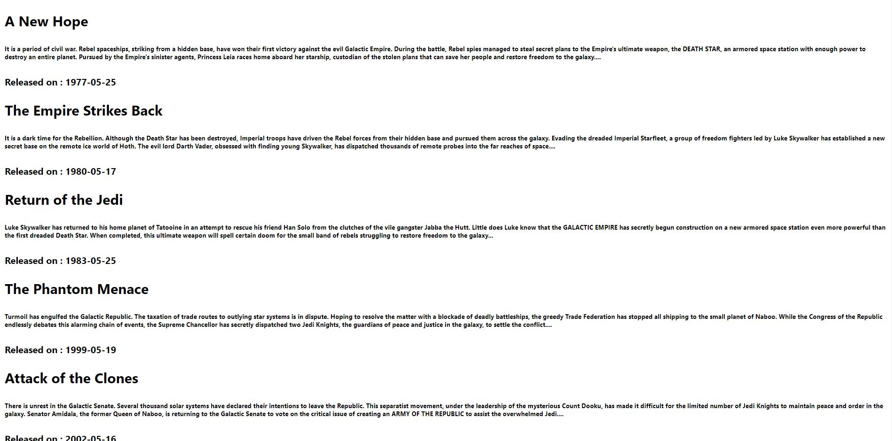

<h1 align='center'>Using built-in Fetch API</h1>

## What is Built-in Fetch API ?

The Built-in Fetch API is a modern interface that sends **HTTP Requests** from React(web browsers) to the background(servers). The fetch()method of **javascript**, having a global scope is way simpler and cleaner than the other methods of handling APIs. It intructs the browser to send a request to the specified URL in an asynchronous fashion.

- **Sending Requests**:

  - The fetch() takes one argument for the default **GET** request— the URL to the resource to be fetched.
  - It takes more arguments like method, body, header etc for other methods like **POST**.
  - It does not return the response body in JSON format.

- **Handling Responses**:
  - The fetch API returns a promise that resolves to a response which we can convert to JSON format using .json().
  - The .json() in turn returns a second promise which allows us then to react to the response accordingly.
  - We can use the .then() block to access,render,modify or log the data fetched in the console.
  - And the .catch() block to catch any potential errors, so that the page loading does not fail and only the error is logged to the console or an Error message is shown on the screen.

## Where we are Using Built-in Fetch API ?

The Fetch API is useful to perform a multitude of tasks involving HTTP Requests.

- Sending HTTP Requests with credentials included
- Uploading Data in JSON format
- Uploading single or multiple files
- Fetching Data from an API
- Checking the status of the fetch

For Example :

- #### Example 1 : While fetching data from an API using 'GET' Method

  ```javascript
  import { useState, useEffect } from "react";

  const App = () => {
    const [movies, setMovies] = useState([]);
    useEffect(() => {
      fetch("https://swapi.dev/api/films/")
        .then((response) => {
          return response.json();
        })
        .then((data) => {
          setMovies(data.results);
        })
        .catch((err) => {
          console.log(err);
        });
    }, []);
    console.log(movies);
    return (
      <div>
        {movies.map((movie) => (
          <div key={movie.episode_id}>
            <h2>{movie.title}</h2>
            <h6>{movie.opening_crawl}</h6>
            <h4>Released on : {movie.release_date}</h4>
          </div>
        ))}
      </div>
    );
  };
  export default App;
  ```

  This code would render the following output:

  

  ##### Explanation:

  - Fetch returns a promise, which resolves to a response.
  - The response’s json() method returns a JavaScript object.
  - If something goes wrong, the catch handler logs the error to the console

- #### Example 2 : While uploading data to a database using 'POST' Method

  ```javascript
  import "./App.css";
  import { useRef, useState } from "react";

  const App = () => {
    const [posts, setPosts] = useState([]);
    const nameRef = useRef();
    const jobRef = useRef();

    const submitHandler = (event) => {
      event.preventDefault();
      const name = nameRef.current.value;
      const job = jobRef.current.value;

      fetch("https://reqres.in/api/users", {
        method: "POST",
        body: JSON.stringify({
          name: name,
          job: job,
        }),
        headers: {
          "Content-Type": "application/json",
        },
      })
        .then((res) => res.json())
        .then((data) => {
          setPosts(data);
        });

      console.log(posts);
    };
    return (
      <div className="App">
        <form onSubmit={submitHandler}>
          <label htmlFor="name-input">Name</label>
          <input
            id="name-input"
            type="text"
            name="Name"
            placeholder="Enter your name here"
            ref={nameRef}
          />
          <label htmlFor="job-input">Job</label>
          <input
            id="job-input"
            name="Job"
            placeholder="Enter job position here"
            type="text"
            ref={jobRef}
          />
          <button type="submit">SUBMIT</button>
        </form>
        <div>
          <h1>You've submitted the following details: </h1>
          <h2>Your Name: {posts.name}</h2>
          <h2>Your Job: {posts.job}</h2>
        </div>
      </div>
    );
  };
  export default App;
  ```

  This code would render the following output:

  

  ##### Explanation:

  - We have used the Developer version of the ReqRes API to demonstrate the 'POST' method.

- #### Example 3: Using Async/Await

```javascript
async function fetchText() {
  let response = await fetch("/readme.txt");
  let data = await response.text();
  console.log(data);
}
```

## Benefits of the Using Built-In Fetch API.

- It has no external dependencies.

## References

- https://reactjs.org/docs/faq-ajax.html
- https://jasonwatmore.com/post/2020/11/02/react-fetch-http-put-request-examples
