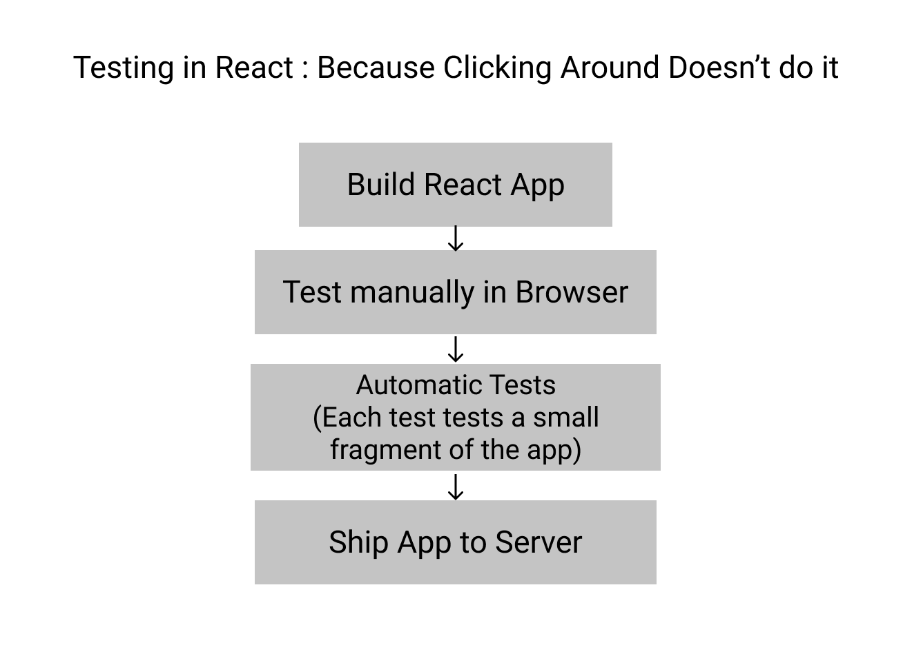

<h1 align='center'>Testing in React</h1>

## What is Testing ?

Testing can be defined as the procedure to make sure a software application or product behaves just the way it is supposed to do.Testing the code is essesntial before deployment. In React, testing involves execution of React components using manual or automated testing tools to identify errors or missing requirements in contrast to actual expectations of the application.



## Required Testing Tools:

- **Test Runner**:  
  A test runner executes tests and provides validation library which performs comparisons and potentially throw some errors (if any). For example: **Jest** provides popular Javascript testing tools.

  ```
  npm install jest
  ```

- **Testing Utilities**:
  Testing utilities "simulate" the React Application i.e. it mounts components and allows developers to dig into the DOM (Document Object Module). For example: **React Test Utils** or **Enzyme** are some of the popular testing utilities in React.

  ```
  npm install --save enzyme react-test-renderer enzyme-adapter-react-16
  ```

## What to Test?

| Do's                                               | Don'ts                              |
| -------------------------------------------------- | ----------------------------------- |
| :heavy_check_mark: Do test isolated units          | :x: Don't test the library          |
| :heavy_check_mark: Do test the Conditional outputs | :x: Dont't test complex connections |

## What are the types ?

There are a few ways to test React components and applications.

- **Rendering Component Trees**:
  This testing method involves testing out React components by rendering the component trees in a Simplified test environment and providing assertions on their expected outputs.

- **Test-Driven Development**:  
  Test-Driven Development is a development process in which tests are written for tasks before writing the code to implement those tasks. These tests can check for different scenarios and edge cases as well.

- **Unit Test**:
  A Unit Test is a type of test that covers a "unit" of code - that is usually a single function, independently from the rest of the program. Ideally, a test program is made to run that runs all the unit tests and lets the tester know which one failed and which one succeeded.

- **End-to-End Tests**:
  End-to-End Tests are executed by running the complete React Application in a realistic browser environment. They can prove to be really useful while testing longer workflows or those that are crucial tasks like Implementing a Payment Gateway or Authentication workflows by rendering the whole app in a real browser, implementing real API calls, using sessions, cookies, navigating routes etc .

Example : For testing such React components **React Testing Library** provides a very light-weight solution by building on top of **DOM Testing Library**. This makes working with React components way easier by adding APIs and providing light utility functions on top of react-dom and react-dom/test-utils.

```
npm install --save-dev @testing-library/react
```

## Benefits of the Testing

- Testing helps developers ensure that the React application will work as expected and intended for the users. It is a very cost-effective procedure as any bug caught in the earlier stages of development requires less amount to fix.
- Logging plays an important role in testing any application. It helps to describe events that have occurred while running the React App to help in debugging.
- Code Reviews benefit the testing procedure to promote best programming practices and thereby help to prepare code for production.
- Testing makes the app robust and less error prone by catching errors and faulty conclusions before they make any major impact post deployment.
- It ensures that the app is reliable, secure and is a high-performing one thereby increasing customer satisfaction.

## References

- https://reactjs.org/docs/testing.html
