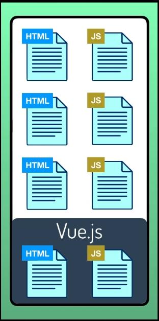
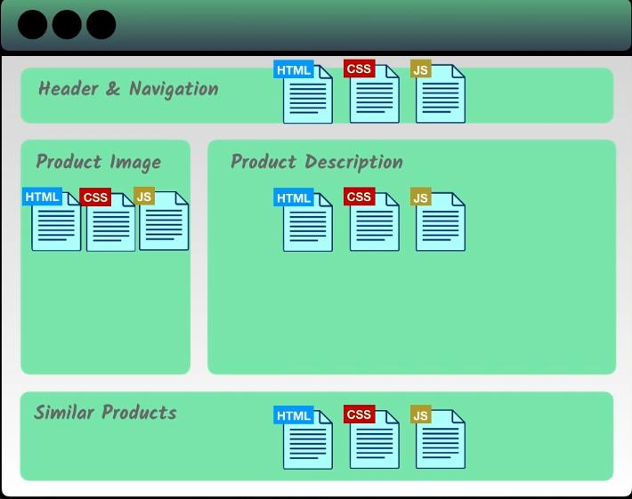

# Introduction

Ever wondered what will your website look like if no Javascript was there. Let me be clear, JavaScript is a programming language that is used to make your website much more interactive, user friendly. JavaScript reacts with your HTML elements via tag names, classes, or ids and helps in implementing interactivity to the website or a particular component of a website.

Nowadays there are several JavaScript frameworks or libraries that help developers to make their code much more organized and compiled together.
The three famous and most used JavaScript frameworks are - **Vue.js, Angular, React.js**.

In this documentation, we will learn more about _Vue.js_.

## What is Vue.js?

Vue.js is an **open-source**, **front-end** **progressive Javascript framework** that is used for _Single Page Applications_ that has richer and _powerful user experience_ and that can be _scaled_ to any level for a single page application or a user interface used with the combination of _modern tooling_ and _supportive library_ .  

_Progressive framework_ means if you have a previous server-side application you can plug Vue.js into one of the application's components that needs to be much more richer and user interactive experience.

    

## Why Vue.js?

Making an application just by using HTML, CSS and JavaScript is a tedious task and is not much organizable and manageable when it comes to building large-scale applications. Here Vue.js comes into play which modularizes (_breaking into small pieces_) your code, compiles HTML, CSS, and JavaScript into one single structure or component which makes it easy to identify errors much more easily.

**Reusable Components** - One of the key features of the Vue.js framework is the _reusability_ of the components which we have created. Each component has its own set of HTML, CSS, and JS which operates independently and which is used to render that piece of the page. These components can be reused at any level of code making it easier for us and preventing us from writing duplicate pieces of code for the same component that has to be rendered elsewhere.

    

Vue.js also provides the ability to control HTML already rendered by the server. Its main focus is the view layer (UI, pages, and the visual elements of the page), which makes it easier to integrate the Vue.js framework with existing web applications.

## Advantages of Vue.js

### 1.Small

Any JS framework that is lightweight and is of small size is always the most used and preferred framework due to its fast rendering and easy-to-understand features. So going by the above point Vue.js, owing to its small size **18-21 KB**, has an advantage over other frameworks as it takes no time to download  and use it.

### 2. Simple Integration

Vue.js is a progressive framework meaning it can be integrated with existing applications easily. (Being itself built on JavaScript can be integrated with any other framework built on JS)

### 3. Flexibility

Vue.js allows a developer to write a template in a pure HTML file, or a JavaScript file, which gives the framework the flexibility to developers who use React.js to understand a particular template. It's also easy to integrate different templating engines, CSS preprocessors, and many other things.

### 4. Two Way Data Binding or Communication

Vue.js has a very interesting feature of communicating with the UI elements called **two-way data binding** -  meaning whatever changes you make in your UI passes on to the data and changes made to the data get reflected in the UI. This is very different when compared to libraries like React.js which has only one-way communication. 

    

### 5. Documentation

In addition to the simple syntax, the Vue.js framework is also truly intuitive. The framework is extensively documented - the video courses and impressive core library focusing on the view layer make it easier for anyone who has even the basic knowledge of HTML, CSS, and JavaScript to understand the concepts and incorporate them.

### 6. Component Based Architecture (CBA)

The components which we previously talked about, represent encapsulated elements of your application interface. Each of these components has its separate HTML, CSS, and JS without the need oof division into separate files. Such a type of architectural approach and component system has several benefits:

1. _Code Reusabilty_ - Owing to the fact that the components of Vue are individually stored in separate files, it makes it easier for you to access a particular section of the code and fix it in case of any bugs.

2. _Good for unit-testing_ - Having components greatly simplifies the unit testing. It is aimed at understanding how the smallest component of the application works on its own.

### 7. Performance

Vue.js uses virtual DOM and lazy loading to boost performance and page loading speed.

Suppose in React you update a component state, all of the components in the subtree are re-rendered as well while in Vue, dependencies are tracked to prevent the unnecessary re-renders. Although in React you can use **shouldComponentUpdate** to prevent child component re-renders, this might add complexity and result in DOM state inconsistencies.

## Disadvantages of Vue.js

### 1. Limited Plugins

Vue.js is still a developing framework so it doesn't enjoy the support of many plugins, but it can be integrated with React or Angular to overcome this issue.

The plugins that are available on Vue that can be integrated with other frameworks are not well supported.

### 2. Language barriers

There are certain results stated by experts that are being developed mostly in the Chinese language, this complicates things for the native language developers. So it seems that there is larger support for the Chinese development community as compared to others.

### 3. Lack of Financial Support for Large-Scale projects

Vue.js has come a long since its development phase in the last two years, but still, it is a relatively young framework and cannot be compared to a well-established framework like Angular. This is one of the main reasons that it does not receive a large amount of financial support from enterprises that can support an app development team that can quickly solve the arising issues.

Despite that, Vue sees growing demands from tech giants like IBM and Adobe, although on relatively small scale projects.