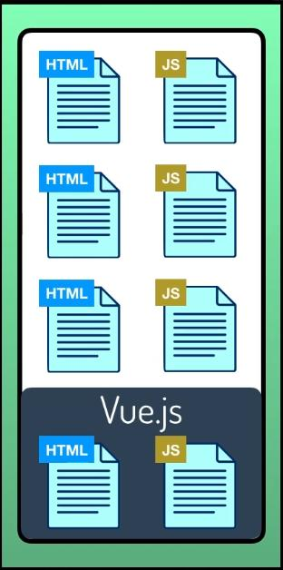
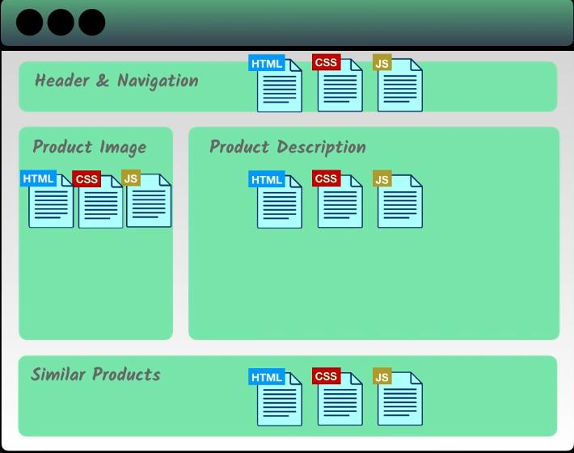

# Introduction

Ever wondered what would your website look like if no **Javascript** would be there. Let me be clear, JavaScript is a programming language that is used to make your website much more interactive, user friendly. JavaScript reacts with your HTML elements via tag names, classes or ids and allows the developer to add interactivity to the website or a particular element of a website.

Nowadays there are several JavaScript frameworks or libraries which help the developers to make their code much more organized and compiled.

The three famous and most used JavaScript frameworks are - **Vue.js**, **Angular**, **React.js**.

In this documentation we would learn more about _Vue.js_.

## What is Vue.js?

Vue.js is an **open-source**, **front-end** **progressive Javascript framework** that is used for _Single Page Applications_ that has richer and _powerful user experience_ and that can be _scaled_ to any level for a single page application or a user interface used with the combination of _modern tooling_ and _supportive library_ .  

_Progressive framework_, means if you have a previous server side application you can plug Vue.js into one of the application's components that needs to be much more richer and user interactive experience.

    

## Why Vue.js?

Making an application just by using HTMl, CSS and JavaScript is a tedious task and is not much organizable and manageable when it comes to building large scale applications. Here Vue.js comes into play which modularizes (_breaking into small pieces_) your code, compiles HTML, CSS and JavaScript into one single structure or component which makes it easy to identify errors much more easily.

**Reusable Components** - One of the key features of Vue.js framework is the _reusability_ of the components which we have created. Each component has its own set of HTML, CSS and JS which operates independently and which is used to render that piece of page. These components can be reused at any level of code making it easier for us and preventing us from writing duplicate pieces of code for the same piece of page that has to be rendered.

    

Vue.js also provides the ability to control HTML already rendered by the server. It's main focus is the view layer (UI, pages and the visual elements of the page), which makes it easier to integrate the Vue.js framework with existing web applications.

## Advantages of Vue.js

### 1.Small

Any JS framework that is light weight and is of small size is always the most used and preferred framework due to it's fast rendering and easy to understand features. So going by the above point Vue.js owing to it's small size **18-21 KB**, has advantnage over other frameworks as it takes literally no time to download it and use it.

### 2. Simple Integration

Vue.js being a progressive framework meaning it can be integrated with existing applications easily. (Being itself built on JavaScript can be integrated with any other framework built on JS)

### 3. Flexibility

Vue.js allows a developer to write a template in pure HTML file, or a JavaScript file , which gives the framewwork the flexibility to developers who use React.js to understand a particular template. It's also easy to integrate different templating engines , CSS preprocessors and many other things.

### 4.Two Way Data Binding or Communication

Vue.js has a very interesting feature of communicating with the UI elements called **two-way data binding** -  meaning whatever changes you make in your UI passes on to the data and changes made to the data gets reflected in the UI. This is very different when compared to libraries like React.js which has ony one way communication.

    

## Disadvantages of Vue.js

### 1. Lack of Support

Not backed by a large or a famous community , Vue.js doesn't have that much support as compared to React.js or Angular. Also the team that developed framework is also small resulting into a limited support.

### 2. Limited Plugins

Vue.js is still a developing framework so it doesn't enjoy the support of many plugins, but it can be integrated with React or Angular to overcome this issue.

### 3. Language barriers

There are certain results stated by experts that being developed mostly in Chinese language, this complicates thing for the native language developers. So it seems that there is larger support for the CHinese development community as compared to others.
