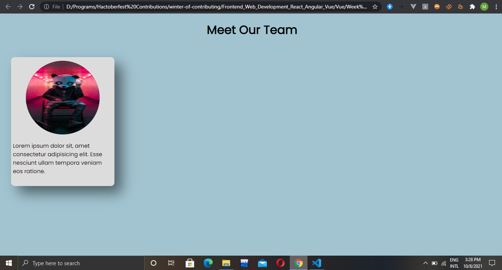
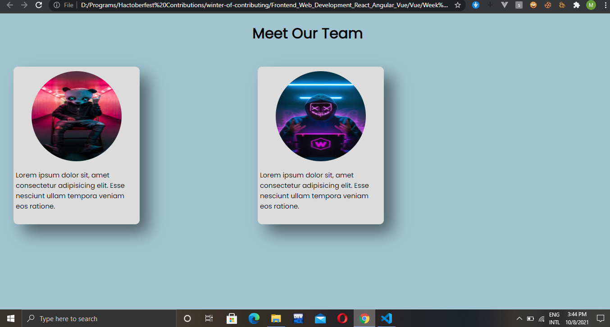
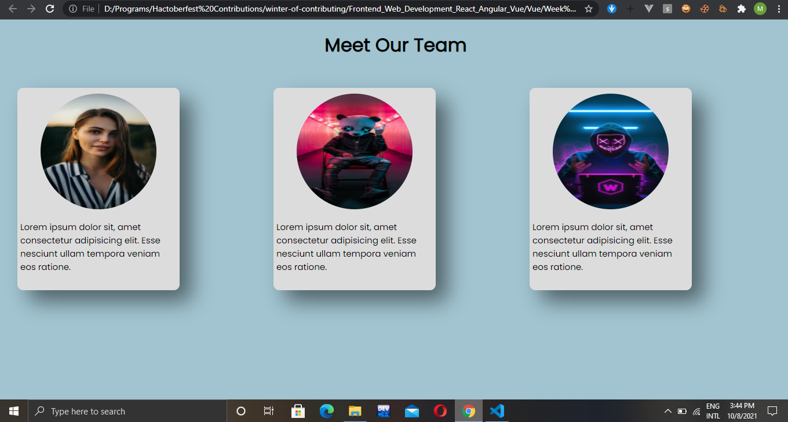

# Vue.js Components

## What are components?

One of the features of Vue.js is the Vue Components which allow us to reuse a piece of code multiple times within a Vue Project. Each component is a separate identity having its own Html, CSS and Javascript which can be used within the project. They helps us to avoid adding duplicate code in the project. So, components make the code portable within the Vue environment.

<div style="display: flex; justify-content: center; align-items: center; margin-bottom: 10px;">
    
</div>

## Why we need them?


We usually use the components we need a certain functionality or a UI (code) multiple times in the application. The components also increase the flexibility of our code as well as to make to code more manageable. We can use the simple components to make more complex layout with ease. 

### For Example: 

When we create a blogging website the interface of the blog remains the same only the content in the blog is changed. So, we can define a template for the blog and just change the text inside it to use it in the project. So, this is where we can use the components.

## Code Structure:

So, now you know what a component is and why it is needed. The step is how to write a component by yourself.

If you are using Vue through **CDN** in your project, then here how you can use a create a component. Create a file with “.js” extension and create the component as shown below. 

  * ### Global Components:

      These are the components that can be used with any of the Vue instance. They can be called and used anywhere in the Vue application. They have a global scope. Below is the way to create “Global Components”.

     ``````
    Vue.component(‘component-name’, {
    template: `
    <div>
    // Here the Html of the component is added
    </div>`,
    data: function() {
     return {
     // Here the local data for the component is stored
      }
     },
     methods: {
     // Here the functionality for the component is added
     },
     props: {
     // Here data passed from the parent component is stored
     },
     }); 

    ``````

     In the above code, Vue.Component() is a function which takes two parameters a string (Component Name) and an object which contains the details about the object like the: template, props, methods and data. These Global Components can be used anywhere in any Vue Instance.

     `````` 
     <div id = “app”>
     <component-name> </component-name>
     </div> 

     ``````


   * ### For Local Components:

     These are components that can be used within a specific scope, where they are registered using the “components” object property as show below:
     ``````
      var Component = {
      template: ` 
      <div>
       // Here the body of the component is added 
      </div>
      `,
      props: {
      // Here the data passed from the parent component is added
      },
     data: function(){
       return {
           // Here the local data of the component is added
      }
     },
     methods: {
       // Here the functions related to component are added
      }
     };
     ``````
     Now, these components must be called in the specific Vue Instance to be able to use them: 

     ``````
      const app = new Vue ({ 
      el: ‘#app’, 
      components: {
      ‘component-name’: Component (Object Name created above)
      },
      data: {
         // Here the main data for the application is added 
       } 

      });

     ``````
     Now call them in the html file as below:

     ``````
     <div id = “app”>
     <component-name> </component-name>
     </div>

     ``````


For the Project created using **Vue Cli**, you can create a component by creating a file with “.vue” extension in the “Components” folder and then import it where you want to use it. Below is the way to create the components for vue cli environment:


``````
<template>
 <div>
     // Here the Html body of the component is added
</div>
</template>

<script>
export default {
  name: “ComponentA”,
  data: function() {
      return {
          // Here the local data of the component is added
      }
 },
methods: {
 // Here the methods for the component is added
},
props: {
// Here the data passed from the parent component is added
}

};
</script>

<style scoped>
// Here the CSS for the component is added
</style>

``````
Now, in order to use these components, import them in the desired file where you want to us them as show below: 

``````
import ComponentA  from “./Component.vue”;
export default {
components: {
      ComponentA
   }
};

``````
## How to Code Efficiently:

Components make the work much simpler. There are some ways you can work more efficiently with them:

- Avoid using the Global Components because they can affect the performance of the application because they are loaded when the application is loaded. So, avoid using them.

- It is a good practice to use the local components because they are loaded only when they are used in the application. So, always try to use local components.

- Always try to make separate files for each components called as the “Single File Components”. Making multiple components in a single can make it confusing when using them in the code.

- Always keep the “data property” as a function in the components. So, that each component can have its own local data as show below:

         data: function() {
          return {
            firstname: ‘Vue.js’
          }
        }

- It is also very important to clearly define the props in the components. Define the type of the prop also assign a default value to it as:
        
        props: 
        {
            firstname:     //Prop Name
            {
              type: String,
              default: ‘Vue.js’
            }
        }        

## Coding Example:

Here in this code example I have created a simple into card component which is every commonly used in website. The full code is available at the end of this file. 

``````
Vue.component('IntroCard',{
  
    template: `
    <div>
    <div class="card">
      <div class="card-header">
        
      </div>
      <div class="card-body">
       <p>
        Lorem ipsum dolor sit, amet consectetur adipisicing elit. Esse nesciunt ullam tempora veniam eos ratione. 
       </p>
       </div>
    </div>
</div>
    `,
    props: {
        img: {
            type: String,
            default: '../assets/../assets/images(2).jpg'
        }

    }
      
})

``````
In the above code "Intro Card" is the "component-name". In the template I have added the body of the card. In the props object I have one prop "img" which will be the src of the image to be added in the component. I have also assigned it a "default" value in case no data is passed to component.

Now we will use the IntroCard component in our project as shown below:

`````
<!DOCTYPE html>
<html lang="en">
<head>
    <meta charset="UTF-8">
    <meta http-equiv="X-UA-Compatible" content="IE=edge">
    <meta name="viewport" content="width=device-width, initial-scale=1.0">
    <title>Document</title>
    <link rel="stylesheet" href="./style.css">
</head>
<body>
     <div id="app">
         <h1>Meet Our Team</h1>
         <div class="app-body">                
                <intro-card></intro-card>           
         </div>        
    </div>
     <script src="https://cdn.jsdelivr.net/npm/vue@2.6.14/dist/vue.js"></script>
     <script src="./index.js"></script>
</body>
</html>

`````
Now, look in the above code I have called the IntroCard component in the "app div" which is our application body. The output of this above code is:

<div style="display: flex; justify-content: center; align-items: center; margin-bottom: 10px;">
    
</div>

Now, we will use the component again but this time we will pass the src of the image in the component as shown below:


````
<!DOCTYPE html>
<html lang="en">
<head>
    <meta charset="UTF-8">
    <meta http-equiv="X-UA-Compatible" content="IE=edge">
    <meta name="viewport" content="width=device-width, initial-scale=1.0">
    <title>Document</title>
    <link rel="stylesheet" href="./style.css">
</head>
<body>
     <div id="app">
         <h1>Meet Our Team</h1>
         <div class="app-body">
                
                <intro-card></intro-card>
                <intro-card img="../assets/images(3).jpg"></intro-card>
                          
         </div>        
    </div>
     <script src="https://cdn.jsdelivr.net/npm/vue@2.6.14/dist/vue.js"></script>
     <script src="./index.js"></script>
</body>
</html>

````

Here in the above code, in the component tag we have passed the src of the image in the "img prop" of the component. The output of the above code is:

<div style="display: flex; justify-content: center; align-items: center; margin-bottom: 10px;">
    
</div>


We can use the components as many times as we want in the project as shown below:


``````

 <div id="app">
         <h1>Meet Our Team</h1>
         <div class="app-body">
                <intro-card img="../assets/images(1).jpg"></intro-card>      
                <intro-card></intro-card>
                <intro-card img="../assets/images(3).jpg"></intro-card>           
         </div>        
    </div>

``````


Output of the above code will be:


<div style="display: flex; justify-content: center; align-items: center; margin-bottom: 10px;">
    
</div>


Now observe the output all the images are different in each card this is because we have passed the "src" of the other two images by ourself whereas in the "second card" the default value of the prop was used in the component.


 If we have not used the components in the project the code would have looked this this:


``````
<div id="app">
         <h1>Meet Our Team</h1>
         <div class="app-body">
            
            <div class="card">
                <div class="card-header">
                  
                </div>
                <div class="card-body">
                 <p>
                  Lorem ipsum dolor sit, amet consectetur adipisicing elit. Esse nesciunt ullam tempora veniam eos ratione. 
                 </p>
                 </div>
            </div>


            <div class="card">
                <div class="card-header">
                  
                </div>
                <div class="card-body">
                 <p>
                  Lorem ipsum dolor sit, amet consectetur adipisicing elit. Esse nesciunt ullam tempora veniam eos ratione. 
                 </p>
                 </div>
              </div>


              <div class="card">
                <div class="card-header">
                  
                </div>
                <div class="card-body">
                 <p>
                  Lorem ipsum dolor sit, amet consectetur adipisicing elit. Esse nesciunt ullam tempora veniam eos ratione. 
                 </p>
                 </div>
              </div>  
            
         </div>        
    </div>

``````

Now as you can see how much our duplicate code has been removed by using the components in our application. This is one of the biggest advantage of using components.

This is a small example of how we can reuse the components in our code based on the needs of our project. 

I hope you were able to understand how to create and use the components in Vue.js.

## Code Implementation

Here is the complete implementation of the component. Place the code in their respected files for the code to work properly.

This code is to be placed in the Html file:

``````
<!DOCTYPE html>
<html lang="en">
<head>
    <meta charset="UTF-8">
    <meta http-equiv="X-UA-Compatible" content="IE=edge">
    <meta name="viewport" content="width=device-width, initial-scale=1.0">
    <title>Document</title>
    <link rel="stylesheet" href="./style.css">
</head>
<body>
     <div id="app">
         <h1>Meet Our Team</h1>
         <div class="app-body">
            
            <div class="card">
                <div class="card-header">
                  
                </div>
                <div class="card-body">
                 <p>
                  Lorem ipsum dolor sit, amet consectetur adipisicing elit. Esse nesciunt ullam tempora veniam eos ratione. 
                 </p>
                 </div>
            </div>


            <div class="card">
                <div class="card-header">
                  
                </div>
                <div class="card-body">
                 <p>
                  Lorem ipsum dolor sit, amet consectetur adipisicing elit. Esse nesciunt ullam tempora veniam eos ratione. 
                 </p>
                 </div>
              </div>


              <div class="card">
                <div class="card-header">
                  
                </div>
                <div class="card-body">
                 <p>
                  Lorem ipsum dolor sit, amet consectetur adipisicing elit. Esse nesciunt ullam tempora veniam eos ratione. 
                 </p>
                 </div>
              </div>  
            
         </div>        
    </div>
     <script src="https://cdn.jsdelivr.net/npm/vue@2.6.14/dist/vue.js"></script>
     <script src="./index.js"></script>
</body>
</html>

``````
This is the styling of the applciation.This code is to be placed in the **style.css** file:


````````
@import url('https://fonts.googleapis.com/css2?family=Poppins&display=swap');
*{
   margin:0;
   padding:0;
   box-sizing: border-box;
}
/* This is the styling for the Main App (Vue Instance)*/
#app{
    background-color: #a1c4d0;
    height: 100vh;
}
#app h1{
    text-align: center;
    font-family: 'Poppins', sans-serif;
    padding: 20px;
}
.app-body{
 display: grid;
 grid-template-columns: auto auto auto;
 margin: 20px;
}


/* This is styling for the intro component*/

.card {
    height: 350px;
    width: 280px;
    background-color: gainsboro;
    margin: 10px;
    border-radius: 10px 10px;
    box-shadow: 20px 20px 35px rgba(0,0,0,0.5);
}
.card-header {
    padding: 10px 20px;
    text-align: center;
}
.card-header img{
    border-radius: 50%;
    height: 200px;
    width: 200px; 
}
.card-body{
    padding: 5px;
    font-family: 'Poppins', sans-serif;
}
.card-body p{
    font-size: 15px;
}

````````


This is the setup of the vue application.This code is to be placed in **index.js** file.

````
Vue.component('IntroCard',{
  
    template: `
    <div>
    <div class="card">
      <div class="card-header">
        
      </div>
      <div class="card-body">
       <p>
        Lorem ipsum dolor sit, amet consectetur adipisicing elit. Esse nesciunt ullam tempora veniam eos ratione. 
       </p>
       </div>
    </div>
</div>
    `,
    props: {
        img: {
            type: String,
            default: '../assets/../assets/images(2).jpg'
        }

    }
      
})

const app = new Vue({
  el: '#app',
  data: {
      
  }
})`
````

## References 
[Vue.js Documentation](https://vuejs.org/v2/guide/components.html) , [Tutorialpoint](https://www.tutorialspoint.com/vuejs/vuejs_components.htm) , [Educative](https://www.educative.io/edpresso/what-are-vue-components)
