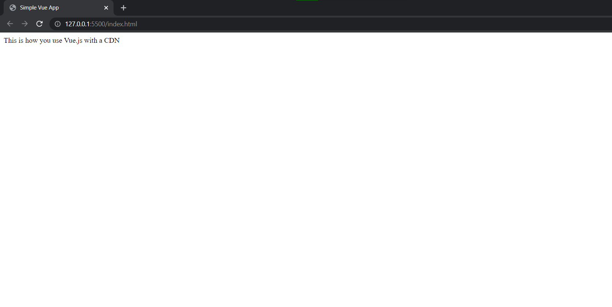

# Using Vue.js with CDN
If you dont want to go throught the hassle of installation, and just want to try out Vue.js for learning or prototyping (or for fun), using a CDN would be a good choice. CDN stands for Content Delivery Network, it is used to deliver content like HTML Pages, Javascript files, images etc and is responsible for serving a huge amount of internet traffic these days. We will be using Vue.js via a CDN service called jsdelivr

### Usage
To use Vue.js with a CDN, simply add the following script tag to the head tag of your HTML and you will be good to go (yes it's that simple!).
```
<script src="https://cdn.jsdelivr.net/npm/vue@2.6.14/dist/vue.js"></script>
```

### Example
Let's take a look at an example.
```html
<!DOCTYPE html>
<html lang="en">
<head>
    <meta charset="UTF-8">
    <meta http-equiv="X-UA-Compatible" content="IE=edge">
    <meta name="viewport" content="width=device-width, initial-scale=1.0">
    <title>Simple Vue App</title>
    <!-- This is where we have brought in the CDN-->
    <script src="https://cdn.jsdelivr.net/npm/vue@2.6.14/dist/vue.js"></script>
</head>
<body>
    <div>
        <!--A HTML based template is used here. To know more about it visit this webpage https://vuejs.org/v2/guide/syntax.html-->
        {{ content }}
    </div>
    <script>
        var container = new Vue({
            //el is the abbreviation for element. We can use the element names like div,
            //p,h1 to target the elements, or use CSS Selectors like .class-name, #id-name
            el: "div",
            //The value of the property in this object literal, will be displayed in its 
            //corresponding template (has the same name as the property in this case it 
            //is called - content).
            data:{
                content: "This is how you use Vue.js with a CDN"
            },
        })
    </script>
</body>
</html>
```
### This code renders the following page in the browser:


