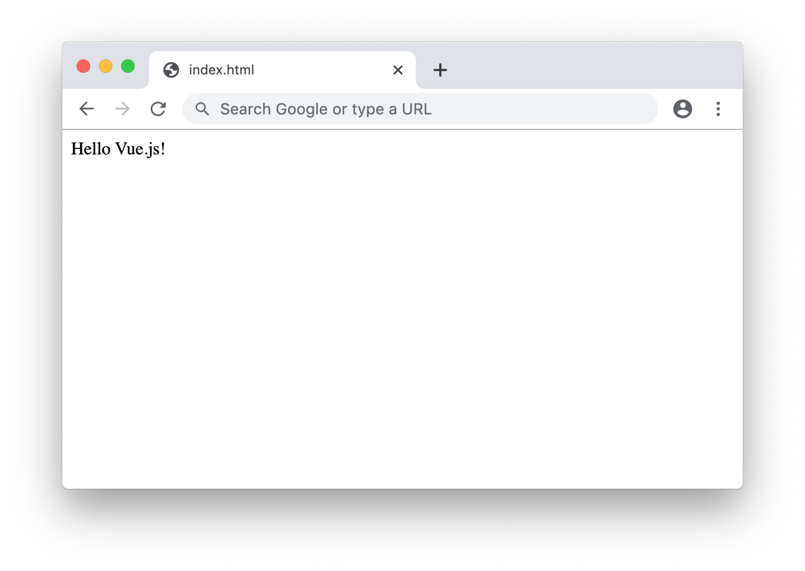
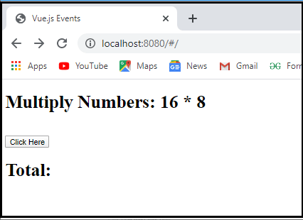
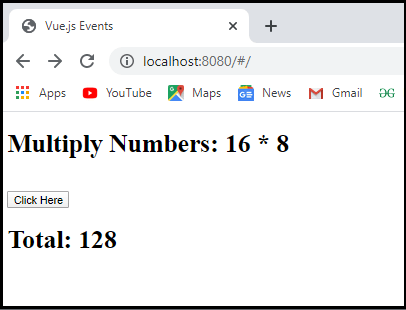

<h1 align="center"> Data and Methods </h1>

## What is data() in Vue.js?

Data is used to define properties in a particular component. Data is a function that returns a set of properties that has been defined in the function. Basically in vue.js data() we defined collection of logic and stored in component using vue.js we can access data Node.js associated with a vue instance. Components are reusable as many times as per requirement. But each time it uses a separate component and also creates a new instance. When we use a data function at that time each instance maintains a separate copy of the return data object. Most of vue.js uses API to fetch and post data.

**Syntax:**
```javascript
Vue.component('new component name', {
  data: function () {
    return {
      count: 0
    }
  },
  template: '<button v-on:click="count++">hit clicked {{ count }} times.</button>'
})
```
___

Let’s see how we can implement Vue.js data() with examples as follows.

**Example 1 :-**

**#App.vue**
```javascript
<template>
  <div id="app">
    <h2>{{title}} </h2>
  </div>
</template>

<script>
  export default {
    name: 'App',
    data(){
    return{
    title: 'Hello Vue.js!'
    }
  }
}
</script>
```

In this example, we only made changes in the App.vue file in which we added a data method to access the title. Illustrate the end result of the above declaration by using the use of the following snapshot.

**#Output :-**<br>



<hr>

## What is Method in Vue.js?

Vue.js methods are defined as a function to perform certain actions whenever the user is needed and the method is associated with a Vue instance as the method is similar to function like in other programming languages. In Vue.js methods are defined using the “method” name property before declaring or using it as a method in the Vue.js app code, in simple words we can say methods are function associated with an instance which are defined inside the method property, methods are usually defined similarly to as declaring “def” in the python for defining methods or functions and in Vue.js we use “method” property.
___

Let us demonstrate how to declare methods in Vue.js with the below syntax and example.

**Syntax:**
```javascript
new Vue({
  e1: ‘#app’
…….
  methods: {
    piece of code or logic
  }
)}
}
```

In the above, we can see the syntax for declaring methods in the Vue.js code snippets.

**Example:-**

#Html file:
```javascript
<!DOCTYPE html>
<html>
  <head>
    <title>Vue.js Events</title>
    <script src="https://unpkg.com/vue/dist/vue.js"></script> 
  </head>
  <body>
    <div id="app">
      <h1>Multiply Numbers: 16 * 8</h1></br>
      <button v-on:click = "displaynumbers">Click Here</button>
      <h1>Total: {{total}}</h1>
    </div>   
  </body>
</html> 
```

#Vue js file:
```javascript
import Vue from 'vue'
import App from './App'
import router from './router'
Vue.config.productionTip = false
var vm = new Vue({
  el: '#app', 
  data: {
   num1: '16',
   num2 : '8',
   total : '' 
},
methods : {
  displaynumbers : function(event) {
    console.log(event);
      return this.total =  this.num1 * this.num2;
    }
  }
}); 
```

**#Output :-**<br>



When we click on the “Click Here” button, it shows the output, as shown in the below screenshot.



<hr>


