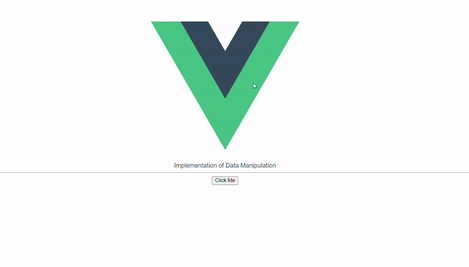
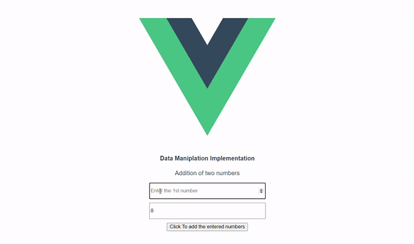

### Need of Data Manipulation

You cannot process raw data incoming from a specific endpoint, since that might contain several other unnecessary information which might not be required at that specific instant. So to avoid this we use data manipulation to get the desired data and then work on it. Each JS framework has its unique way of doing this and in this documentation, we shall learn one of how **Vue.js** manipulates the data using **methods** object.

Suppose you made a **GET** request to the specific endpoint and you received the following data from that request:

```json
[
  {
    "mood": "happy",
    "fish": "robin",
    "colors": ["blue", "green"]
  },
  {
    "mood": "tired",
    "fish": "panther",
    "colors": ["green", "black", "orange", "blue"]
  },
  {
    "mood": "sad",
    "fish": "goldfish",
    "colors": ["green", "red"]
  }
]
```

and from this, you want all the colors from the color array so for this you would play around or manipulate the received data from the specific endpoint. You might use the following piece of code to do so:

```js
let response = [
  {
    mood: "happy",
    fish: "robin",
    colors: ["blue", "green"],
  },
  {
    mood: "tired",
    fish: "panther",
    colors: ["green", "black", "orange", "blue"],
  },
  {
    mood: "sad",
    fish: "goldfish",
    colors: ["green", "red"],
  },
];
let myColors = [];
for (let i = 0; i < response.length; i++) {
  myColors.push(response[i].colors);
}
```

By the above code, you would get all the colors in the _myColors_ variable and you can then manipulate and use it accordingly.

So here the need for data manipulation arises, you just don't want raw data coming from an endpoint or data which is passed as props in some of the JS frameworks, you would want to use that data and display it in the format as the client wants to see it.

### Using methods for data manipulation

In Vue.js to declare custom methods or to write a logic that should run at a particular instance, we write them in the methods object provided by the VUe.js instance. The **this** value is automatically bound to **methods** by Vue.js such that each function in the method has its unique copy of the component instance. Here **this** refers to the component instance.

With the help of **this** keyword, we can access the data properties in the component and manipulate them when any event listener is fired and that particular event matches with that in the methods object.

Just like any other property of Vue component methods are accessible within the component's template. The most common way of using methods in a template is as follows:

```html
<!-- changebkg is the name of the method that is used to handle data manipulation - in this case changing background with click-->
<button @click="changebkg">Click To change background</button>
```

### Implementation of Data Manipulation using methods

#### Illustration 1

```html
<template>
  <div id="app">
    <span>{{message}}</span>
    <hr />
    <button @click="changeMessage()">Click Me</button>
  </div>
</template>

<script>
  export default {
    name: "App",
    data: () => ({
      message: "Implementation of Data Manipulation",
    }),
    methods: {
      changeMessage() {
        this.message = "Succesfully message changed";
      },
    },
  };
</script>
```

In the above code snippet you can see that in the method properties there is a function named **changeMessage()** using this we can manipulate the **message** data property and set it to the text as we want that should be displayed on the screen on clicking the button.

Below is the output of the above performed operation:

<div style="display: flex; justify-content: center; align-items: center">
  
</div>
<br>

#### Illustration 2

```html
<template>
  <div class="hello">
    <h3>Data Manipulation Using Methods</h3>
    <div>
      <input
        type="number"
        name="num1"
        placeholder="Enter the 1st number"
        v-model="num1"
      />
    </div>
    <div>
      <input
        type="number"
        name="num2"
        placeholder="Enter the 2nd number"
        v-model="num2"
      />
    </div>
    <button @click="add">Click To add the entered numbers</button>
    <p v-if="displayResult">Result: {{sum}}</p>
  </div>
</template>

<script>
  export default {
    name: "HelloWorld",
    data: () => ({
      num1: 0,
      num2: 0,
      displayResult: false,
      sum: 0,
    }),
    methods: {
      add() {
        this.displayResult = true;
        this.sum = parseInt(this.num1) + parseInt(this.num2);
      },
    },
  };
</script>
```

In the above code snippets, we are adding 2 numbers _num1_ and _num2_. This is done by firing a click event which triggers the **add()** in the **methods** object and the result is displayed in a paragraph tag by accessing the data variable sum which stores the result of the performed operation.

Below is the output of the above performed operation:

<div style="display: flex; justify-content: center; align-items: center">
  
</div>
<br>

The above example illustrates how we can manipulate the data enetered by the user and perform operations on them with the help of functions in the **method** object.

### Reference Links

1. [Vue.js Guide](https://v3.vuejs.org/guide/data-methods.html#methods)

2. [CSS-Tricks](https://css-tricks.com/methods-computed-and-watchers-in-vue-js/)
