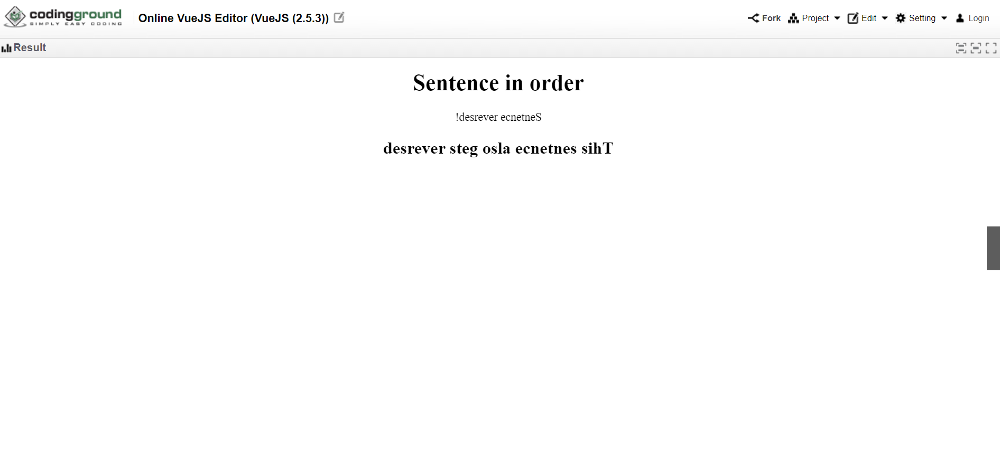
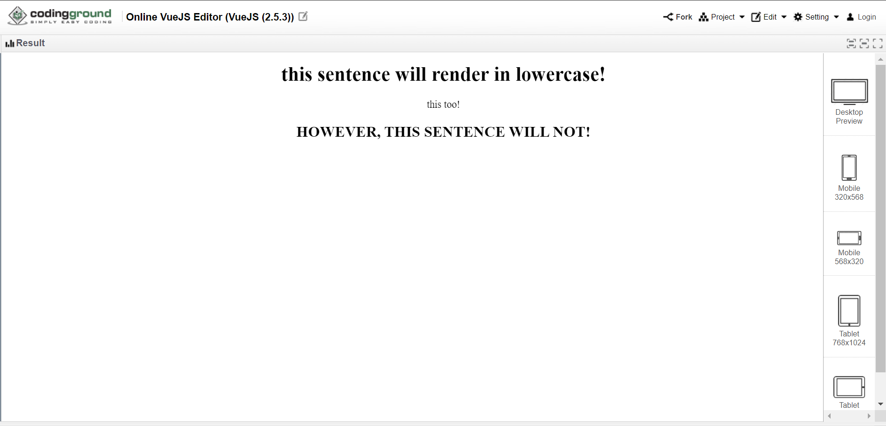
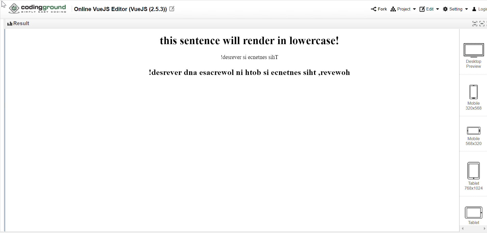
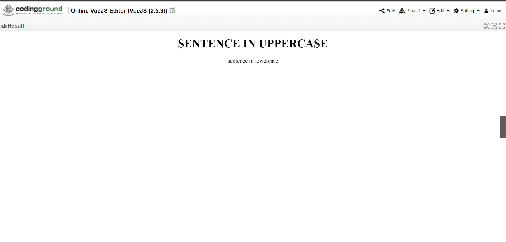
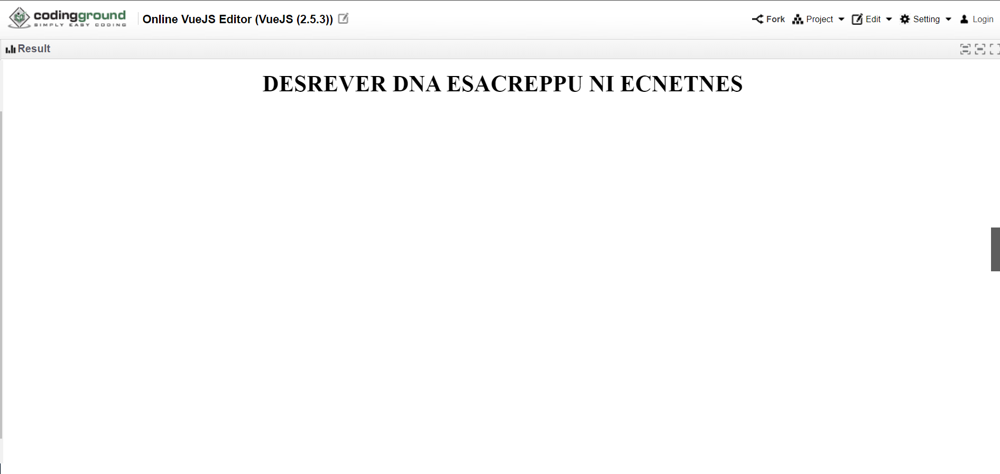
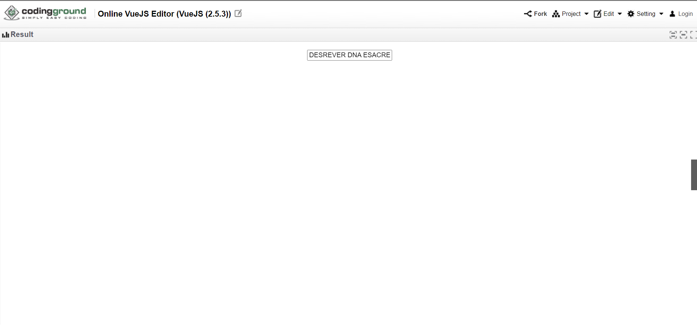

# Filters in Vue.js
Vue.js Filters were used before Vue 3.0 in order to perform common text formatting in a component template. They don't actually change the original data but just add formatting to it so that the data sent to browser is altered. 

Although filters have been deprecated since then, you may still find their use in legacy code so, let's take a look at how they work:

There are two places where one can use Vue filters 
* mustache interpolations 
    ```html
    <h1>{{ message | lowercase }}</h1>
    ```
* ```v-bind``` expressions
    ```html
    <input type="text" v-bind:value="currAmount | formatVal"/> 
    ```

In order to use a filter, you can simply mention the function name to the end of expression after the "pipe" symbol (``` | ```). The pipe operator redirects the value from the first expression to the filter function and the value returned is sent to the browser for rendering. In the above two instances, the value of ```message``` is passed to ```lowercase``` filter and the value of ```currAmount``` to ```formatVal```.


# Ways to use a Filter in Vue.js
There are two ways to register a filter function.  
1. Global Filter Function
2. Local Filter Function


# 1. Global Filter
We can set the filter function for use in multiple components by setting it using Vue.filter() just before creating the Vue instance like-

```html
<html>
   <head>
      <!--aranez-->
<title>VueJs Introduction</title>
      <script type = "text/javascript" src = "https://cdnjs.cloudflare.com/ajax/libs/vue/2.5.3/vue.min.js">
      </script>
   </head>

   <body>

       <!--The content inside this div will be able to use the reverseIt filter-->
      <div id = "intro" style = "text-align:center;">
         <h1>{{ message }}</h1>
         <p>{{message2 | reverseIt }}</p>
      </div>

    <!--The content inside this div will ALSO be able to use the reverseIt filter-->
      <div id = "desc" style= "text-align:center;">
          <h2>{{ desc | reverseIt }}</h2>
      </div>

      <!--Script-->
      <script type = "text/javascript">

        //Global Filter
        Vue.filter("reverseIt", (value) => {
            return value.split("").reverse().join("");
        });
      
         var vue_head = new Vue({
            el: '#intro',
            data: {
               message: 'Sentence in order',
               message2: 'Sentence reversed!'
            },
         });
         var vue_desc = new Vue({
            el: '#desc',
            data: {
               desc: 'This sentence also gets reversed'
            }
         });
      </script>
   </body>
</html>
```
## Output
<div style="display: flex; justify-content: center; align-items: center; margin-bottom: 10px;">
    
</div>

## Explanation

In the above code, you may notice the following piece of code.
```js
 Vue.filter("reverseIt", (value) => {
    return value.split("").reverse().join("");
});
```
This piece of code is registering a filter with a name of ```reverseIt``` globally that takes a value as input, reverses it and returns the reversed string as output. By registering it globally you can use this filter inside any of the components in our Vue App.

# 2. Local Filter
When you'd want to use a filter locally, say for use inside a particular section or div component of your webpage, you can do so by adding it to the filters object as a method like so-

```html
<html>
   <head>
      <!--aranez-->
<title>VueJs Introduction</title>
      <script type = "text/javascript" src = "https://cdnjs.cloudflare.com/ajax/libs/vue/2.5.3/vue.min.js">
      </script>
   </head>

   <body>
       <!--The content inside this div will be able to use the lowercase filter-->
      <div id = "intro" style = "text-align:center;">
         <h1>{{ message | lowercase }}</h1>
         <p>{{message2 | lowercase }}</p>
      </div>
    <!--The content inside this div will NOT be able to use the lowercase filter-->
      <div id = "desc" style= "text-align:center;">
          <h2>{{ desc | lowercase }}</h2>
      </div>
      <!--Script-->
      <script type = "text/javascript">
         var vue_head = new Vue({
            el: '#intro',
            data: {
               message: 'THIS SENTENCE WILL RENDER IN LOWERCASE!',
               message2: 'THIS TOO!'
            },
            filters: {
               //Local Filter
                lowercase: (value) => value.toLowerCase()
            }
         });
         var vue_desc = new Vue({
            el: '#desc',
            data: {
               desc: 'HOWEVER, THIS SENTENCE WILL NOT!'
            }
         });
      </script>
   </body>
</html>
```

## Output
<div style="display: flex; justify-content: center; align-items: center; margin-bottom: 10px;">
    
</div>

## Explanation

In the above code, you may notice the following piece of code inside ```vue_head```.
```js
filters: {
    lowercase: (value) => value.toLowerCase()
}
```
This piece of code is locally registering a filter with a name of ```lowercase```.  
The filter takes a value as input, converts it to lowercase and returns the final value string as output. By registering it locally, in this case, you can only use this filter inside the DOM element with the id of ```intro``` which is where the vue app ```vue_head``` is being rendered.


# Chaining Filters
There may be a case where you'd want to chain multiple filters, maybe for adding different sets of formatting or something else. Well, you can do so easily by specifying all the filters sequentially separated by ```pipe``` operators. Let's take an example- 
```html
<html>
   <head>
      <!--aranez-->
<title>VueJs Introduction</title>
      <script type = "text/javascript" src = "https://cdnjs.cloudflare.com/ajax/libs/vue/2.5.3/vue.min.js">
      </script>
   </head>

   <body>
       <!--You can use individual filters or chain multiple filters!-->
      <div id = "intro" style = "text-align:center;">
         <h1>{{ message | lowercase }}</h1>
         <p>{{message2 | reverseIt }}</p>
         <h2>{{ desc | lowercase | reverseIt }}</h2>
      </div>
      
      <!--Script-->
      <script type = "text/javascript">
         var vue_head = new Vue({
            el: '#intro',
            data: {
               message: 'THIS SENTENCE WILL RENDER IN LOWERCASE!',
               message2: 'This sentence is reversed!',
               desc: 'HOWEVER, THIS SENTENCE IS BOTH IN LOWERCASE AND REVERSED!'
            },
            filters: {
               //Local Filters
                lowercase: (value) => value.toLowerCase(),
                reverseIt: (value) => value.split("").reverse().join("")
            }
         });
         
      </script>
   </body>
</html>
```

## Output
<div style="display: flex; justify-content: center; align-items: center; margin-bottom: 10px;">
    
</div>

## Explanation

In the above code, you may notice the following piece of code inside ```vue_head```.
```html
   <h2>{{ desc | lowercase | reverseIt }}</h2>
```
This piece of code shows how the ```desc``` key is being filtered by both ```lowercase``` and ```reverseIt``` filters locally.  
The first filter (```lowercase```) takes the value of desc as input, converts it to lowercase and returns the final value string as output to the second filter (```reverseIt```) which then reverses the lowercase string and returns the value for rendering.


# Passing Multiple arguments to Filter Functions
Let's supoose you wanted to change a string to either lowercase or uppercase but wanted to create a single filter that can perform both. Let's take an example- 

```html
<html>
   <head>
      <!--aranez-->
<title>VueJs Introduction</title>
      <script type = "text/javascript" src = "https://cdnjs.cloudflare.com/ajax/libs/vue/2.5.3/vue.min.js">
      </script>
   </head>

   <body>

       <!--You can specify the case you want to convert the value to by passing it as an argument to the filter-->
      <div id = "intro" style = "text-align:center;">
         <h1>{{ message | changeCase('uppercase') }}</h1>
         <p>{{ message2 | changeCase('lowercase') }}</p>
      </div>

      <!--Script-->
      <script type = "text/javascript">

        //Global Filter
        Vue.filter("changeCase", (value, tCase) => {
            if (tCase == "uppercase") return value.toUpperCase();
            else if (tCase == "lowercase") return value.toLowerCase();
            else return value;
         });
      
         var vue_head = new Vue({
            el: '#intro',
            data: {
               message: 'sentence in uppercase',
               message2: 'SENTENCE IN LOWERCASE'
            }
         });
      </script>
   </body>
</html>
```

## Output
<div style="display: flex; justify-content: center; align-items: center; margin-bottom: 10px;">
    
</div>

## Explanation

In the above code, the following code is defining a filter ```changeCase``` globally that takes two arguments ```value``` and ```tCase``` and the value returned by this filter is in lowercase or uppercase depending on whether ```tCase``` is ```"uppercase"``` or ```"lowercase"```
```js
   Vue.filter("changeCase", (value, tCase) => {
      if (tCase == "uppercase") return value.toUpperCase();
      else if (tCase == "lowercase") return value.toLowerCase();
      else return value;
   });
```

The following piece of code shows how the same filter```changeCase``` is being called with both ```lowercase``` and ```uppercase``` arguments.  

```html
<h1>{{ message | changeCase('uppercase') }}</h1>
<p>{{ message2 | changeCase('lowercase') }}</p>
```

In the first case ```changeCase``` takes two arguments,
1. the value ```message``` and
2. the string ```"uppercase"```  


And in the second case ```changeCase``` takes two arguments,
1. the value ```message2``` and
2. the string ```"lowercase"```    

<hr>

## _You can also chain filters with multiple arguments or global filters with local filters_
let's take an example-

```html
<html>
   <head>
      <!--aranez-->
<title>VueJs Introduction</title>
      <script type = "text/javascript" src = "https://cdnjs.cloudflare.com/ajax/libs/vue/2.5.3/vue.min.js">
      </script>
   </head>

   <body>

       <!--You can chain global filters with local filters, filters with multiple arguments with filters with single arguemnt-->
      <div id = "intro" style = "text-align:center;">
         <h1>{{ message | changeCase('uppercase') | reverseIt }}</h1>
      </div>

      <!--Script-->
      <script type = "text/javascript">

        //Global Filter
        Vue.filter("changeCase", function (value, tCase) {
            if (tCase == "uppercase") return value.toUpperCase();
            else if (tCase == "lowercase") return value.toLowerCase();
            else return value;
         });
      
         var vue_head = new Vue({
            el: '#intro',
            data: {
               message: 'sentence in uppercase and reversed'
            },
            filters : {
               //Local Filter
                reverseIt: (value) => {
                    return value.split("").reverse().join("");
                }
            }
         });
      </script>
   </body>
</html>
```
## Output
<div style="display: flex; justify-content: center; align-items: center; margin-bottom: 10px;">
    
</div>

## Explanation

In the above code, the following code is using two filters ```changeCase``` and ```reverseIt```.  
1. ```changeCase``` is a global filter which takes two arguments, in this case, the value of ```message``` and ```"uppercase"``` and converts the message to uppercase.
2. ```reverseIt``` is a local filter which takes only one argument, in this case, the value returned by ```changeCase``` filter i.e., ```message``` string converted to uppercase.
```html
<h1>{{ message | changeCase('uppercase') | reverseIt }}</h1>
```
<hr>

### _Although in this document only moustache interpolations were used, you can just as well do all these operations in ```v-bind``` expressions_

Let's take an example-

```html
<html>
   <head>
      <!--aranez-->
<title>VueJs Introduction</title>
      <script type = "text/javascript" src = "https://cdnjs.cloudflare.com/ajax/libs/vue/2.5.3/vue.min.js">
      </script>
   </head>

   <body>

       <!--You can chain global filters with local filters, filters with multiple arguments with filters with single arguemnt in v-bind expressions too-->
      <div id = "intro" style = "text-align:center;">
         <input v-bind:value="message | changeCase('uppercase') | reverseIt" />
      </div>

      <!--Script-->
      <script type = "text/javascript">

        //Global Filter
        Vue.filter("changeCase", function (value, tCase) {
            if (tCase == "uppercase") return value.toUpperCase();
            else if (tCase == "lowercase") return value.toLowerCase();
            else return value;
         });
      
         var vue_head = new Vue({
            el: '#intro',
            data: {
               message: 'sentence in uppercase and reversed'
            },
            filters : {
               //Local Filter
                reverseIt: (value) => {
                    return value.split("").reverse().join("");
                }
            }
         });
      </script>
   </body>
</html>
```

## Output
<div style="display: flex; justify-content: center; align-items: center; margin-bottom: 10px;">
    
</div>

## Explanation

In the above code, see the following piece of code-
```html
<input v-bind:value="message | changeCase('uppercase') | reverseIt" />
```
This piece of code shows that we can use ```v-bind``` expression to filter the value of an ```input``` tag in HTML.

#  References
*  https://theninja.blog/using-filters-in-vue/
*  https://vuejs.org/v2/guide/filters.html
*  https://www.reddit.com/r/vuejs/comments/bfpfrz/are_vuejs_filters_really_that_bad/
*  https://www.adcisolutions.com/knowledge/how-build-single-page-application-spa-vuejs


