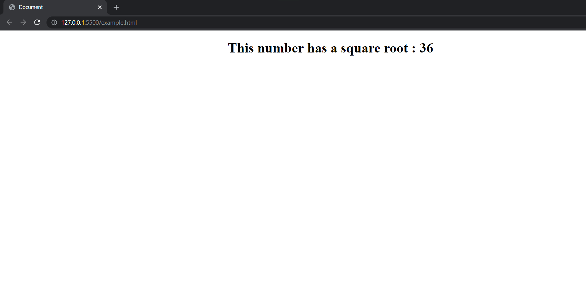
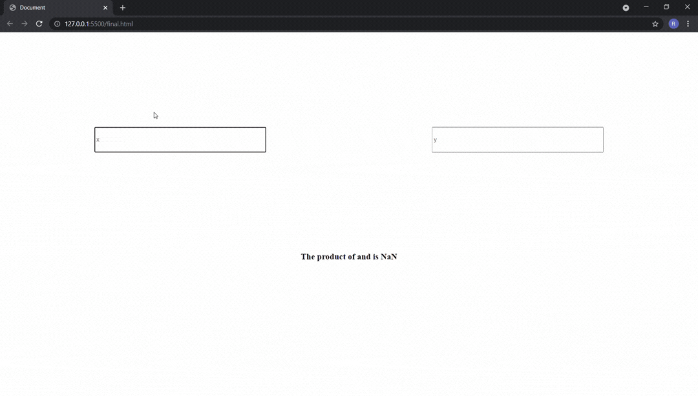

# Computed Properties
Computed properties are very similar to [methods](https://flaviocopes.com/vue-methods/) in Vue.js. The templates in our code for the most part, should be dealing with displaying their content and not with performing logical operations on them(for example multiplying the displayed number by 2 or reversing the string that is displayed). To perform these logical operations, we can use computed properties.

Let's take a look at an example:
```html
<!DOCTYPE html>
<html lang="en">
<head>
    <meta charset="UTF-8">
    <meta http-equiv="X-UA-Compatible" content="IE=edge">
    <meta name="viewport" content="width=device-width, initial-scale=1.0">
    <title>Document</title>
    <!-- We are using a CDN to use Vue.js -->
    <script src="https://cdn.jsdelivr.net/npm/vue@2.6.14/dist/vue.js"></script>
</head>
<body>
    <!-- Notice how we are calculating the square of the number here. -->
    <h1 id = "demo" style="text-align: center;">This number has a square root : {{ sqNumber**2 }}</h1>
    <script>
        let vueInstance = new Vue({
            // We are targeting the element with the ID demo
            el:"#demo",
            data:{
                // This is the number whose square, we are displaying in the browser
                sqNumber: 6,
            }
        })
    </script>
</body>
</html>
```
This code, produces the following output. 



While we get our desired output, notice how an operation takes place at the sqNumber template. Not only should our templates be concerned with only displaying their data, performing these operations individually if we need to display the squared number in multiple places will easily become hectic. So in this case, we can use computed properties. Replacing the vue instance in the previous code, with the following lines of code will produce the same output.
```js
let vueInstance = new Vue({
            el:"#demo",
            data:{
                sqNumber: 6,
            },
            computed:{
                squaredValue: function(){
                    return this.sqNumber**2;
                }
            }
        })
```
Note that you should also change your template as follows as we are now using a computed property.
```html
<h1 id = "demo" style="text-align: center;">This number has a square root : {{ squaredValue }}</h1>
```
# Usage
To know when to use computed properties, we should first know the difference between computed properties and methods. When it comes to methods, the code is executed as long as the method is invoked. But that is not the case with computed properties. Computed properties are cache based, and will be triggered only when their reactive dependency (dependencies that can change) has changed. 

Let us take a look at an example. Consider the following HTML code, that displays a webpage that shows some random numbers between 1 and 1000

```html
<!DOCTYPE html>
<html lang="en">
<head>
    <meta charset="UTF-8">
    <meta http-equiv="X-UA-Compatible" content="IE=edge">
    <meta name="viewport" content="width=device-width, initial-scale=1.0">
    <title>Document</title>
    <!-- We are using a CDN to use Vue.js -->
    <script src="https://cdn.jsdelivr.net/npm/vue@2.6.14/dist/vue.js"></script>
</head>
<body>
    <div id = "content">
        <h1>A Random number from 1-1000</h1>
        <!-- These two h3 tags, will display a number that is returned from a method -->
        <h3>Random number 1 from a method: {{ methodNumber() }}</h3>
        <h3>Random number 2 from a method: {{ methodNumber() }}</h3>
        <!-- These two h3 tags, will display a number that is returned from a computed property -->
        <h3>Random number 1 from a computed property: {{ computedNumber }}</h3>
        <h3>Random number 1 from a computed property: {{ computedNumber }}</h3>
    </div>

    <script>
        let vueInstance = new Vue({
            //We are targeting the div element with the ID 'content'
            el: '#content',
            //This is a method, that returns a random number
            methods: {
                methodNumber: function(){
                return Math.floor(Math.random()*1000);
            }},
            //This is a computed property that returns a random number. 
            computed: {
                computedNumber: function(){
                return Math.floor(Math.random()*1000);
            }},
        }
        )
    </script>
</body>
</html>
```
This code renders the following web page in the browser:


Notice how the random numbers from methods are different, but the ones from computed properties are always the same. No matter how many time the computed property is called it would instantly return the previously computed value and will not run the function again.

# Basic Implementation:
Let us consider this basic implementation of computed properties. This webpage, takes in two numerical inputs from the user and displays a product of those numbers. Notice how computed properties are triggered when the value in the input field is changed (because it is a reactive dependency).

```html
<!DOCTYPE html>
<html lang="en">
<head>
    <meta charset="UTF-8">
    <meta http-equiv="X-UA-Compatible" content="IE=edge">
    <meta name="viewport" content="width=device-width, initial-scale=1.0">
    <title>Document</title>
    <!-- We are using a CDN to use Vue.js -->
    <script src="https://cdn.jsdelivr.net/npm/vue@2.6.14/dist/vue.js"></script>
</head>
<body>
    <div id = "demo" >
        <!-- This div container has two input fields. The value in these input fields will be
        assigned to the numberOne and numberTwo data properties in the vue instance.  -->
        <div style="display: flex; flex-direction: row;justify-content: space-between; padding: 200px;">
            <!-- We are using 2-way binding with the help of v-model, which we will cover later in this Documentation -->
            <input style="width: 33%; height:50px;" type="number" v-model = "numberOne" placeholder="x">
            <input style="width: 33%; height:50px;" type="number" v-model = "numberTwo" placeholder="y">
        </div>
        <!-- When there is a change in the input field, it will trigger the computed property,
        productValue because, its reactive dependency has changed -->
        <h3 style="text-align: center;">The product of {{numberOne}} and {{numberTwo}} is {{productValue}}</h3>
    </div>
    <script>
        let vueInstance = new Vue({
            //We are targeting the div container with the ID 'demo'
            el:"#demo",
            //The data used by the computed property. It is initialised as an empty string
            data:{
                numberOne: "",
                numberTwo: "",
            },
            computed:{
                productValue: function(){
                    //parseInt() is used to convert a numerical string to its corresponding number
                    return parseInt(this.numberOne)*parseInt(this.numberTwo);
                }
            }
        })
    </script>
</body>
</html>
```



# Additional Resources:
To learn more about Computed Properties in Vue.js, refer the following links:
1. A detailed explanation about [computed properties](https://blog.logrocket.com/understanding-computed-properties-in-vue-js/#usingcomputedpropertiesassetters)
2. A good implementation of [computed properties](https://developer.mozilla.org/en-US/docs/Learn/Tools_and_testing/Client-side_JavaScript_frameworks/Vue_computed_properties)
3. [Computed properties](https://vuejs.org/v2/guide/computed.html) from the official documentation of Vue.js