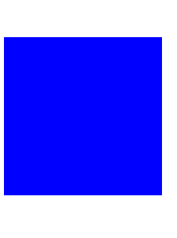

# Inline style manipulation 💅

Unlike other frameworks, (React, Angular), VueJS too has the inline styles feature. <u>*It is for those who just want to maintain their stylesheets in a single vue file and not referencing the styles from an external stylesheet.*</u> Though this seems to be a bad idea, as you are jamming many things into a single codebase, but it is still efficient for many devs.


As a very good practical example, the [Tailwinds CSS library](https://tailwindcss.com/docs) is mostly to be used with inline styling. Check out their [docs](https://tailwindcss.com/docs) to have a clearer picture, also I am attaching a sample code, to explain what I am trying to say,

```html
<div class="h-64">
        <div class="p-4 m-4 bg-green-600">
            <h1 class="text-2xl font-bold text-white">Tailwind CSS Demo</h1>
        </div>
        <div class="p-4 m-4 bg-green-300 h-full">
            <h2 class="text-green-900">Have much fun using Tailwind CSS</h2>
        </div>  
    </div>
```

In the above code, **p-4 m-4 bg-green-300 h-full** represents inline styling.

Well, enough talks about the terminology now, let's dive into the inline styling in VueJS now.

1) Inline Styling by HTML style attribute
Styles can be inlined to an element (HTML or Custom) with the `style` HTML attribute. Since we are going to bind to an HTML attribute, we are bound to use the **v-bind** property or the `:` **shorthand of *v-bind***

```html
<div style="width: 1366px; height: 768px;" v-bind:style="">Inline Styling</div>
```
I have added a simple div in advance which is *1366* pixels in width and  *768* pixels in height, and the first thing I want to do, is to set its background color to blue.

---

## Styling Techniques
Style binding like this, requires any two formats, they are
1) Object Notation
2) Array Representation

### Styling with Object Notation 💅

Let's begin by seeing what the *object notation* looks like. The **keys** in this object should match the **CSS style** that we want to set, and the value should be an expression that resolves to a value. In this case, the key will be **background-color**.
As in normal JavaScript, we need to ***enclose the key within quotation marks because it contains a dash***. Note that I will use single quotes here so I don't have to escape double quotes, as they would otherwise interfere with the HTML markup.

So that was the name of the style that I want to apply to the div element. For the value, I can simply write red enclosed in single quotes as well.

```html
<div style="width: 1366px; height: 768px;" v-bind:style="{ 'background-color': 'red' }">
{{ content }}
</div>
```

This shall produce a red square.


Of course this is not all that useful, because we defined the color directly within our template. If that's all we needed, we might as well just have added the style directly to the HTML style attribute. What's more useful, is to actually bind to a dynamic color. Let's create a data property containing the color instead and bind to this property within the template.

```js
data: { 
  color: 'blue' 
}
```

Now I just need to write the name of this property as the expression for the background-color style, and the result will be the same.

```html
<div style="width: 1366px; height: 768px;" v-bind:style="{ 'background-color': color }">
  {{ content }}
</div>
```


Seeing a downside, this is not too useful because we have hardcoded the color within our Vue instance. Also, this enables us to change the color dynamically. Also, if we do this, Vue will automatically update the style, because we have now bound the background-color style to the color data property. To show you this, I will add a button with a click event listener which changes the color.
```html
<button @click="changeColor">Change Color</button>
```

And now the event listener. This listener will simply use an if statement to switch the color from blue to red and vice verca.

```js
methods: {
	changeColor: function() {
		if (this.color == 'blue') {
			this.color = 'red';
		} else {
			this.color = 'blue';
		}
	}
}
```

If I click the button now, we will see that the background color of the  div  changes.

As you can probably imagine, it can quickly become difficult to read if we add more properties to the object within the template. To solve this, we can simply move the object to a data property and refer to this property within the template. I will call the property  styles.

In the process I will clean up the code a little, because we will no longer need the button that changes colors.

```js
data: {
	styles: {
		'background-color': 'blue'
	}
}
```

With this, I can simply write  styles  as the expression within the template.

```html
<div style="width: 200px; height: 200px;" v-bind:style="styles">
{{ content }}
</div>
```

*Did you notice, that we have a `style` in pure HTML alongwith the binding to same HTML attrib?*
> This works because Vue.js merges the styles on our behalf before applying the styles to the DOM. So the styles that are applied to the DOM are the result of merging the HTML style attribute with our style binding.

That being said, let's move the width and the height to this `styles` object as well, just to keep the styles in one place and thereby make things a little easier to maintain.
**IF**
```js
styles: {
	'background-color': 'blue',
	width: '200px',
	height: '200px'
}
```
**THEN**
```html
<div v-bind:style="styles"> {{ content }} </div>
```

For this long, what we did, is great for such simple styling and does not scale up great. 
**What if we needed to make use of some other data properties to determine the styles?** 
Perhaps we always want the width to be half of the height. Of course we could be lazy and just change the **width to 100 pixels**, but that woundn't be much fun. Since we cannot access other data properties from within our styles object, we need to do a workaround.

*Can you guess it?*
> The answer is a computed property.

```js
computed: {
	styles: function() {
		var height = 200;
    
		return {
			'background-color': 'blue',
			width: (height / 2) + 'px',
			height: height + 'px'
		};
	}
}
```

Now we will see that the width is half of the height. The point is that you can either use a *data property* if your styles do not depend on one another, or a *computed property* if they do.

If we add an array instead of an object, this array should in fact be an array of objects, where each object uses the same syntax as we have just seen. The point of this is that you can override styles. So I add a new data property named  **moreStyles**  which adds round corners to the  `div`  by using the  `border-radius`  CSS style.

```js
data: {
	moreStyles: {
		'border-radius': '5px'
	}
}
```

In the template, I can now add the two objects within an array.
```html
<div v-bind:style="[styles, moreStyles]"> {{ content }} </div>
```

I could of course also have referred to either a data property consisting of an array, or a computed property which returns an array.

What this does, is that it **merges the two objects together**, so if I run the code, you will see that the  	`div`  still has the same styles, but that it now also has **round corners**. This is *because Vue.js merges the objects together, and it is worth noting that an object in the array takes precedence over any objects added before them*. So if I were to change the `background-color` to red within the  `moreStyles`  object, we would see that the background color changes to red, even though we had already defined it to be blue in the first object.

```js
data: {
	moreStyles: {
		'border-radius': '10px',
		'background-color': 'red' // REMOVE AFTER RUNNING CODE
	}
}
```

---
### Styling with Class Notation/Syntax 💅
Now that we have seen how to add inline styles by binding to the `style` attribute, let's now see how to use classes for styling. While it is convenient and sometimes necessary to use the style attribute, it is *considered best practice* to write CSS in external stylesheets and apply `styles` to elements based on **classes** and **element IDs**.

Supposingly, we have an array of shapes, which can be either a circle or a square, and that each shape has some common styles associated with it. We distinguish circles from squares by having an *isRound* property on each shape object. With this, I can make a `div` element which iterates through the shapes array by using the `v-for` directive. I will just write that before we get to determining which classes should be on the `div` elements.

```html
<div class="shape"
        v-for="shape in shapes">
      {{ content }}   
</div>
```

Notice that we will always add the shape class.

Similarly to how we bound an object to the style attribute in the previously lecture, we will bind an object to the class attribute now.

Notice that we will always add the  `shape`  class.

Similarly to how we bound an object to the  style  attribute in the *previously method*, we will bind an object to the  `class`  attribute now.
```html
<div class="shape"
       v-for="shape in shapes" 
       v-bind:class="{ }">
      {{ content }}   
</div>
```

Now the syntax for this object is slightly different in the context of the class attribute. The keys of the object should match the class names, and the values should be an expression that evaluates to a `boolean`.

The firstmost class to be added conditionally is `circle`, so that shall be the first key of the object. As for the expression, I am going to use the alias for the current iteration of the loop, which is `shape`. If the `isRound` property holds *true* then the `circle` class would be added.

```html
<div class="shape"
       v-for="shape in shapes" 
       v-bind:class="{ circle: shape.isRound }">
      {{ content }}
</div>
```

So if the `isRound` property on the shape object is `true`, then the `circle` class is added. If it is `false`, then the class will not be added to the DOM.

Now we have checked if the shape is a **circle**, but we also need to check whether or not it is a square and if so, add the appropriate class. 
So let's do the same for the square class, except that we need to negate the expression.

```html
<div class="shape"
       v-for="shape in shapes" 
       v-bind:class="{ circle: shape.isRound, square: !shape.isRound }">
      {{ content }}   
</div>
```

With this, each `div` element will contain the shape class plus either circle or square.

We only need to assign two classes to a `div` to turn it into a `triangle`; the `triangle` class and a class specifying the direction of the triangle, which can be either **up, down, left, or right**. Well, now we can clearly see that the `isRound` property was not the best idea in the world, so let's get rid of it and add a more generic property which holds the type of shape. I will name it `shape`.

```js
shapes: [
    { shape: 'circle' },
    { shape: 'square' }
]
```

We can now make the assumption that the value of the shape property will match a CSS class for a given shape. So how do we apply this class to the div element? When we supply an object as the binding to the class attribute, we specify the class name as object keys, but we need something more dynamic in this case. So let's clear out what we already had and start over and use the array syntax.

```html
<div class="shape"
       v-for="shape in shapes" 
       v-bind:class="[ shape.shape ]">
      {{ content }}
</div>
```

Upon building the code, the circle and square shapes will be working again, but this time, in a more dynamic fashion. Let's now work on the triangles, so we need to add some objects to the shapes array. The class name for the triangle shape is not so surprisingly triangle, and besides that we need to specify a **direction**.

```js
shapes: [
	{ shape: 'circle' },
	{ shape: 'square' },
	{ shape: 'triangle', direction: 'up' },
	{ shape: 'triangle', direction: 'right' },
	{ shape: 'triangle', direction: 'down' },
	{ shape: 'triangle', direction: 'left' }
]
```

For the triangles to show up, we need to add the **direction** as a class too, as I have added styles for the different directions within the stylesheet.

```html
<div class="shape"
        v-for="shape in shapes" 
        v-bind:class="[ shape.shape, shape.direction ? shape.direction : '' ]">
        {{ content }}   
</div>
```

Now we should see the triangles appear, so let's try again. We want to apply an animation to some of the shapes when we load the page.

I have already added a class named **animate** which takes care of this. So all we need to do, is to add this class to a shape to make it animate. But first, we need to know which shapes should animate, so I will add a **boolean** property named animate to a couple of the shapes.

```js
shapes: [
	{ shape: 'circle' },
	{ shape: 'square', animate: true },
	{ shape: 'triangle', direction: 'up' },
	{ shape: 'triangle', direction: 'right', animate: true },
	{ shape: 'triangle', direction: 'down' },
	{ shape: 'triangle', direction: 'left', animate: true }
]
```

Alright 😏, we have a small problem here. 

*How do we add the animate class to the shape depending on the truthiness of the animate property?* 
>Since we know the <u>*name*</u> of the class, we could use another shorthand if statement, but I want to show you a cleaner way of doing it. We started out by adding an object as the binding which allowed us to toggle classes based on a boolean value. This would be of use to us right now, so luckily this is also possible with the array syntax. What we can do, is to add an object following the same syntax as we saw earlier, to the array. Since we want to toggle the animate class, we will use this as the object key, and the value will simply be the animate property on the shape alias, which contains a boolean value. If the property does not exist, the evaluation will be false, and the class will not be added.

```html
<div class="shape"
          v-for="shape in shapes" 
          v-bind:class="[ shape.shape, shape.direction ? shape.direction : '', { animate: shape.animate } ]">
				{{ content }}
</div>
```

---

# References
1) [Vue3 Style Docs](https://v3.vuejs.org/guide/class-and-style.html)
2) [Code Snippets Reference](https://codingexplained.com/coding/front-end/vue-js/styling-css-classes)
---
# Conclusion 😏

Well, we have now reached an end to this article of *styles manipulation (inline)*. I hope I have made my points very clear to teach you the nitty-gritty details of inline styling in Vue.

Do like, share the article, wherever you find it in the future.
Your sharing of this article, will keep thriving the GirlScript community and the developers, supporting open-source. 🙏


## Contribution made by,
**Ankur Paul**

<br>
<br>


<marquee>

> Follow me on [GitHub](https://www.github.com/nooobcoder) **OR** [Twitter](https://twitter.com/AnkurSurya12345)


</marquee>

--- 
>*This article is contributed to GirlScript Winter of Contribution (GWoC), 2021 by **Ankur Paul***