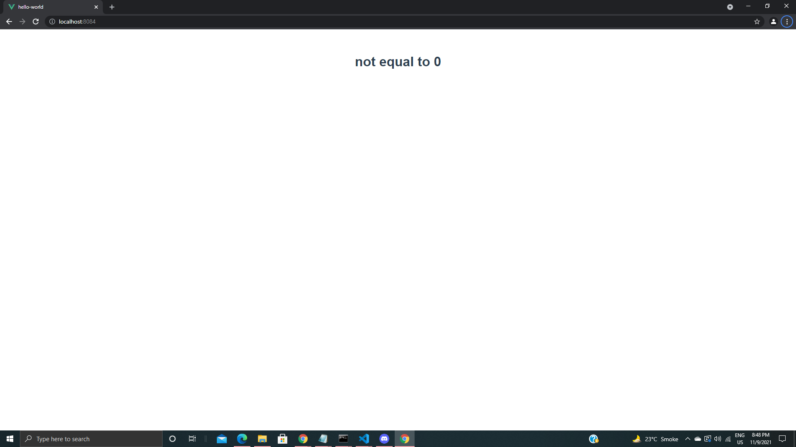
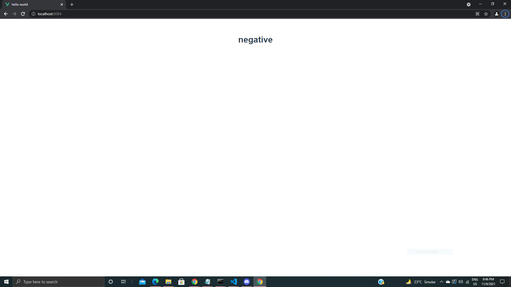
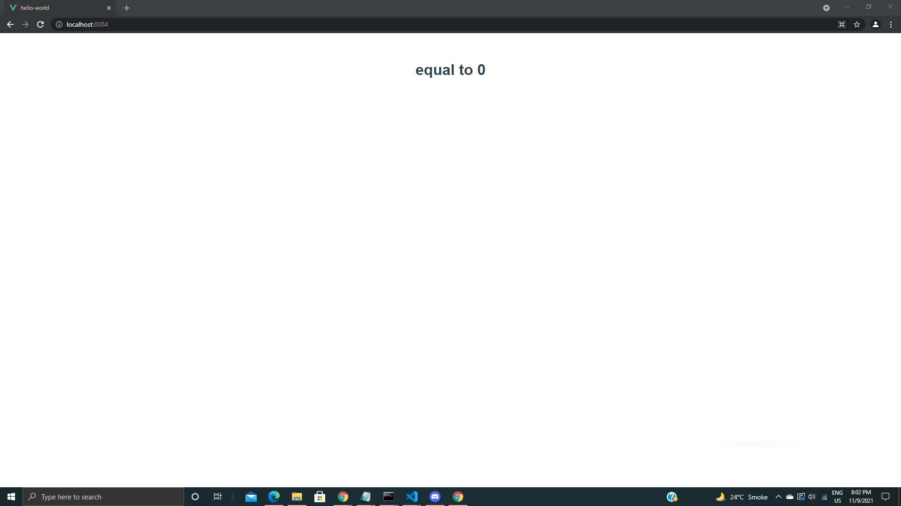

# Conditional Rendering
Conditional Rendering allows us to render different elements or components based on a condition.  
It makes it easy to toggle the presence of any element in the DOM based on a certain condition. 

## Benefits of Conditional Rendering
Tries to help us render our element as efficient as possible.  
  
Helps in making vue work fast.  


**Conditional Rendering has four directives ``` v-if ``` ,``` v-else``` ,``` v-else-if``` and ``` v-show```.**  

### v-if  
The directive ```v-if``` is used to conditionally render a block. The block will only be rendered if the directive’s expression returns a truthy value. 

### v-else
```v-else``` directive to indicate an “else block” for ```v-if```.
A v-else element must immediately follow a v-if or a v-else-if element - otherwise it will not be recognized.

```
<template>
 <h1 v-if='num===0'>equal to 0</h1>
 <h1 v-else >not equal to 0</h1>
</template>

<script>


export default {
  name: 'App',
  data(){
    return{
      num:2
    }
  }
}
</script>
```

### v-else-if
 This serves as an “else if block” for v-if.We use this when we have more number of conditions to check.

 ```
 <template>
 <h1 v-if='num===0'>equal to 0</h1>
 <h1 v-else-if='num>0' >positive</h1>
 <h1 v-else-if='num<0' >negative</h1>
 <h1 v-else >not a no.</h1>
</template>

<script>


export default {
  name: 'App',
  data(){
    return{
      num:-2
    }
  }
}
</script>
```  




### v-show
This is also an option for conditionally displaying an element. It's results are similar to those of ```v-if```. 
```
<template>
 <h1 v-show ='num===0'>equal to 0</h1>
 
</template>

<script>


export default {
  name: 'App',
  data(){
    return{
      num:0
    }
  }
}
</script>
```



**Then why do we use v-show**

## Difference between v-if and v-show
  
 ```v-if``` actually destroys and recreate elements when the conditional is toggled whereas``` v-show``` will always keep the element in the DOM and will only toggle its display by changing its CSS.   
 ```v-if``` has higher toggle costs while```  v-show  ```has higher initial render costs. So we prefer``` v-show``` if we need to toggle something very often, and prefer``` v-if``` if the condition is unlikely to change at runtime.


## References
1. [Vue.js](https://vuejs.org/v2/guide/conditional.html)
2. [Codevolution](https://www.youtube.com/playlist?list=PLC3y8-rFHvwgeQIfSDtEGVvvSEPDkL_1f)

