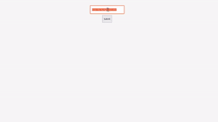

# Introduction

Instead of standard events provided by Vue.js like `@click` or `@change`, someone wants to create a custom event, like doing some task after a function in a child component has finished its execution. Here **Emitting events** comes into play.

In Vue.js `$emit` keyword helps us to emit or send custom events from child components to parent components. In a standard Vue flow, this can be considered as the best way to send data or trigger certain events from child to parent components.

## How do the emitting events work?

In the syntax of `$emit` there are two arguments that need to be passed to make this work:

1. **Event name** - this is the name of the event that we listen to in our parent component.

2. **Payload object** - this is the data which we want to pass as the event is emitted; _this is optional_

Example of the above syntax:

```js
$emit("event-name", payload_object);
```

The above code snippets create a custom event with the provided event name and also data can be passed from child component to parent if required. In the parent component, the event is listened to and a certain task is performed if the event is emitted or triggered correctly.

Unlike components or props, event names don't provide any automatic case transformation. So the event names should be the same where the event is listened to.

The most common ways to use emit is:

1. Inline using `$emit`

2. Options API - `this.$emit`.

We will see the working of the above two syntaxes in a while.

## Advantages of emitting events:

1. Passing data from any component to another with the help of the `$emit` payload object.

2. Overriding the native events to achieve many concise and complex actions to be performed as and when required.

3. Building wrappers for event-heavy elements like the `input`, `form` components.

## Need for emitting events:

It is generally used to notify the parent component that something has changed, and also can be used to send data while an event is being emitted to change/update its state or value, or compute some fields which might require that data value.

## Examples

Child Component: `Hello World.vue`

```html
<template>
  <div class="hello">
    <input type="text" placeholder="Custom events demo" v-model="color" />
    <button @click="$emit('custom-event', color)">Submit</button>
  </div>
</template>

<script>
  export default {
    name: "HelloWorld",
    props: {
      msg: String,
    },
    data: () => ({
      color: "Enter the background color",
    }),
  };
</script>
```

In the above component, we are emitting an event `custom-event` when the button is clicked after entering the value in the input box, then the above value is passed to the parent component as shown value, which hears for it and updates the background color to the same as the value in the input box.

Parent Component: `App.vue`

```html
<template>
  <div id="app">
    <HelloWorld @custom-event="changeColor" />
  </div>
</template>

<script>
  import HelloWorld from "./components/HelloWorld";

  export default {
    name: "App",
    components: {
      HelloWorld,
    },
    methods: {
      changeColor(event) {
        document.getElementById("app").style.background = event;
      },
    },
  };
</script>
```

The changeColor method changes the background of the element with id `app` to the value passed in the emit event. Here we are using `inline-emit`.

The above code in action:

<div style="display: flex; justify-content: center; align-items: center">
  
</div>
<br>

The same can be achieved with the Options API using the `this` keyword as shown below:

```html
<template>
  <div class="hello">
    <input type="text" placeholder="Custom events demo" v-model="color" />
    <button @click="$emit('custom-event', color)">Submit</button>
  </div>
</template>

<script>
  export default {
    name: "HelloWorld",
    props: {
      msg: String,
    },
    data: () => ({
      color: "Enter the background color",
    }),
    methods: {
      emittingEvent() {
        this.$emit("custom-event", this.color);
      },
    },
  };
</script>
```

The above change in the code would bring the same output as shown earlier.

## Using `context.emit` in Composition API

In the **Composition API**, setup runs before our component is created so we don't have access to the `this` keyword.

Instead, we can emit events by using the second argument of our `setup` function - `context`.

`context` has access to your component slots, attributes, and most importantly **emit** event.

We can use this just like emitting events with Options API, creating a method, and emitting an event.

Let's tweak the previous example to print the user input value in the console:

```html
<!-- HelloWorld.vue -->
<template>
  <div class="hello">
    <input type="text" placeholder="Custom events demo" @change="customEvent" />
  </div>
</template>

<script>
  export default {
    name: "HelloWorld",
    setup(props, context) {
      const customEvent = (event) => {
        context.emit("customEvent", event.target.value);
      };
      return {
        customEvent,
      };
    },
  };
</script>
```

```html
<!-- App.vue -->
<template>
  <div id="app">
    <HelloWorld @custom-event="changeColor" />
  </div>
</template>

<script>
  import HelloWorld from "./components/HelloWorld";

  export default {
    name: "App",
    components: {
      HelloWorld,
    },
    methods: {
      changeColor(event) {
        console.log(event);
      },
    },
  };
</script>
```

## Reference links:

1. [LearnVue](https://learnvue.co/2021/05/a-guide-to-vue-emit-how-to-emit-custom-events-in-vue/)

2. [Vue.js](https://vuejs.org/v2/guide/components-custom-events.html)
