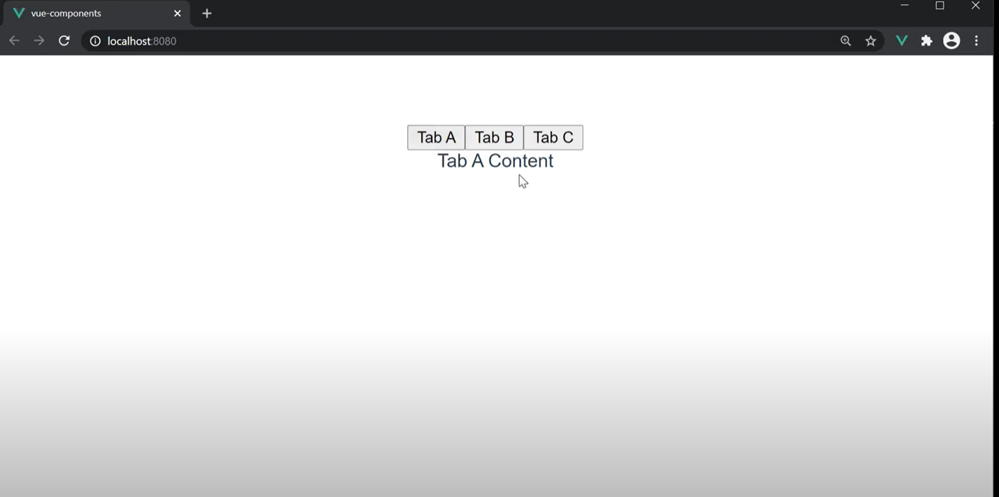

# Dynamic Components
Dynamic components let us dynamically switch between components at run-time. They simplify several conditional components (ones toggled using v-if, v-else-if, v-else) into just one line of code.

## How does this work?
It is made possible by Vue’s``` <component>``` element with the ```is``` special attribute:
```
<!-- Component changes when currentTabComponent changes -->
<component v-bind:is="currentTabComponent"></component>
```
## Why is there a need for this?
1. Enable users to switch between two or more components without routing.  
2. It can retain the state of data when switching back to the initial component using ```<keep-alive>``` element.  

## Advantages of Dynamic Components
1. They are  reusable and make building large-scale applications much easier.
2. Saves us from writing a lot of code as it simplifies several conditional components (ones toggled using v-if, v-else-if, v-else) into just one line of code.
3. This approach ensures that your presentation is always clean and unambiguous.
## How to implement this with code
1. I am going to make three new components in the components folder and name them TabA,TabB and TabC respectively.
### TabA.vue
```
<template>
  <div>Tab A Content</div>
</template>

<script>
export default {
  name: 'Tab A ',
}
</script>

<style scoped>
</style>
```
Similarly, I have made TabB and TabC files .  
  
We write our main code in App.vue file.
```
<template>
  <button @click="activeTab = 'TabA'">Tab A</button>
  <button @click="activeTab = 'TabB'">Tab B</button>
  <button @click="activeTab = 'TabC'">Tab C</button>

  <!--Dynamic Component-->
  <component :is="activeTab" ></component>


</template>
<script>
import TabA from :'./components/TabA.vue'
import TabB from :'./components/TabB.vue'
import TabC from :'./components/TabC.vue'

export default {
    name:'App',
  components: { 
  TabA
  TabB
  TabC },
  data(){
      return{
          active:'TabA'
      }
  }
    
}
</script>


<style scoped>
#app {
  font-family: Avenir, Helvetica, Arial, sans-serif;
  -webkit-font-smoothing: antialiased;
  -moz-osx-font-smoothing: grayscale;
  text-align: center;
  color: #2c3e50;
  margin-top: 60px;
}
h4 {
  color: orange;
}
</style>
```  
  

In case you want some component instances to be cached once they're created for the first time we use ```<keep-alive>``` element. We simply wrap the ```<component>``` tag with the ```<keep-alive>``` tag.
```
<keep-alive>
<component :is="activeTab" />
</keep-alive>  

```

## References
1. [Codevolution](https://www.youtube.com/playlist?list=PLC3y8-rFHvwgeQIfSDtEGVvvSEPDkL_1f)
2. [vue-nav-tabs](https://cristijora.github.io/vue-tabs/#/)


 