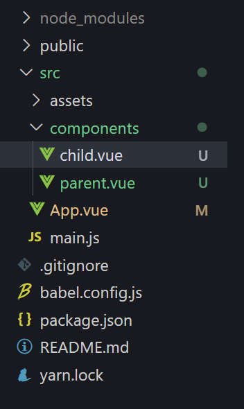
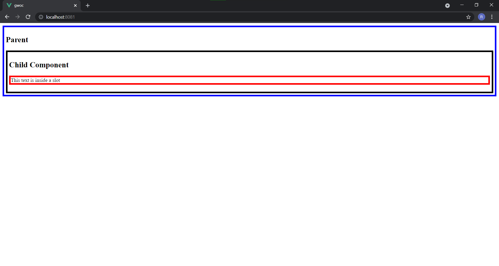
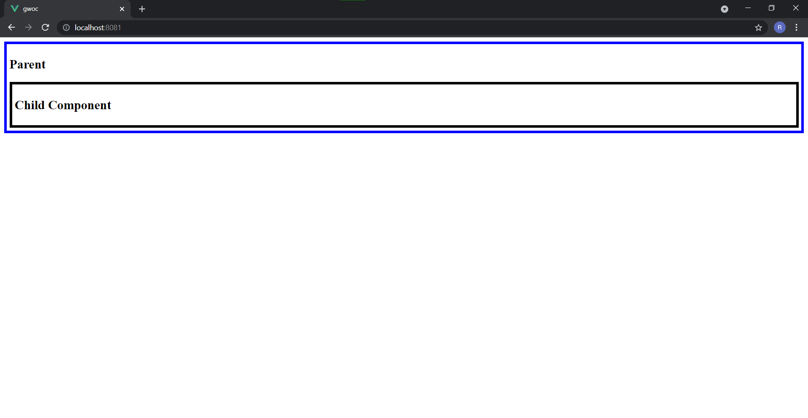

# Slots in Vue.js
Reserved spaces, which are offered by Vue.js to render content transferred from one component to another are called **slots**. Basically the < slot > element is an implementation of the content distribution API.
# Why do we need to use it?
One of the main reasons we use slots is to pass HTML elements from one component to another.

We can pass HTML elements from a parent component to a child component using props as a string. But this has a disadvantage. This method makes the site vulnerable to [cross site scripting attack](https://owasp.org/www-community/attacks/xss/). Therefore slots is a much more secure method of passing HTML and other elements from a parent to its child component

# Implementation
Now let's take a look at how to use these slots. Using Vue CLI, create a new Vue Project with the following command and move to the newly created folder with cd new-vue-project.
```bash
vue create new-vue-project
```
If you don't have Vue CLI, just install it with the following command:
```bash
npm install -g @vue/cli
```

Go to the src folder>components and remove the Helloworld.vue file. Create 2 new files, child.vue and parent.vue.

The project structure should be similar to this:



Add the following code inside child.vue file:
```html
<template>
            <!-- We are creating a basic div container, with a h2 and the slot tag -->
            <div class = "child">
               <h2>Child Component</h2>
               <!-- The slot tag -->
               <slot></slot>
            </div>
</template>

<script>
    export default {

    }
</script>
<style>
/* Here we have given the child a black colored border and some padding to differentiate it from other components */
.child{
    border: 5px solid black;
    padding: 5px;
}
</style>


```
Now add the following lines of code to parent.vue
```html
<template>
            <!-- This is the parent div container, it will display the child component. -->
            <div class = "parent">
               <h2>Parent</h2>
               <!-- This is where the child component is displayed. We are passing the 'p' tag into the child component from the parent component which will be shown with the help of the slot tag -->
               <child-component>
                    <p class = "slot-text">This text is inside a slot</p>
               </child-component>
            </div>
</template>

<script>
import child from './child.vue'
    export default {
        components: {
            childComponent: child
        }
    }
</script>

<style>
    /* Styling the parent component and the 'p' tag to differentiate them */
.parent{
    border: 5px solid blue;
    padding: 5px;
}
.slot-text{
    border: 5px solid red;
}
</style>```

Then head to the App.vue file and do the following modifications.

```html
<template>
  <div class="app">
      <!-- Passing the parent component into the main App.vue file -->
    <Parent/>
  </div>
</template>

<script>
import Parent from './components/parent.vue'

export default {
  name: 'App',
  components: {
    Parent
  }
}
</script>

<style>
</style>

```
Now head back to the root of your project in a terminal and run the following command:
```bash
yarn serve 
```
(May Change based on your package manager)

You should see the following output:


The 'p' tag with the class 'slot-name' is passed from the parent to the child component, and is rendered via the slot tag in the child component. Now let's see what happens, when the slot tag is missing in the child component. Remove the 
```html 
<slot></slot>
``` 
line from the child.vue file and save it and head back to the web page, where you saw the output before. 

Your child.vue file should look like this.
```html
<template>
            <div class = "child">
               <h2>Child Component</h2>
               
            </div>
</template>

<script>
    export default {

    }
</script>
<style>
.child{
    border: 5px solid black;
    padding: 5px;
}
</style>
```

And this is how your output should look like.



The line, *This text is inside a slot* is missing. It is because we have removed the slot tag from the child.vue file. Therefore, the 'p' tag we write inside the child component, is not passed into the child component. 

I hope this documentation helped you understand slots in vue.js.

# Additional Resources:
- [Official documentation](https://vuejs.org/v2/guide/components-slots.html) for slots in Vue.js
- A brief [article](https://medium.com/@aliafsah1988/what-are-slots-in-vue-js-and-when-we-should-use-them-5e3012963377) explaining slots in Vue.js
- Another brief [article](https://www.digitalocean.com/community/tutorials/vuejs-component-slots) regarding slots.
