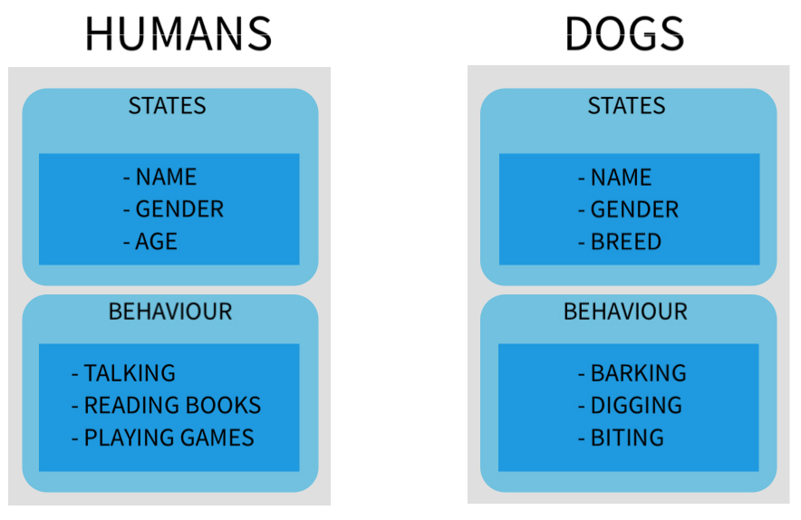
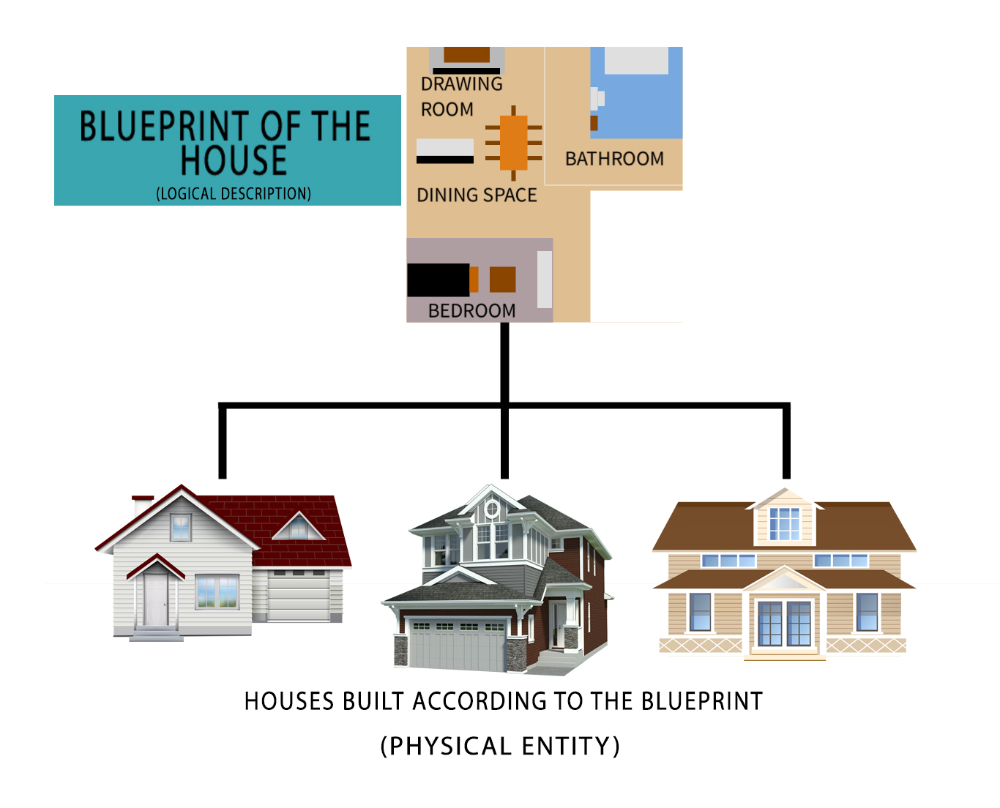
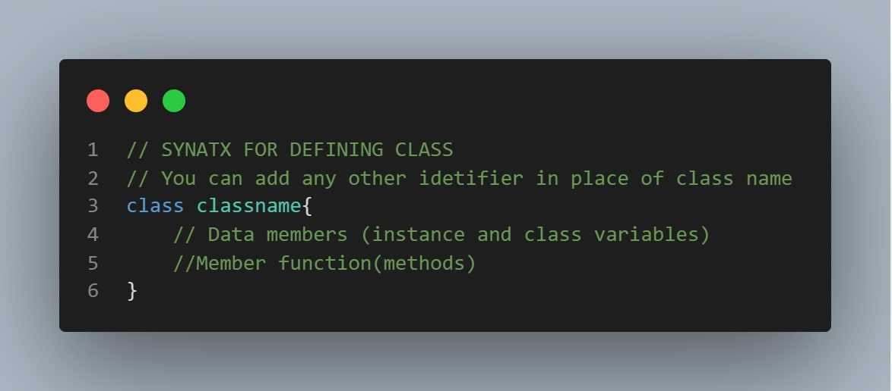
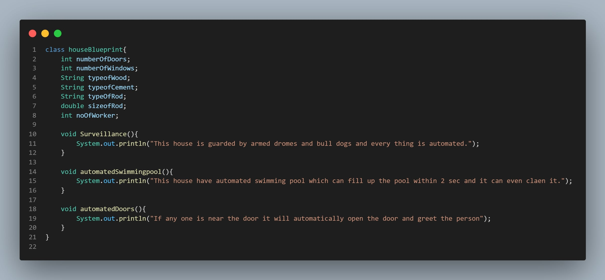
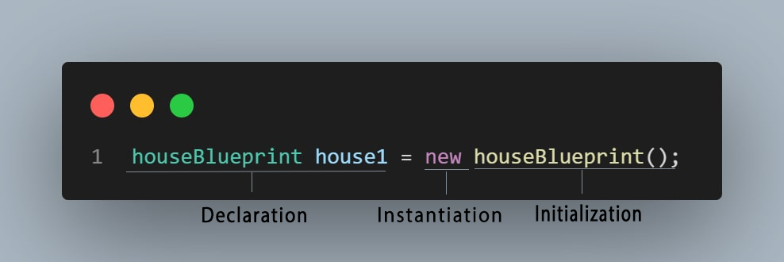
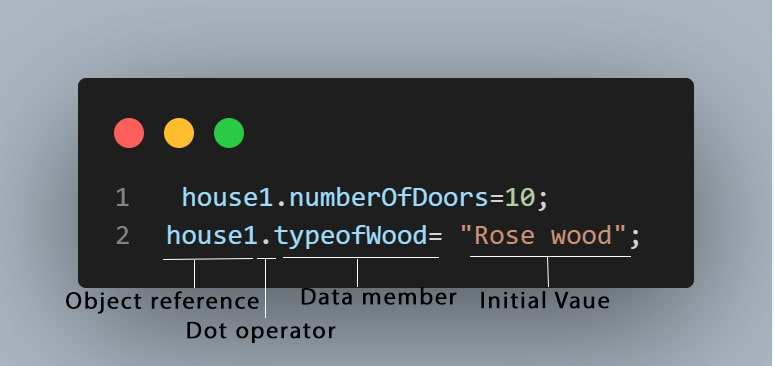
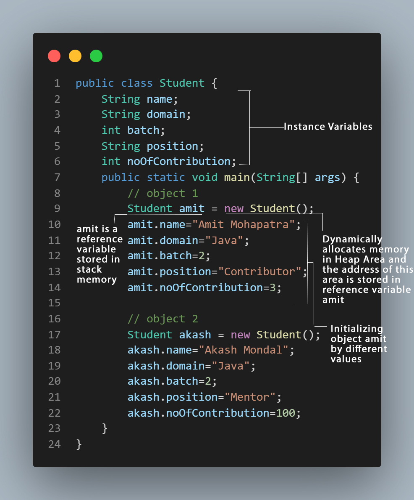
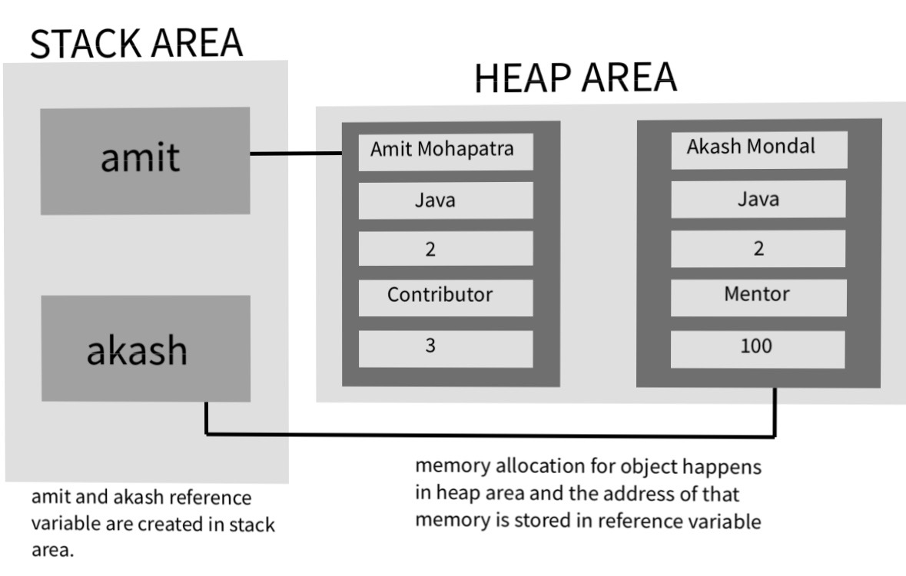

# OOP
------------
## Contents
1. Introduction to class and object 
2. What is a class ?
3. What is an object?
4. Difference between Classes and objects in Java
5. Memory allocation 
 
-------------
## Introduction to class and object 
- Classes and objects are one of the most fundamental units of many Java application and frameworks. 
- As Java is an object oriented programming language we can see classes and objects everywhere. So it's quite important to understand these concepts .
- If we take example of our surrounding we can find objects everywhere like car, dogs, humans etc .
- All these thing have something in common and that is 
    1. **States**
    2. **Behaviour**
- And these states and behaviour are used to differentiate them properly.   
    **FOR EXAMPLE :**
    Humans can talk but dogs can't talk they bark. So here the talking of the human and barking of the dogs are their behaviour and these behaviour help us to differentiate between objects , in this case humans and dogs. So here you might be having some confusion about states and behaviour. 
- **State** is nothing but the values or the data . In human case their Name and gender are considered as state .
- **Behaviour** is the action or the work or the task the object performs. Here human is able to talk, talking is action or we can say behaviour. Similarly barking is a behaviour of dog. For better understanding you can look at this image 
<!-- Image stating the difference between states and behaviour -->

- Now let us talk about classes. In layman term **Classes** are nothing but the logical description of how an object will behave and what are the states the object is going to have.
- So let us take another **Example**. When you are creating a house, what is the first thing you do ? Yes you do the planning and make a sketch of it and if we make this sketch  with proper measurements and all, then it will be a **Blueprint**. So Blueprint will contain all the details and measurements of the floor ,ceiling and how it will be designed .
<!-- Image of a house (blueprint) -->

- Based on these logical descriptions which we call it as a Blueprint we build our house and now this house is a physical object . So like that in software domain too , we can think of the class as a blueprint of the house that describes the various characteristics .
- So once we have got our plan or the Blueprint we can create as many houses we want .
-------
## What is a class ?
- So earlier we have seen that in layman term class is nothing but a Blueprint of an object .
- Let us redefine it properly. **A class is an user defined template that logically describes the states and behaviours of an object.**
- In general, class includes **variables (State)** and **methods (Behaviours)**.
- **Syntax** for defining class: 
<!-- class Syntax -->


- **For example** let us define some of the states and behaviour in the class
<!-- defining class  -->

<!-- Image of the states and behaviour -->
----------
## What is an object ?
- Object are the basic unit of OOP with behaviour and identity. As we have told earlier that class is nothing but a blueprint of the object.
- Classes only act as a template for a physical entity known as **object** .
- So classes act as logical description for an object and Object is physical instance of the class .
- There are three steps to creating an object of a class 
    - **Declaration** :- A variable declaration with a variable name with an object type.
    - **Instantiation** :-The '**new**' keyword is used to create object in heap memory (We will talk more on heap memory in memory allocation section).
    - **Initialization** :- After the '**new**' keyword we call the constructor .This initializes the new object.
- **Syntax** of defining object : 
<!-- Syntax of creating object -->


- Once we have created an object, then to access these class members we will use a special operator that is **Dot operator**.
- **Syntax** of using dot operator:
 <!-- Dot operator  -->

----------
## Difference between Classes and Objects in Java
|Class                                                         |Object                                                 |
|--------------------------------------------------------------|-------------------------------------------------------|
|Classes is a logical description of an object                 |Object is a physical instance of the class             |
|A class is datatype.                                          |Objects are stored in a reference variable of type class|
|Class is created only once                                    |But we can create as many objects according to our need |
|Class is created using keyword **class**                     |But object can be created in many ways and one of them is using **new**          keyword| 
|Classes do not occupy memory location                         |But object occupy memory location  |
|Classes can not be manipulated as its not available in memory |But we can manipulate objects|

-----------
## Memory Allocation
- Memory Allocation is a process by which computer programs are assigned with some memory space .
- As we know that object's address are stored in the reference variable of type class. Then to which place this address refer to ? Its the address of a space taken by the object in heap memory (which we will talk in this section) and that address is stored in reference variable. Can we print this address? **NO**, we can't print the address of the object but we can print the identity hashcode of that object by writing 
```Java
    object.hashCode();
```
Now let us take a deep dive into memory allocation of variables. Java memory allocation is divided into mainly three parts **Stack area**, **Heap area**, and **Class Area**
- **Stack area :** Stack is a section of the memory where local primitive or object reference variables are stored. These variables are stored in the stack until the block or the method is being executed.
- **Heap Area :** Heap is another section of the memory where the memory for object are being allocated. So we can say objects are stored in heap memory. Heap memory is dynamic in nature. So heap memory is used for dynamic memory allocation of the object which is created using **new** keyword.
- **Class Area :** In the class area all the static variables of the class or we can say the class variables are stored, so that it can be accessed by everyone.

Here is an **Example**
<!-- Example of heap and stack -->

<!-- heap and stack area -->

