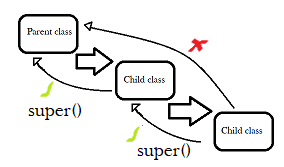

# The *Super* Keyword

The super keyword in java is used to refer to the immediate parent class.<br>
It can be used in three ways:

- To access parent class Variables (syntax: *super.variable_name*)
- To invoke parent class Methods (syntax: *super.method_name()*)
- To invoke parent class Constructors (syntax: *super()*)

Assume you have a parent class named *GradeX* and a child class *Section_A* that inherits the class *GradeX*.
Students(Objects) belonging to *Section_A* inherit the characteristics and behavior of *GradeX* too.
```java
class GradeX
{
    void show(){

       System.out.println("Student belongs to GradeX");
    }
}
class Section_A extends GradeX
{
    void show(){

       System.out.println("Student belongs to Section A");
    }
    void display(){

      show(); // calls current class show method

      super.show(); // calls parent class show method
    }

}
class Test
{
  public static void main(String args[]){

    Section_A student1 = new Section_A();
    student1.display();

  }
}
```
Output:<br>
Student belongs to Section A<br>
Student belongs to GradeX<br>

In the above code sample, the *display()* method contains two statements.
The first statement only calls the *show()* method of the current class. In order to access the contents of the parent class we make use the ***super*** keyword.

Note:
- The *super* keyword can access only the immediate parent class and not the ancestor class
- When using *super* to access contructors, call to *super()* must be the first statement in Derived Class constructor.<br>

