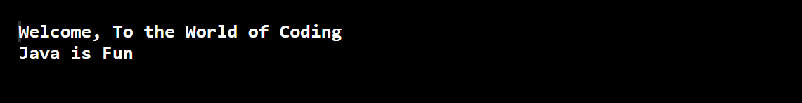

<h1 align="center"><b><u>DEFAULT INTERFACE METHODS</u></b></h1>
<br>
<br>

### **INTRODUCTION:** <br>
## **What is an Interface?**
- An interface in Java is a blueprint of a class.
- It is a completely "abstract class" that is used to group related methods with empty bodies.
- It has static constants and abstract methods.
- They are similar to protocols. Interfaces are declared using the interface keyword, and may only contain method signature and constant declarations.
<br>
<br>

## **Example:**
```jsx
interface printable{
void print(); // interface method (does not have a body).
}

class gwoc implements printable{
public void print(){
    // The body of print() is provided here.
    System.out.println("GirlScript Winter of Contribution- 2021");
    }

public static void main(String args[]){
gwoc obj = new gwoc();
obj.print();
 }
}
```

## **Output:**
<br>

<br>
<br>

### **DEFAULT INTERFACE METHODS:**
- An Interface can have both Static and Default Methods.
- A default method is a method defined with a method body using default keyword inside an interface wih default implementation.
- It is sometimes called an optional method. Default methods are also known as defender methods or virtual extension methods.
- It was established in Java 8, to ensure backward compatibility while updating an interface.
- Default Methods enables us to addnew functionalities to the existing interface.
- Interfaces can also include private methods for the default methods to use.
<br>
<br>

### **GENERAL SYNTAX:**
```jsx
public interface Contribution {
  void method1(); // Normal Abstract Method.
  default void method2() // Default Method.
  {
   // Default Implementation.
   }
}
```

<br>
<br>

## **USE OF DEFAULT METHODS IN INTERFACE:**
- The most important use of default methods in interfaces is to provide additional functionality to a given type without breaking down the implementing classes.
- The default method in Java 8, improves code development and backward compatibility.
- Default methods are implicitly public.
- In Java 8, the default method makes it easy to evolve interfaces. By defining a default implementation of the method, the existing interface becomes backward compatible with the existing code without breaking the old code.
- In addition, they can be used to provide additional functionality around an existing abstract method.
<br>
<br>

## **DECLARATION OF DEFAULT METHOD IN INTERFACE:**
- A default method can only be defined inside an interface, not within a class or abstract class.
- It must be declared with the 'default' keyword.
- It cannot be marked with static, final, or abstract, as it may be used or overridden by a class that implements the interface.
- Default keyword cannot be marked with static method because all default methods are instance methods.
<br>
<br>

## **EXAMPLES:**
1. 
```jsx
interface Gwoc{
    // Default method
    default void say(){
        System.out.println("Hello, This is GirlScript Winter of Contributing");
    }
    // Abstract method
    void sayMore();
}
public class Contribution implements Gwoc{

    @Override
    public void sayMore() {
        // implementing abstract method.
        System.out.println("Contribution is Fun");
        System.out.println();
    }
    public static void main(String[] args) {
        Contribution obj1 = new Contribution();
        obj1.say(); // calling default method
        obj1.sayMore(); // calling abstract method

    }

}
```
<br>

## **Output:**

<br>
<br>

2. 
```jsx
interface Coding{
    // Default method
    default void say(){
        System.out.println("Welcome, To the World of Coding");
    }
    // Abstract method
    void code();
}
public class Programming implements Coding{

    @Override
    public void code() {
        // implementing abstract method.
        System.out.println("Java is Fun");
    }
    public static void main(String[] args) {
        Programming obj1 = new Programming();
        obj1.say(); // calling default method
        obj1.code(); // calling abstract method

    }

}
```
<br>

## **Output:**

<br>
<br>

## **CONCLUSION:**
- In this document, we explored in depth about Interface and the use of default interface methods in Java 8.
- At first glance, this feature may look a little bit sloppy, particularly from an object-oriented purist perspective.
- Ideally, interfaces shouldn't encapsulate behavior and should be used only for defining the public API of a certain type.
- When it comes to maintaining backward compatibility with existing code, default methods are a good trade-off.

## *Reference:*
   - Documentation:
     - <a href="https://www.baeldung.com/">Baeldung</a> 
     - <a href="https://www.geeksforgeeks.org/default-methods-java/">GeeksforGeeks</a>
<br>
